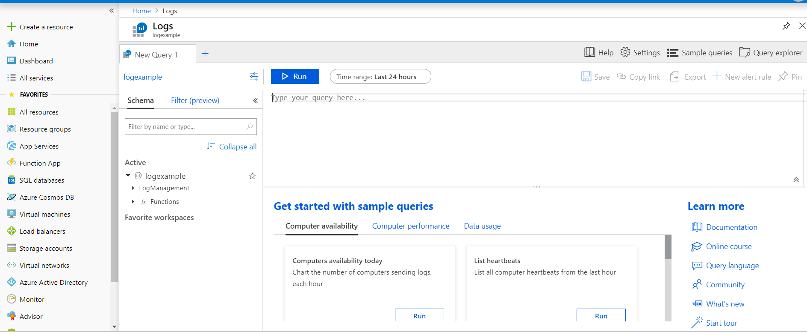

In this exercise you will be creating basic Azure Monitor log queries to extract information from log data

## Azure Monitor Log Analytics in the Azure portal to write Azure Monitor log queries

To view the Azure Monitor and write some log queries:

1. Click **Monitor** on the left pane in the Azure portal
1. This brings up the Azure monitor blade and you will see  some more options such as **Activity Log**, **Alerts**, **Metrics**, **Logs**
1. Clicks **Query & Analyze Logs**
1. Here you can type your query and see the output



## How to write queries with the Kusto language

The Kusto Query Language is used to query Azure's services. It is a read-only request to process data and return results. The request is stated in plain text, using a data-flow model designed to make the syntax easy to read, author, and automate. The query uses schema entities that are organized in a hierarchy similar to SQL's: databases, tables, and columns.

The query consists of a sequence of query statements, delimited by a semicolon (;), with at least one statement being a tabular expression statement which is a statement that produces data arranged in a table-like mesh of columns and rows. The query's tabular expression statements produce the results of the query.

The syntax of the tabular expression statement has tabular data flow from one tabular query operator to another, starting with data source (e.g. a table in a database, or an operator that produces data) and then flowing through a set of data transformation operators that are bound together through the use of the pipe (|) delimiter.

For example, the following Kusto query has a single statement, which is a tabular expression statement. The statement starts with a reference to a table called Events (the database that host this table is implicit here, and part of the connection information). The data (rows) for that table are then filtered by the value of the StartTime column, and then filtered by the value of the State column. The query then returns the count of "surviving" rows.

```kusto
Events
| where StartTime >= datetime(2018-11-01) and StartTime < datetime(2018-12-01)
| where State == "FLORIDA"  
| count
```

 [!NOTE]
> The Kusto query language used by Azure Monitor is case-sensitive. Language keywords are typically written in lower-case. When using names of tables or columns in a query, make sure to use the correct case.