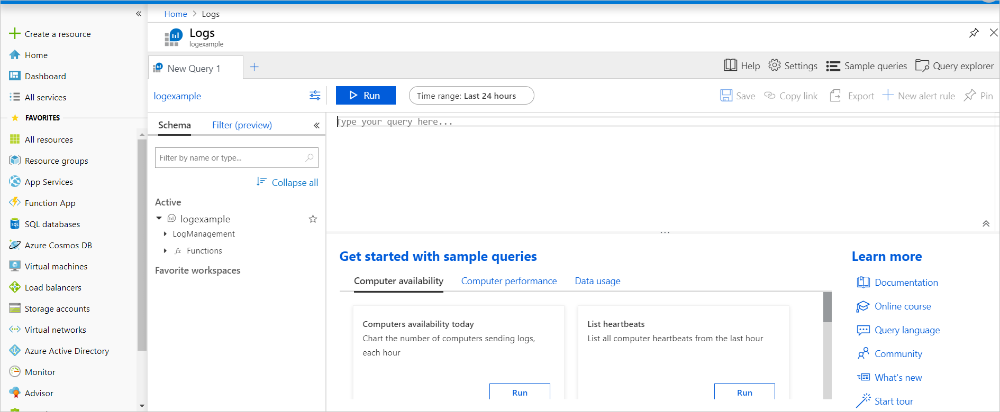

You can use Azure Monitor log queries to extract information from log data. Querying is an important part of examining the log data that Azure Monitor captures.

In the example scenario, the operations team will use Azure Monitor log queries to examine the health of its system.

## Write Azure Monitor log queries by using Log Analytics

You can find the Log Analytics tool in the Azure portal and use it to run sample queries or to create your own queries:

1. In the Azure portal, in the left menu pane, select **Monitor**.

    The Azure Monitor page appears along with more options, including **Activity Log**, **Alerts**, **Metrics**, and **Logs**.

1. Select **Logs**.

    Here, you can enter your query and see the output.

    

## Write queries by using the Kusto language

You can use the Kusto Query Language to query log information for your services running in Azure. A Kusto query is a read-only request to process data and return results. You'll state the query in plain text by using a data-flow model that's designed to make the syntax easy to read, write, and automate. The query uses schema entities that are organized in a hierarchy similar to that of Azure SQL Database: databases, tables, and columns.

A Kusto query consists of a sequence of query statements, delimited by a semicolon (`;`). At least one statement is a tabular expression statement. A tabular expression statement formats the data arranged as a table of columns and rows.

A tabular expression statement's syntax has a tabular data flow from one tabular query operator to another, starting with a data source. A data source might be a table in a database or an operator that produces data. The data then flows through a set of data-transformation operators that are bound together with the pipe (`|`) delimiter.

For example, the following Kusto query has a single tabular expression statement. The statement starts with a reference to a table called `Events`. The database that hosts this table is implicit here, and is part of the connection information. The data for that table, stored in rows, is filtered by the value of the `StartTime` column. The data is filtered further by the value of the `State` column. The query then returns the count of the resulting rows.

```kusto
Events
| where StartTime >= datetime(2018-11-01) and StartTime < datetime(2018-12-01)
| where State == "FLORIDA"  
| count
```

> [!NOTE]
> The Kusto query language that Azure Monitor uses is case-sensitive. Language keywords are typically written in lowercase. When you're using names of tables or columns in a query, make sure to use the correct case.

Events captured from the event logs of monitored computers are just one type of data source. Azure Monitor provides many other types of data sources. For example, the `Heartbeat` data source reports the health of all computers that report to your Log Analytics workspace. You can also capture data from performance counters and update management records.

The following example retrieves the most recent heartbeat record for each computer. The computer is identified by its IP address. In this example, the `summarize` aggregation with the `arg_max` function returns the record with the most recent value for each IP address.

```kusto
Heartbeat
| summarize arg_max(TimeGenerated, *) by ComputerIP
```
