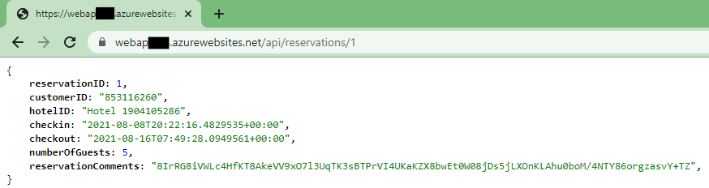

You should scale out a system when you expect in increase in traffic. You might also scale out in response to declining performance.

Recall that in the hotel reservation system example, you would increase the number of instances of the web app when you anticipate extra traffic due to a special event, a special offer, or because of seasonal fluctuations. You would scale the system back when the demand drops.

In this exercise, you'll create an App Service Plan and deploy a web app using this plan. You'll monitor the performance of the web app under load. You'll then scale out the web app, and verify that the performance of the web app has improved as a result.

This exercise uses a sample web app that implements a web API. The web API exposes HTTP POST and GET operations that create and retrieve customer's bookings for a hotel reservations web site. The bookings aren't actually saved, and the GET operation simply retrieves dummy data.

The exercise also runs a client app that simulates a number of users issuing POST and GET operations simultaneously. This app provides the workload that is used to test the performance of the web app before and after scaling.

## Create an App Service Plan and web app

[!include[](../../../includes/azure-sandbox-activate.md)]

1. Sign in to the [Azure portal](https://portal.azure.com/learn.docs.microsoft.com?azure-portal=true) using your MSLearn account.

1. Choose **Create a resource**, select **Web**, and then click **Web App**.

1. On the **Web App** page, enter the values in the following table.

    > [!NOTE]
    > The web app must have a unique name. We suggest using something like **\<*your name or initials*\>hotelsystem**. Use this name wherever you see *\<your-webapp-name\>* in this exercise.

    | Property  | Value  |
    |---|---|
    | App name | *\<your-webapp-name*\> |
    | Subscription | Concierge Subscription  |
    | Resource Group | Use the existing resource group <rgn>[Sandbox resource group]</rgn> |
    | OS | Windows |
    | Publish | Code |
    | App Service plan/Location | *Leave default* |

1. Click **Create**, and wait for the web app to be created.

## Build and deploy the web app

1. In the Cloud Shell window on the right, run the following command to download the source code for the hotel reservation system:

     ```bash
    git clone https://github.com/MicrosoftDocs/mslearn-hotel-reservation-system.git
    ```

 1. Move to the `mslearn-hotel-reservation-system/src` folder:

     ```bash
    cd mslearn-hotel-reservation-system/src
    ```

 1. Build the apps for the hotel system. There are two apps; a web app that implements the web API for the system, and a client app that you'll use for load testing the web app:

     ```bash
    dotnet build
    ```

 1. Prepare the HotelReservationSystem web app for publishing:

     ```bash
    cd HotelReservationSystem
    dotnet publish -o website
    ```

 1. Go to the **website** folder containing the published files, zip them up, and deploy them to the web app you created in the previous task. Replace `<your-webapp-name>` with the name of your web app.

     ```bash
    cd website
    zip website.zip *
    az webapp deployment source config-zip --src website.zip --name <your-webapp-name> --resource-group <rgn>[Sandbox resource group]</rgn>
    ```

1. Using your web browser, navigate to `http://<your-webapp-name>.azurewebsites.net/api/reservations/1`. You should see a JSON document containing the details for reservation number 1.

    

## Monitor the performance of the web app before scaling out

1. Return to the Cloud Shell and move to the **~/mslearn-hotel-reservation-system/src/HotelReservationSystemTestClient** folder:

    ```bash
   cd ~/mslearn-hotel-reservation-system/src/HotelReservationSystemTestClient

1. Edit the App.config file in this folder using the **code** editor:

    ```bash
    code App.config
    ```

1. Uncomment the line that specifies the **ReservationsServiceURI**, and replace the value with the URL of your web app. The file should like the example shown below:

    ```text
    <?xml version="1.0" encoding="utf-8" ?>
    <configuration>
        <appSettings>
            <add key="NumClients" value="100" />
            <add key="ReservationsServiceURI" value="https://<your-webapp-name>.azurewebsites.net/"/>
            <add key="ReservationsServiceCollection" value="api/reservations"/>
        </appSettings>
    </configuration>
    ```

    > [!NOTE]
    > The **NumClients** setting in this file specifies the number of simultaneous clients that will attempt to connect to the web app and perform work. The work consists of creating a reservation, and then running a query to fetch the details of a reservation – all of the data used is fake and is not actually persisted anywhere. Leave this value set to 100.

1. Save the file and close the code editor.

1. Rebuild the test client app with the new configuration:

    ```bash
    dotnet build
    ```

1. Run the client app. You'll see a number of messages appear as the clients start running, make reservations, and run queries. Allow the system to run for a couple of minutes. The responses will be slow, and soon the client requests will start to fail with HTTP 408 (Timeout) errors:

    ```bash
    dotnet run
    ```

   

1. In the Azure portal, go to the blade for your web app (not the service plan), and under **Monitoring**, click **Metrics**.

1. Add the following metrics to the chart, set the time range to **Last 30 minutes**, and then pin the chart to the current dashboard:

   - CPU Time. Select the Sum aggregation
   - Http Server Errors. Select the Sum aggregation.
   - Http 4.xx. Select the Sum aggregation.
   - Average Response Time. Select the Avg aggregation.

1. Allow the system to run for five minutes to stabilize, and note the CPU Time, the number of HTTP 4.xx errors, and the average response time. You should see a significant number of HTTP 4xx errors (these are HTTP 408 Timeout errors), and that the average response time is several seconds. There may be the occasional HTTP Server Error, depending on how the web server is coping with the burden.

   

1. Leave the client app running while you perform the next task.

## Scale out the web app and verify the performance improvement

1. In the Azure portal, in the blade for your web app, under **Settings**, click **Scale out (App Service Plan)**.

1. On the **Configure** page, set the **Instance count** to **5**, and then click **Save**.

    

1. Switch to the Cloud Shell running the client app. You should see fewer requests failing with errors although there will still be some that time out.

1. Allow the app to keep running for another five minutes, and then go to the chart showing the metrics for the web app on the dashboard in the Azure portal. You should see that the CPU time has increased dramatically because there is now five times more CPU power available. The average response time should have dropped, and the number of HTTP 4xx errors should have also decreased. The chart below shows a typical set of results, highlighting the point at which scaling out occurred.

    

1. If you have time, try increasing the instance count for the App Service Plan to 10. This is the maximum number of instances supported by the S1 tier. You should notice a further increase in CPU time, and a corresponding drop in response time and HTTP 4xx errors.

1. Return to the Cloud Shell running the client app. Press Enter to stop the app.

1. Using the Azure portal, reduce the instance count for the App Service Plan back to 1.