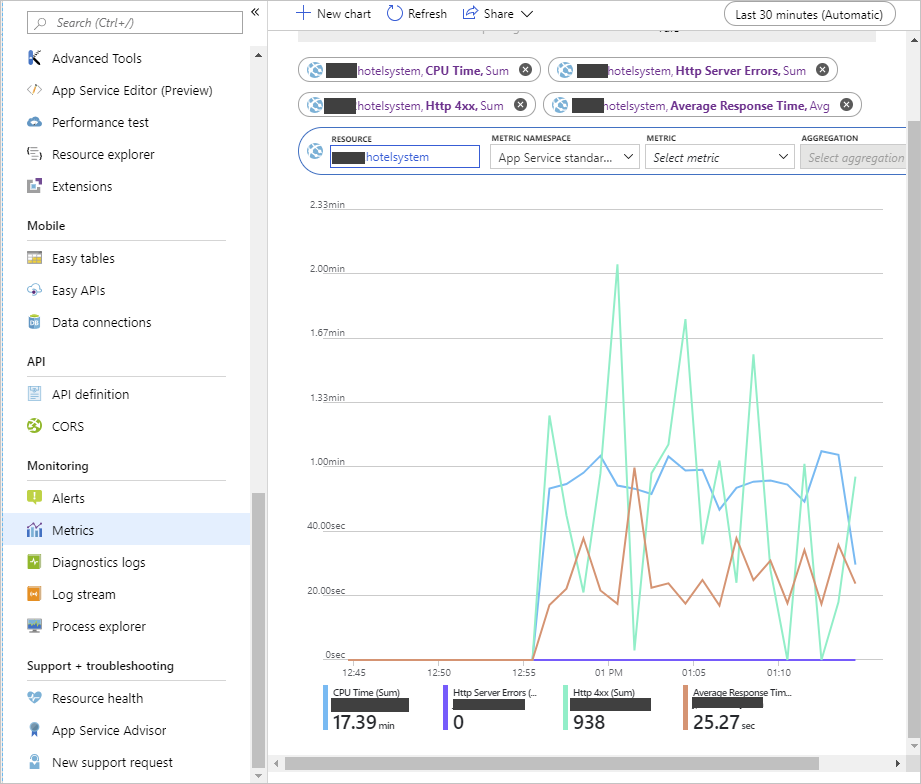
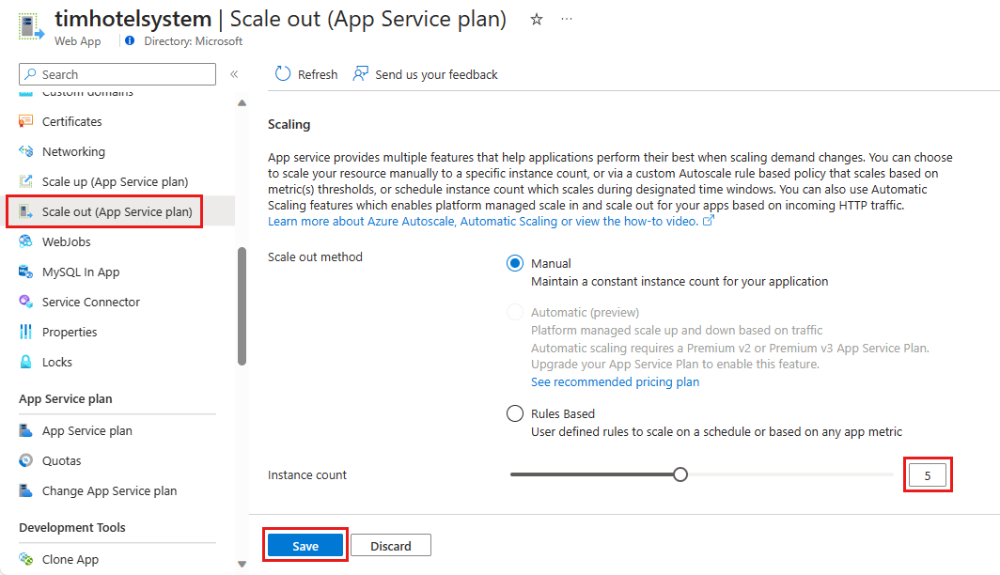
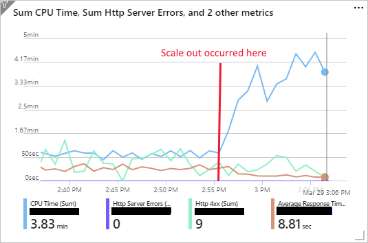

You should scale-out a system when you expect an increase in traffic. You might also scale-out in response to declining performance.

Remember that, in the hotel reservation system example, you increase the number of instances of the web app when you anticipate extra traffic because of a special event, a special offer, or seasonal fluctuations. You scale the system back when the demand drops.

In this exercise, you'll create an App Service plan and deploy a web app using this plan. You'll monitor the performance of the web app under load. You'll then scale-out the app and verify that its performance has improved as a result.

The exercise uses a sample web app that implements a web API. The web API exposes HTTP POST and GET operations that create and retrieve customer bookings for a hotel reservations website. The bookings aren't saved, and the GET operation simply retrieves dummy data.

The exercise also runs a client app that simulates several users issuing POST and GET operations simultaneously. This app provides the workload that's used to test the performance of the web app before and after scaling.

## Create an App Service plan and web app

[!include[](../../../includes/azure-exercise-subscription-prerequisite.md)]

1. Sign in to the [Azure portal](https://portal.azure.com/?azure-portal=true).

1. On the Azure portal menu or from the **Home** page, select **Create a resource**.

1. Select **Web**, search for and select **Web App**, and then select **Create**.

1. On the **Web App** page, enter the values in the following table.

    > [!NOTE]
    > The web app must have a unique name. We suggest using something like **\<your name or initials\>hotelsystem**. Use this name wherever you see \<your-webapp-name\> in this exercise.

    | Property  | Value  |
    |---|---|
    | Subscription | Select the Azure subscription you'd like to use for this exercise  |
    | Resource Group | Create a new resource group called **mslearn-scale** |
    | App name | \<your-webapp-name\> |
    | Publish | Code |
    | Runtime stack | .NET Core 3.1 (LST)|
    | O/S | Windows|
    | App Service plan/Location | *Leave default* |

1. Select **Create** and wait for the web app to be created.

## Build and deploy the web app

1. Open the Cloud Shell in the Azure portal (at the top-right, looks like a square with >_ inside). Run the following command to download the source code for the hotel reservation system.

     ```bash
    git clone https://github.com/MicrosoftDocs/mslearn-hotel-reservation-system.git
    ```

1. Go to the *mslearn-hotel-reservation-system/src* folder.

     ```bash
    cd mslearn-hotel-reservation-system/src
    ```

1. Build the apps for the hotel system. There are two apps: a web app that implements the web API for the system and a client app that you'll use to load test the web app.

     ```bash
    dotnet build
    ```

1. Prepare the HotelReservationSystem web app for publishing.

     ```bash
    cd HotelReservationSystem
    dotnet publish -o website
    ```

1. Go to the *website* folder, which contains the published files. Zip the files and deploy them to the web app that you created in the previous task. Replace `<your-webapp-name>` with the name of your web app.

     ```bash
    cd website
    zip website.zip *
    az webapp deployment source config-zip --src website.zip --name <your-webapp-name> --resource-group mslearn-scale
    ```

1. Use your web browser to go to `http://<your-webapp-name>.azurewebsites.net/api/reservations/1`. A JSON document appears that contains the details for reservation number 1.

    :::image type="content" source="../media/3-web-app.png" alt-text="Screenshot of the running web app, showing the details for reservation number 1 in JSON format." loc-scope="other"::: <!-- no loc -->

## Monitor the performance of the web app before scaling out

1. Return to the Cloud Shell and go to the *~/mslearn-hotel-reservation-system/src/HotelReservationSystemTestClient* folder.

    ```bash
   cd ~/mslearn-hotel-reservation-system/src/HotelReservationSystemTestClient
    ```

1. Edit the App.config file in this folder by using the code editor.

    ```bash
    code App.config
    ```

1. Uncomment the line that specifies the `ReservationsServiceURI` and replace the value with the URL of your web app. The file should look like this example.

    ```text
    <?xml version="1.0" encoding="utf-8" ?>
    <configuration>
        <appSettings>
            <add key="NumClients" value="100" />
            <add key="ReservationsServiceURI" value="https://<your-webapp-name>.azurewebsites.net/"/>
            <add key="ReservationsServiceCollection" value="api/reservations"/>
        </appSettings>
    </configuration>
    ```

    > [!NOTE]
    > The `NumClients` setting in this file specifies the number of clients that will simultaneously try to connect to the web app and perform work. The work consists of creating a reservation and then running a query to fetch the details of the reservation. All the data used is fake. It's not persisted anywhere. Leave this value set to `100`.

1. Save the file and close the code editor.

1. Rebuild the test client app with the new configuration.

    ```bash
    dotnet build
    ```

1. Run the client app. You'll see several messages appear as the clients start running, make reservations, and run queries. Allow the system to run for a couple of minutes. The responses will be slow, and soon the client requests will start to fail with HTTP 408 (Timeout) errors.

    ```bash
    dotnet run
    ```

    :::image type="content" source="../media/3-web-client.png" alt-text="Screenshot of a running client app, showing the responses and error messages that occur." loc-scope="other"::: <!-- no-loc -->

1. In the Azure portal, go to the pane for your web app (not the service plan). Under **Monitoring**, select **Metrics**.

1. Add the following metrics to the chart, set the time range to **Last 30 minutes**, and then pin the chart to the current dashboard.

   - Select **Add metric** CPU Time. Select the Sum aggregation.
   - Select **Add metric** Http Server Errors. Select the Sum aggregation.
   - Select **Add metric** Http 4.xx. Select the Sum aggregation.
   - Select **Add metric** Average Response Time. Select the Avg aggregation.

1. Allow the system to run for five minutes to stabilize, and then note the CPU Time, the number of HTTP 4.xx errors, and the average response time. You should see a significant number of HTTP 4xx errors (these are HTTP 408 Timeout errors), and that the average response time is several seconds. You might see the occasional HTTP server error, depending on how the webserver is coping with the burden.

   

1. Leave the client app running while you perform the next task.

## Scale out the web app and verify the performance improvement

1. In the Azure portal, in the pane for your web app, under **Settings**, select **Scale-out (App Service Plan)**.

1. On the **Configure** page, set the **Instance count** to **5**, and then select **Save**.

    

1. Switch to the Cloud Shell that's running the client app. You should see fewer requests failing with errors, though you'll still see some that time out.

1. Run the app for another five minutes. Next, go to the chart that shows the metrics for the app on the dashboard in the Azure portal. You should see that the CPU time has increased dramatically because there's now five times more CPU power available. The average response time should have dropped, and the number of HTTP 4xx errors should also have decreased. The following chart shows a typical set of results. The point at which scale-out occurred is noted.

    

1. If you want to experiment some more, try increasing the instance count for the App Service plan to 10. Ten is the maximum number of instances supported by the S1 tier. You should notice a further increase in CPU time, and a corresponding drop in response time and HTTP 4xx errors.

1. Return to the Cloud Shell that's running the client app. Select Enter to stop the app.

1. In the Azure portal, set the instance count for the App Service plan back to 1.
