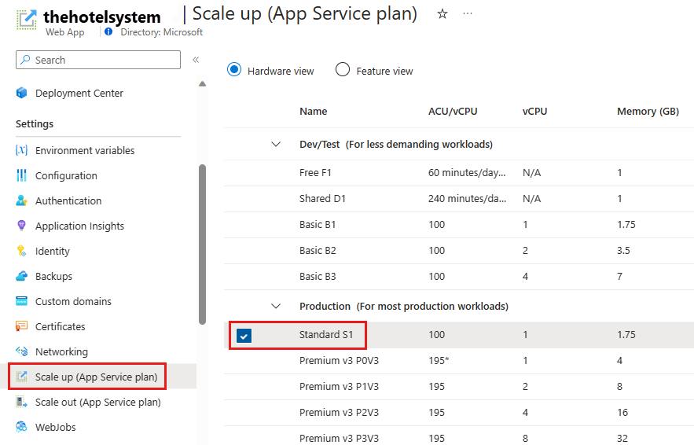
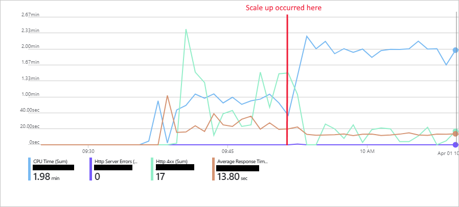

Scaling up provides more powerful resources for running a web app, and also increases the number of instances available for scaling out.

In the hotel reservation system, you should scale out to handle the increasing number of visitors to the web app. Scaling up will enable you to scale out further. Additionally, scaling up will likely be necessary to support the new functionality that will be added to the web app.

In this exercise, you'll scale up the hotel reservation system web app that you deployed earlier. You will run the same test client application that you used before, and monitor the performance of the web app.

## Examine the current pricing tier for the web app

[!include[](../../../includes/azure-sandbox-activate.md)]

1. Sign in to the [Azure portal](https://portal.azure.com/learn.docs.microsoft.com?azure-portal=true) using your MSLearn account.

1. Click **All resources**, and then navigate to your App Service Plan.

1. Under **Settings**, click **Scale up (App Service plan)**. You should see details of the pricing tier for your App Service Plan. The pricing tier is S1, which provides 100 Azure Compute Units and 1.75 GB of memory running on an A-Series virtual machine.

    

## Run the test client app

1. In the Cloud Shell window on the right and move to the **~/mslearn-hotel-reservation-system/src/HotelReservationSystemTestClient** folder:

   ```bash
   cd ~/mslearn-hotel-reservation-system/src/HotelReservationSystemTestClient
   ```

1. Run the client app. Allow the system to run for a couple of minutes. As at the start of the previous exercise, the responses will be slow, and soon the client requests will start to fail with HTTP 408 (Timeout) errors:

    ```bash
    dotnet run
    ```

1. Allow the app to keep running. Wait for another five minutes, and then go to the chart showing the metrics for the web app on the dashboard in the Azure portal. Like the previous exercise, you should see that the statistics indicate a relatively slow response time with many HTTP 4xx errors.

## Scale up the web app and monitor the results

1. In the Azure portal, return to the page for the App Service Plan.

1. Under **Settings**, click **Scale up (App Service plan)**.

1. Select the **P2V2** pricing tier and then click **Apply**. This pricing tier gives you 420 ACU (more than four times the power of the S1 pricing tier), and 7 GB of memory, running on a Dv2-Series VM. However, this VM is four times as expensive to run compared to the S1 pricing tier.

1. Wait for another five minutes, and then view the performance chart on the dashboard in the Azure portal.

1. At the time, the system was scaled up, you might notice some additional HTTP server errors reported. These errors are due to ongoing client requests being aborted when the system switched hardware. Thereafter, the CPU time jumps because more processors are available. You might not notice the same drop in response time that you saw when scaling out. The reason for this is that you are still only using a single instance, so requests are not being load balanced distributed as they were when scaling out. But, you now have the opportunity to scale out across more instances (20) than you had before. The chart in the image below shows an example of the performance metrics for the web app. The point at which the system was scaled up is highlighted.

    

1. Return to the Cloud Shell running the client app. Press Enter to stop the app.