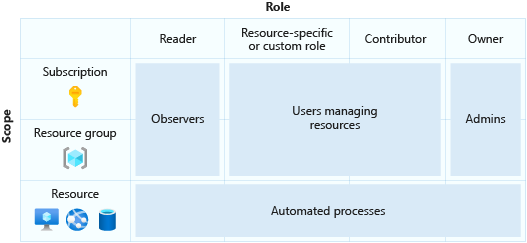

The person replacing the administrator needs to able to manage Azure resources created under that subscription, among other things. You'll identify the appropriate role to assign to them.

In this unit, you'll look in detail at the essential aspects of RBAC and Azure AD. You'll explore the different scopes available to you. You'll then identify what the right role would be for your scenario.

## Overview of role-based access control

RBAC allows control over who has access to which Azure resources, and what they can do with those resources. RBAC controls access to resources like the network interface card (NIC) inside an Azure virtual machine, or a secret stored in an Azure Key Vault.

Use RBAC to allow one user, or set of users, to access PaaS resources in a subscription. RBAC allows you to separate responsibility for different resources according to the specializations within your team. For example, give your organization's data scientists access to Azure Machine Learning and any associated resources such as an Azure SQL Database, or Blob storage within a dedicated machine learning resource group. This access isolates these resources from other team members who don't have such skills.

You can create fine-grained permissions schemes for applications so that a marketing web app only has access to the associated marketing database and storage account. For managers or team members higher up in the organization, you could give access to all resources in a resource group or even a subscription for management purposes and overview of billing and consumption.

RBAC implements the principle of least permissions. Give users only the bare minimum of permissions needed to get their work done. RBAC has many built-in roles, and you can create custom roles.

The built-in default roles are:

- **Owner**, which gives full access to all resources, including the ability to delegate access to other users.
- **Contributor**, which can create and manage Azure resources.
- **Reader**, which can only view existing Azure resources.

There's also a **User Access Administrator** role that allows for management of user access to Azure resources. The following diagram shows some approaches to determine which roles you should give to which users.

## Identify the right scope

The scope is important and establishes which resources should have a specific type of access applied. Imagine someone needs access to VMs. You could create a Virtual Machine Reader role, with the ability to view virtual machines, limited to a specific resource group. You can set the scope for a role to a specific resource, resource group, subscription, or management group level.

By combining one of the default role types with a given resource, you can set incredibly tailored permissions on your Azure resources.

For example:

- Setting reader access on a virtual machine, or group of virtual machines
- Give owner access to resource groups
- Give contributor access to a subscription. This access enables the role holder to create and manage every Azure resource in that subscription without giving access to other users.

## Azure AD role differences

Azure AD also has its own set of roles that are more concerned with users, passwords, and domains. These roles have different purposes.

The **Global Administrator** can manage access to administrative features in Azure AD. This role can give admin roles to other users, and handle password reset for any user or administrator. By default, whoever signs up for the Azure Active Directory tenant is automatically assigned this role.

The **User Administrator** can manage all aspects of users and groups, including support tickets, monitoring service health, and changing passwords for certain types of users. 

The **Billing Administrator** can make purchases, manage subscriptions and support tickets, and monitor service health.

## RBAC compared with Azure AD roles

The main difference between RBAC and AAD roles is the area they cover. RBAC handles Azure resources, while the other handles Azure AD resources (particularly users, groups, and domains). You can't create custom roles with Azure AD roles like you can with RBAC. Also, Azure AD has only one scope (directory tenant) while RBAC's scope covers management group, subscription, resource group, and resource. You can use different tools to administer either of them.

There's a key area of overlap. An AAD Global Administrator can elevate their access to manage all Azure subscriptions and management groups. This access gives them the RBAC User Access Administrator role for all subscriptions of their tenant. The RBAC User Access Administrator role enables the global administrator to give other users access to Azure resources. In our scenario, you need to give full RBAC management and billing privileges to a new manager. To achieve this, you'll temporarily elevate your access to include the RBAC User Access Administrator role. You can then grant the new manager the RBAC owner role so that they can create and manage resources. You also set the scope to the subscription level, so that they can do this for all resources in the subscription.
