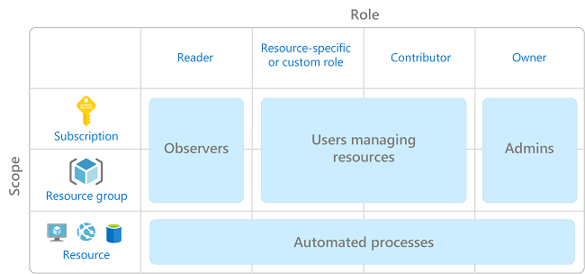
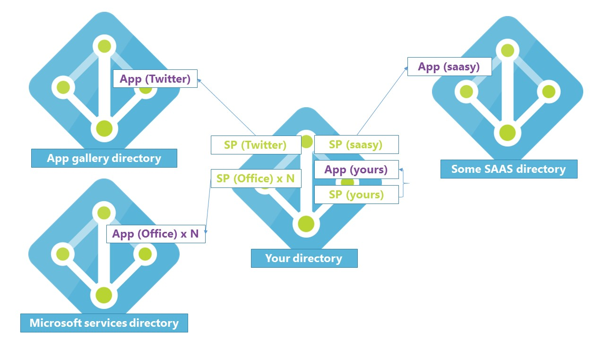

Your company is migrating a stock-tracking application to Azure Virtual Machines, as part of this migration the application needs to authenticate to various services and also access secrets using Azure Key Vault.

Your IT manager has stated that the application can't store credentials in it's configuration and you must look to use alternative resources for automatic authentication. This approach requires you to configure Azure Service Principals.

In this unit, you'll explore Azure Service Principals in more detail, the concept behind them and ways to work with service principals in the Azure platform.

## Overview of Azure Service Principals

In Azure service principals are a fundamental concept for authentication and access. Service principals are one of the underpinnings for the entire Microsoft platform whether you sign in to Azure, Office 365, or Dynamics 365, the first time you authenticate with your user credentials through Azure Active Directory (Azure AD) a service principal is created behind the scenes.

This workflow is important for automated services or applications, it's a common expectation that services or applications don't have unrestricted permissions, sign in as a user with full privileges or that credentials aren't stored in code. In Azure, service principals are used as a way to combat this as a key component of role-based access control (RBAC).

Access management in the cloud is crucial. RBAC enables you to manage who, or what has access to Azure resources, what resources they have access to, and what actions they can perform on these resources. The image below illustrates RBAC in Azure:

## What are Azure service principals

Service principals in Azure are effectively a security identity used by applications or services to access specific resources, similar to a service account or a username, password, or certificate for an application. They provide application governance when integrating or authenticating with Azure AD using secure communication.

Service principals are used with hosted services, automated tools, or applications. They give you the flexibility to only provision permissions or scope to run a specific scheduled task in a predefined set of Azure resources. This access method is known as the **least privilege principle**.

In essence, service principals are an easier way to manage accounts or credentials for your applications, with simplicity for provisioning, monitoring, and managing.

## Working with service principals in Azure

For an application to be integrated with Azure AD, it's important to consider that the term application refers to more than just a line of business (LOB) or software application. In the context of Azure AD, an application is an object for authentication or authorization that is created consisting of two parts:

- **An application object**: An Azure AD application, that is a global representation of a LOB application for all tenants.
- **A service principal object**: Used to access resources secured by Azure AD, a local representation of a LOB application in a specific tenant.

  > [!NOTE]
  > To work with service principals in Azure an Azure AD application must be created. You'll cover this in the next section.

The relationship between the two parts is important to understand, the image below highlights the relationship workflow in the context of a multi-tenant application scenario:

A service principal can be created through a few different pathways:

- **The portal**: After creating an AD Application through App Registrations in Azure AD, the service principal is automatically created with the application.
- **Programmatically**: Using code to configure an application for AD authentication, first creating the AD application then creating the service principal, for example, using Powershell to create the application and the service principal with the [New-AzureRmADApplication](https://docs.microsoft.com/en-us/powershell/module/azurerm.resources/new-azurermadapplication?view=azurermps-6.13.0) and [New-AzureRmADServicePrincipal](https://docs.microsoft.com/en-us/powershell/module/azurerm.resources/new-azurermadserviceprincipal?view=azurermps-6.13.0) cmdlets.

In a multi-tenant scenario, your application needs a service principal object to be created for each tenant. These service principals are then associated to the application object in the home (or main) tenant. For example, You create an Azure AD application with a service principle in your Contoso tenant for your ArmChair application. Fabrikam are a consumer of the application but have their own tenant. When the Fabrikam administrator completes consent, a service principal object gets in their tenant with permissions granted as per the application configuration in the home tenant and is associated to the home tenant Azure AD application object.

## Azure Active Directory applications

Azure AD applications are required (in most scenarios) for working with service principals. Each application in Azure AD has one application object, which can be referenced by one or more service principals. Internally Microsoft maintains two directories for published applications the **Microsoft Services Directory** (Microsoft applications) and **App gallery directory** (third-party applications). When creating an application in Azure AD this sits in your own directory as part of the AD tenant.

The workflow for registering an application in Azure AD is as follows:

- Register a new application in Azure AD.
- A name must be assigned to the application, this is a display name for the app so does not need to follow Azure naming conventions although this is recommended to easily identify the application.
- An account type must be specified, this is from the list of supported account types dependent on the scenario for the application that is, single or multi-tenant.
- A redirect URI, this is an optional parameter but is typically required. There are two types available either **Web** or **Public Client**. It takes the form of a web link (https) but does not need to be a valid link unless selecting public client.
- The application is then registered with Azure AD.

## Assigning Application Roles

Azure AD applications must be assigned roles to work with other services, changes to an application object are also replicated to the service principal. The roles that can be assigned to the application determine which permissions and scope the application will ultimately have. Roles use the RBAC method and can be assigned with any of the available Azure AD built-in roles. The scope for permissions can be set at a high level and inherited down, such as subscription level, or at a low level of granularity on a dedicated resource. The permissions are inherited down from the level of scope set, for example, if you assign the reader role on a resource group read permissions are assigned to all resources within that group. A tenant administrator can grant consent permissions for the application to the entire user directory.

Service principals have the contributor role by default, which includes full read and write permissions. It should be noted, however, that the service principal doesn't have permissions to access Azure resources until they're actively assigned.

Assigning permissions to an Azure AD application is done through API permissions, the APIs are then used to authenticate into Azure services. For example, assigning user impersonation permissions to Azure Key Vault grants the application full access to the key vault on behalf of the signed-in user.

Further information on permission assignment and best practice for your Azure AD application can be found [here](https://docs.microsoft.com/azure/active-directory/develop/v1-permissions-and-consent#types-of-permissions).

## Managing keys and permissions

When working with service principals through an Azure AD application there are several parameters required to successfully authenticate a request, be that service-to-service or from a custom application. The required things are:

- **The Tenant ID (Directory ID)**: The unique ID for the subscription.
- **The Application ID**: The unique ID to identify your Azure AD application.
- **An Authentication key**: The token needed to authenticate with the service principal.

Following permission assignment for the application needs to have credentials assigned for requests to be authenticated. The credentials allow the application to identify itself to the authentication service when a token is received through a request. Keys can take two forms:

- **A certificate**: Commonly referred to as a public key, the same in form as a certificate used for website security.
- **A client secret**: A complex secret string or application password.

  > [!NOTE]
  > Remember to copy and securely store the client secret. When a client secret is generated the authentication key value is only displayed at the time of creation. In the portal this is on saving, programmatically this is returned in the response.

Authentication requests using a service principal are directed through Azure Resource Manager. Azure Resource Manager is the main deployment and management tool for Azure environments. You'll learn more about Azure Resource Manager later in this module.