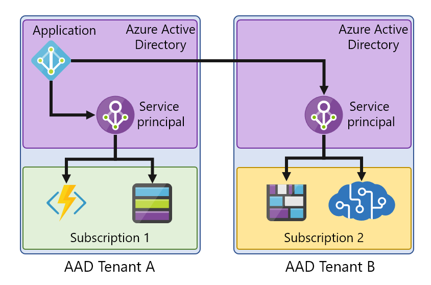
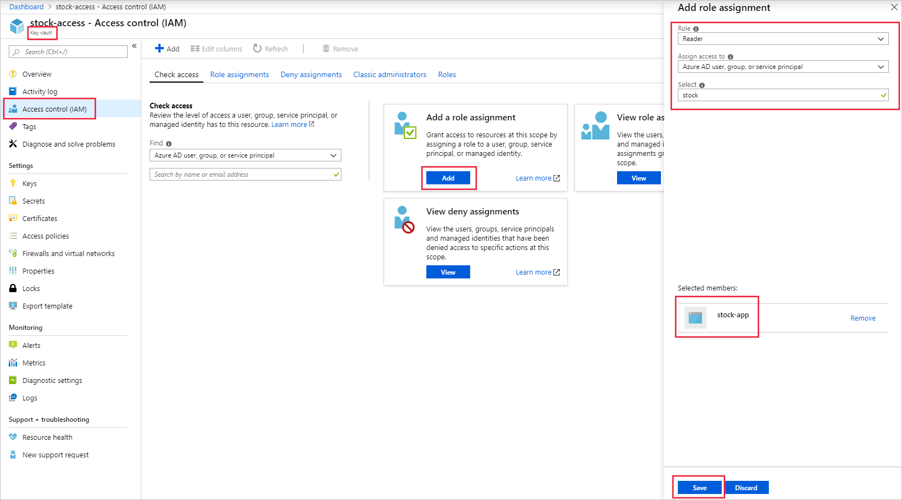

Your company has several on-premises applications used by its staff in the day-to-day running of the business. Recently, the company completed an enterprise-wide security assessment and audit. The results of the audit highlighted a design flaw in several applications. Username and password credentials were stored, either in application source code, or in the associated configuration files. 

The report indicated the following security issues with storing usernames and passwords in code, or within configuration files:

- Passwords were stored in plain text, making them accessible to anyone
- Compromised user credentials expose the network security of your enterprise domain
- Compromised user credentials allow access to sensitive resources, like your sales and marketing data
- Creates an unnecessary technical debt in updating and redeploying the application when credentials expire
- Tethers the application to only on-premises usage, preventing it from scaling to cloud usage without significant changes

As the developer, you've been asked to fix the issues identified. The report suggested using Azure service principals to improve application security.

In this unit, you'll explore Azure service principals in more detail, the concept behind them, and how to implement them to access Azure resources.

## What are Azure service principals?

Think of an Azure service principal as a proxy account, or identity, that represents your app or service. This *account* is managed by Azure Active Directory (Azure AD), and you grant it access to the Azure resources you need. Use the service principal instead of embedding credentials, or creating a dummy account for your app. Service principals exist at the tenant level in Azure, and are used to grant access to resources in that tenant.

In the Azure portal, you'll create an Azure AD application to represent your app. This application object is then associated with a service principal. You'll only need to associate one service principal if all the resources are in the same tenant. If your app needs access to Azure resources in a different tenant, you'll require a service principal for each of them.

You create your service principal:

- Through the portal
- Using PowerShell
- Through CLI commands
- With API calls

## Using Microsoft identity platform in your applications

Microsoft identity platform simplifies the way your application authenticates with your Azure AD. It provides a unified way to authenticate your apps. When an application successfully authenticates against Azure AD, it's given a unique token. This token is used each time your application makes a call to an API, or to access a service. To build an application, use the Microsoft Authentication Library (MSAL) to provide single sign-on support.

While there are several ways to provision an application for Microsoft identity platform, you'll focus on using the portal to register an application in Azure:

- Sign in to the Azure portal, and select **Azure Active Directory**.
- Select **App registrations**, and in the top left, select **New registration**.

- Enter a display name for the app, one that doesn't need to follow Azure naming conventions.
- Supported account types must be specified. Choose from:
  - Accounts within your company's active directory
  - Accounts in any company's active directory using Azure 
  - Any organizational accounts and personal accounts, such as Microsoft or XBox
- A **redirect URI** is an optional parameter. Two types are available: **Web** or **Public Client**. A redirect URI takes the form of a web link (https) but doesn't need to be a valid link unless you're selecting a public client.
- The application is then registered with Azure AD and has a service principal associated with it.

## Assigning application roles

Azure AD applications must be assigned roles to work with other services. Azure uses role-based access control (RBAC) to tightly manage access to Azure resources and what can be done with them. The roles assigned to the application determine which permissions and scope the application will have.

RBAC permissions are inherited from the level of the scope set. For example, if you assign the reader role on a resource group, read permissions are assigned to all resources within that group.

Use the Azure portal to assign the required roles for your app to access the key vault by:

- Selecting your key vault in the portal.
- On the left, select **Access Control (IAM)**.
- Select **Add** from the **Add a role** assignment pane.
- Choose the role you need.
- Accept the default **assign access to** option: Azure AD user, group, or service principal.
- Search for your created application; it won't appear in the drop-down. Select the application, and then select **Save**.

## Managing keys and permissions

To access Azure resources with service principals, you need two parameters to successfully authenticate the requests:

- **Directory (tenant) ID**: the unique ID for the Azure AD tenant.
- **Application (client) ID**: the unique ID to identify your Azure AD application.

For requests to be authenticated, the application needs to have credentials created. The credentials allow the application to identify itself. Choose from two forms:

- **Certificate**: commonly referred to as a public key, you'll need to generate it locally, and then upload the .cer, .pem, or .crt file.
- **Client secret**: a complex secret string generated in Azure, also known as an application password.

Whether you opt to use a client secret or a certificate, you need to define when it will expire. The expiry varies depending on your organization, but it's good practice to pick one or two years.

> [!NOTE]
> Certificates can expire so, for the best security, the client secret should be set to expire. Managing these credentials is a downside of an app accessing Azure resources via a service principal.

## When to use service principals

You only need to use the above manual process of creating Azure AD applications, associating service principals, and granting access to resources, in two specific scenarios:

- When your application or service is running on-premises.
- The resources or applications you need access to don't support managed identities.

The most secure and convenient way for you to handle authentication within Azure is to use managed identities.
