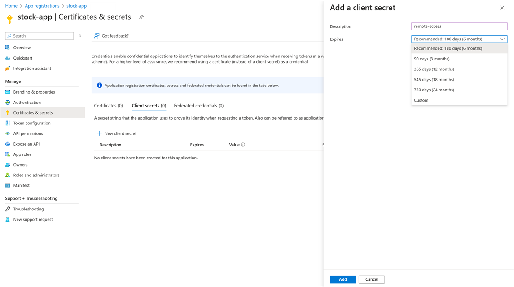

Your company's staff uses several on-premises applications in the daily running of the business. Recently, the company completed an enterprise-wide security audit. The audit highlighted a design flaw in several applications. The audit found usernames and passwords stored in either application source code or associated configuration files.

The report indicated the following security problems with storing usernames and passwords in code or in configuration files:

- Passwords stored in plain text are accessible to anyone.
- Compromised user credentials threaten the network security of the enterprise.
- Compromised user credentials allow access to sensitive resources like sales and marketing data.
- The current credential-storage approach creates unnecessary overhead. Applications need to be updated and redeployed when credentials expire.
- The current credential-storage solution restricts the application to on-premises. The application can't scale to cloud usage without significant changes.

As the developer, you've been asked to fix these problems. The audit report suggested using Azure service principals to improve application security.

In this unit, you'll explore Azure service principals in more detail. You'll learn the concept behind them and find out how to implement them to access Azure resources.

## What are Azure service principals?

Think of an Azure service principal as a proxy account—or identity—that represents your app or service. Microsoft Entra ID manages this account. You grant the service principal access to the Azure resources that you need. Use the service principal instead of embedding credentials or creating a dummy account for your app.

Service principals exist at the tenant level in Azure. They're used to grant access to resources in that tenant.

In the Azure portal, you can create a Microsoft Entra application to represent your app. You can then associate this application object with a service principal.

If all of the resources are in the same tenant, then you need to associate only one service principal. If your app needs access to Azure resources in a different tenant, then you need a service principal for each tenant.

You can create your service principal using any of the following options:

- Through the portal
- By using PowerShell
- Through CLI commands
- By using API calls

## Use Microsoft identity platform in your applications

The Microsoft identity platform simplifies the way your application authenticates with Microsoft Entra ID. It provides a unified way to authenticate your apps. When an application successfully authenticates with Microsoft Entra ID, it receives a unique token. The application uses this token each time it makes a call to an API, or a call to access a service. To build an application, use Microsoft Authentication Library (MSAL) to provide single sign-on support.

You can provision an application for Microsoft identity platform in several ways. Here, we'll use the portal to register an application in Azure.

1. Sign in to the Azure portal and select **Microsoft Entra ID**.

1. Select **App registrations**.

1. In the upper-left corner, select **New registration**.

    

1. Enter a display name for the app.

1. Specify any of the supported account types. You can choose from:
   - Accounts within your company's Microsoft Entra tenant.
   - Accounts in any company's Microsoft Entra tenant.
   - Any organization accounts and personal accounts, such as Microsoft or Xbox.

1. (*Optional*) Choose a **redirect URI** parameter. The two available types are **Web** and **Public Client**. A redirect URI takes the form of a web link (HTTPS). The link doesn't need to be valid unless you select a public client.

When you finish the steps, the application is registered with Microsoft Entra ID. It's also associated with a service principal.

## Assign application roles

Microsoft Entra applications must be assigned roles to work with other services. Azure uses role-based access control (RBAC) to tightly manage access to Azure resources and manage how those resources are used. An application's roles determine its permissions and scope.

RBAC permissions are inherited from the level of the scope set. For example, if you assign the reader role to a resource group, read permissions are assigned to all resources within that group.

Use the Azure portal to assign the roles that your app needs to access the key vault:

1. In the portal, select your key vault.
1. On the left, select **Access Control (IAM)**.
1. Select **Add role assignment**.
1. Choose the role that you need.
1. On the **Members** tab, accept the default **Assign access to** option: User, group, or service principal.
1. Select **+ Select members**.
1. Search for and select your application.
1. Select **Review + assign**.

## Manage keys and permissions

To access Azure resources by using service principals, you need two parameters:

- **Directory (tenant) ID**: Unique ID that identifies the Microsoft Entra tenant.
- **Application (client) ID**: Unique ID that identifies your Microsoft Entra application.

To authenticate requests, the application needs credentials. The credentials allow the application to identify itself. You can choose from two forms of credentials:

- **Certificate**: You generate a certificate locally, and then upload the *.cer*, *.pem*, or *.crt* file. A certificate is commonly referred to as a public key.
- **Client secret**: This complex secret string is generated in Azure. A client secret is also known as an application password.

Whether you use a client secret or a certificate, you need to define when this credential will expire. The expiry varies by organization, but it's a good practice to pick one or two years.

> [!NOTE]
> Because certificates can expire, set the client secret to expire for the best security. Managing these credentials is a downside of apps that use a service principal to access Azure resources.

## When to use service principals

We've now explored the manual processes to create Microsoft Entra applications, associate service principals, and grant access to resources. You use these manual processes in only two scenarios:

- Your application or service is running on-premises.
- The resources or applications that you need to access don't support managed identities.

The most secure and convenient way to handle authentication within Azure is to use managed identities.
