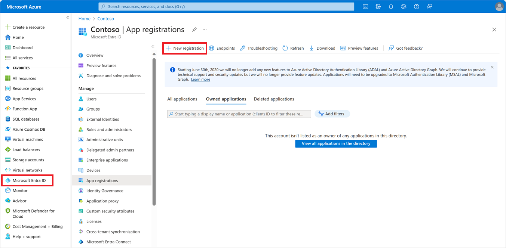

Your company is migrating parts of its stock-tracking application to Azure Virtual Machines. As part of this migration, the on-premises application needs to authenticate to various Azure services to access secrets using Azure Key Vault.

Your company mandates that applications can't store usernames and passwords in their configuration files – you must use alternative methods of authentication. Service principals allow applications hosted outside Azure to be given privileges to access resources inside Azure. You've been asked to set up and configure a service principal for your app.

In this unit, you'll explore Azure service principals in more detail, the concept behind them, and how to implement them to access Azure resources.

## Overview of Azure service principals

In Azure, **security principals** are a fundamental concept for authentication and access. Security principals are one of the underpinnings for the entire Microsoft platform, whether you sign in to Azure, Office 365, or Dynamics 365. Use your **user principal** when you authenticate with user credentials through Azure Active Directory (Azure AD). For applications and services, you'll use a **service principal**.

You use role-based access control (RBAC) to manage who, or what, has access to Azure resources – and what actions they can do on these resources. Your company's app requires access to the Azure Key Vault. You'll need to create a service principal, and assign roles to it that give the correct permissions to the key vault.

## What are Azure service principals?

Azure service principals are effectively a security identity used by apps or services with tightly controlled permissions. A service principal should do a narrow set of operations, unlike the permissions that you'd grant to a user.

In the Azure portal, you'll create an application object to represent your on-premises app. This application object is then associated with a service principal. If your app needs access to other Azure tenants, additional service principals can be added.

In essence, service principals are an easier way to manage credentials for your applications, controlling what the app can access within Azure.

## Working with service principals in Azure

In the context of Azure AD, an application is an object for authentication or authorization that's created, consisting of two parts:

- **An application object**: An Azure AD application that's a global representation of a LOB application for all tenants.
- **A service principal object**: Used to grant access to resources secured by Azure AD for your app – think of it as an instance of the application object granted access in a specific tenant.

  > [!NOTE]
  > To work with service principals in Azure, an Azure AD application object must be created first. You'll cover this in the next section.

A service principal can be created in two ways:

- **The portal**: After you create an AD Application through App Registrations in Azure AD, the service principal is automatically created with the application.
- **Programmatically**: Uses code to configure an application for AD authentication, first creating the AD application object then creating the service principal. For example, using PowerShell to create the application and the service principal with the [`New-AzureRmADApplication`](https://docs.microsoft.com/en-us/powershell/module/azurerm.resources/new-azurermadapplication?view=azurermps-6.13.0) and [`New-AzureRmADServicePrincipal`](https://docs.microsoft.com/en-us/powershell/module/azurerm.resources/new-azurermadserviceprincipal?view=azurermps-6.13.0) cmdlets.

## Microsoft Identity platform applications

The recently released Microsoft Identity platform is an evolution of the previous Azure AD developer platform. Each application has one application object, which can be associated with one or more service principals.

The workflow for registering an application in Azure is:

- Sign in to the Azure portal, select **Azure Active Directory**.
- Select **App registrations**, and in the top left, select **New registration**.
- Enter a name for the application – this is a display name for the app that doesn't need to follow Azure naming conventions.
- Supported account types must be specified. Choose from:
  - Accounts within your company's active directory,
  - Accounts in any company's AD using Azure, or
  - Any organizational accounts and personal accounts – such as Microsoft or XBox.
- A **redirect URI** is an optional parameter. Two types are available – **Web** or **Public Client**. A redirect URI takes the form of a web link (https) but doesn't need to be a valid link unless you're selecting a public client.
- The application is then registered with Azure AD and has a service principal associated with it.

## Assigning application roles

Azure AD applications must be assigned roles to work with other services, and changes to an application object are also replicated to the service principal. The roles assigned to the application determine which permissions and scope the application will ultimately have. The scope for permissions can be set at a high level and inherited down – such as subscription level – or at a low level of granularity on a dedicated resource.

Permissions are inherited down from the level of scope set. For example, if you assign the reader role on a resource group, read permissions are assigned to all resources within that group. A tenant administrator grants permissions for the application to the entire user directory.

You can use the Azure portal to assign the required roles for your app to access the Key Vault by:

- Selecting your key vault in the portal.
- On the left, select **Access Control (IAM)**.
- Select **Add** from the Add a role assignment pane.
- Choose the role you need.
- Accept the default **assign access to** option: Azure AD user, group, or service principal.
- Search for your created application – it won't appear in the drop-down – select it, and then select **Save**.

## Managing keys and permissions

To access Azure resources with service principals, several parameters are required to successfully authenticate the requests. The required information is:

- **Directory (tenant) ID**: The unique ID for the subscription.
- **Application (client) ID**: The unique ID to identify your Azure AD application.

The application needs to have credentials created for requests to be authenticated. The credentials allow the application to identify itself. Choose from two forms:

- **Certificate**: Commonly referred to as a public key, you'll need to have generated it locally, and then upload the .cer, .pem, or .crt file.
- **Client secret**: A complex secret string generated in Azure, also known as an application password.

Whether you opt to use a client secret or a certificate, you need to define when it will expire. This will vary depending on your organization, however it is good practice to pick one or two years.

> [!NOTE]
> Certificates can expire, and for the best security, the client secret should be set to expire. Managing these credentials is a downside of an app accessing Azure resources via a service principal.