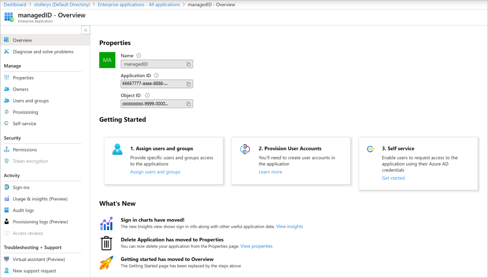

Azure managed identity is a feature of Azure Active Directory that you can use free of charge. This feature automatically creates identities to allow apps to authenticate with Azure resources and services.

Your company is moving all its applications from on-premises servers to Azure hosted virtual machines. As on-premises applications, they authenticate to Azure with service principals. Now you're hosting the application on virtual machines in Azure, you can use managed identities.

In this unit, you'll explore the managed identity feature, see how it works, and what resources you can access in Azure.

## What are managed identities in Azure?

You use managed identities to authenticate any Azure service that supports it, without actual authentication credentials appearing in code. This feature provides a way to solve the problem by granting an automatically managed identity, a service principal you use to authenticate to Azure services. A managed identity combines Azure AD Authentication and Azure role-based access control (RBAC). For system-assigned identities, it's as easy as switching on a toggle.

With managed identities, there's no need for credential rotation or concern over expiring certification. Azure handles credential rotation and expiration for you in the background. When you've configured an application to use a managed identity, you keep calling the service, using the provided token.

The term Managed Service Identity (MSI), which still exists in some client libraries, has been replaced by managed identities for Azure resources.

## How managed identities work

When you work with managed identities, it's important to know about some terms that are commonly referred to:

- **Client ID**: is a unique ID linked to the Azure AD application and service principal created when the identity is provisioned
- **Object ID**: refers to the service principal object of the managed identity
- **Azure Instance Metadata Service**: is a REST API, which is enabled when a VM is provisioned using Azure Resource Manager; the endpoint is only accessible from within the VM

The two different types of managed identity you can create are similar, but they're used differently.

### System-assigned identity

System-assigned identity is enabled directly on the Azure service instance; for example, on a VM. When that identity is enabled, Azure creates a service principal through Azure Resource Manager. The service principal is for the resource that's connected to the information about the managed identity in the Azure AD tenant. For example, if you have two VMs, managed identity has to be enabled on each one. The status of the managed identity is directly linked to the status of the resource. If the resource is deleted, so is the managed identity. A resource can only have one system-assigned managed identity.

### User-assigned managed identity

User-assigned managed identity is created as a standalone Azure resource, that's independent of any app. When provisioned, Azure creates a service principal in the same way as a system-assigned identity. However, a user-assigned identity isn't tied to a specific resource, so can be assigned to more than one application. For example, if you have a web app deployed on 10 front-end VMs, you'd create a user-assigned managed identity for the app, and associate it with all 10 VMs. If you used system-assigned identity, you'd need 10 identities, and then have to manage the access for each one.

## Using managed identities with Azure resources

You're stock-tracking application retrieves the database credentials from an Azure key vault. When the application was running on-premises, it used a service principal and certificates to access credentials in the vault. Now that you're hosting the VM on Azure, you can use a system-assigned identity instead.

You can use the Azure portal to go to the VM that's hosting the app. On the overview page, under Settings, you'll see there's an **Identity** item. By selecting this item, you'll get the choice of assigning a system-assigned or user-assigned identity. You just need to change the status to **On**. Save the changes and you're reminded that the server will be registered with the Azure Active Directory, and you can grant permissions to resources there.

You can always see the current managed identities for the subscription in your Azure Active Directory, on the Enterprise applications page. You'll see the overview page where you can assign users and change permissions.

