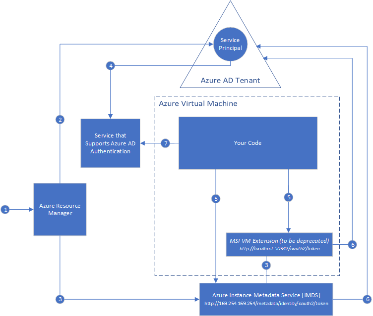
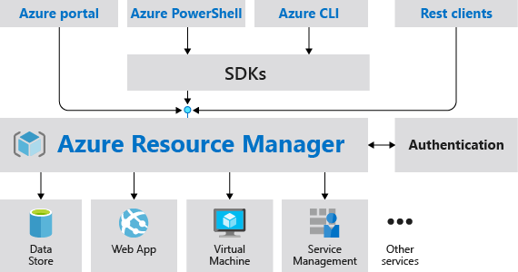

Your company wants to deploy a new line-of-business application located in Azure to the internal bookings team. The application needs to authenticate to various other resources within Azure to pull in content, however, at present that involves hard-coded authentication details with the applications code, which isn't the most secure as anyone viewing the code could easily obtain the details.

Your manager has asked you to look at removing the hard-coded authentication details from the applications code and reverting to using the more secure **Managed Identities** service within Azure.

In this unit, you will learn about the management of identity within Azure virtual machines and how it interacts with the Azure Resource Manager to form a more secure working environment for applications and their authentication secrets.

## Managed identity with Azure Windows Virtual Machines

Managed identity in a VM allows the easy accessing of multiple Azure resources automatically without the need to specify any additional credentials. This automatic access could include Azure Resource Manager, the Key Vault, Azure SQL, or even a non-azure AD resource using the Key Vault. Managed identities are useful in cloud applications as often they will require access to other Azure resources to work correctly. Rather than specifying actual credentials in the source code, managed identities allow an automatic authentication to happen in the background thus keeping your application as easy to use and secure as possible.

You can assign a managed identity to a VM either during its build time, or to an existing VM using the portal, Azure CLI, or Powershell script.



## Introduction to Azure Resource Manager

Azure Resource Manager is the main deployment and overall management tool for Azure environments. It is the central point where you would create, modify, and delete resources for your Azure subscription, as well as performing auditing, access control, and some security tasks. Your Azure environment can be managed via several tools, including the GUI, PowerShell, or the CLI, with each tool interacting with Resource Manager via the same API to ensure consistent results.



Several benefits of using Azure Resource Manager are:

- The ability to deploy, manage, and monitor all the resources that combine to make up your solution as a group rather than handling them individually
- The whole infrastructure and its deployment can be managed by templates instead of traditional scripts, this means you can deploy your solution time and time again knowing full well you will receive a consistent end result
- Access control can be deployed to all services in the chosen resource group to define roles and responsibilities using RBAC (Role-Based Access Control) which is integrated into the management platform
- Resources can be organized in an easy to understand fashion using tags

In addition to all the above benefits, Azure Resource Manager offers many other uses, in this case it is also the conduit for setting up and creating Azure-managed identities.

## Overview of identity in an Azure Windows VM

In the previous unit you learned about the two types of managed identity, a **system-assigned managed identity** and a **user-assigned managed identity**, both of them can be created with an Azure VM.

As a quick reminder:

- **A system-assigned identity** is enabled directly on the Azure service instance. When that identity is enabled, Azure creates an identity for that instance in the Azure AD tenant that is then trusted by the subscription of the instance. After the identity is created the credentials are provisioned on to that instance.
- A **user-assigned managed identity** is created as a standalone Azure resource. When initiated, Azure creates an identity in the Azure AD tenant that is trusted by the subscription in use. After the identity is created, it can be assigned to one of more Azure services as required.

In both scenarios, system-assigned and user-assigned managed identities are configured via the Resource Manager. The process flow for those tasks is:

- Azure Resource Manager receives a request to enable the managed identity on a VM
- Resource Manager then creates a service principal in the Azure AD for the identity of that VM within the tenant trusted by the subscription.
- Resource Manager configures the identity of the VM by updating the Azure Instance Metadata Service identity endpoint with the service principal client ID and certificate.
- Once the VM has its identity the new service principal information can be used to grant the VM access to Azure resource. For example, to give it access to Resource Manager, use RBAC (Role-Based Access Control) in Azure AD to assign the role to the VM service principal. Or for Key Vault, grant the code access to the required key or secret within the Key Vault.
- The code running on the VM can request an access token at any time from the Azure Metadata service endpoint, but only from within that VM by going to

    ```Text
    http://169.254.169.254/metadaata/identity/oauth2/token
    ```

    The resource parameter specifies the service to which the token is sent, for example if specifying to authenticate to Azure Resource Manager the code would be

    ```Text
    resource=https://management.azure.com/
    ```

- A call is then made to Azure AD to request an access token by using the Client ID and certificate. Azure AD returns a JSON Web Token (JWT) access token.

Once the configuration is done, accessing those resources will now be automatic with no need for additional credentials.

## Access control and authentication

Access control within Azure is handled using Role-Based Access Control (RBAC). RBAC is an authorization system built upon Azure Resource Manager and allows fine grained management of access to resources and ultimately what can be done with them. Some examples of what can be done using RBAC are, allowing support personnel access to manage virtual machine properties within a subscription. That same group may be restricted from managing the virtual machine networks, but a different group with the required access could.

Role-based access is used to form how permissions are formed and consist of three elements, those being, security principal, role definition, and a scope.

- **Security principal**: A security principal is an object that represents a user, group, service principal or in this case, a managed identity.
- **Role definition:** A role definition is a collection of permissions, such as a group called 'Full Access' who has read, write, and delete to an object or group. Azure has several predefined roles built in but additional roles can be created with permissions specific to the use case if necessary
- **Scope:** The scope is the set of resources or single resource that the access applies to. For example, a permission set could apply to a single VM only, or the resource group that contains that VM, which would grant access to all the VMs in that particular resource group.

RBAC checks and authenticates a user to a resource using the Azure Resource Manager, the process that the check follows is below:

- The user acquires a token for the Azure Resource Manager, this token includes details of the users group memberships.
- The user then makes a REST API call to the Azure Resource Manager with the token attached to it.
- Azure Resource Manager processes that call and identifies all the role assignments and deny assignments that apply to the resource that is being actioned upon
- Azure Resource Manager narrows the role assignments that apply to the user or group and determines what role they should have.
- The action in the API call is then matched to the roles the user has for the resource and if a match is found the action is completed, if the user does not have a role to grant the requested action or a Deny assignment exists then the action is not completed.

## Using managed identity in an application

An application running inside an environment such as a VM or Function App utilizing a managed identity, can use this identity to authenticate and access other resources.

This process involves a series of requests to the Azure Instance Metadata Service, which validates the identity associated with your app and generates a resource access token. Your app then sends this token to the resource to which it requires access, which authenticates the token. If the token is valid, the resource then verifies the token represents an identity that has the appropriate authorization rights to meet the request. If this test passes, your application can access the resource.

This process sounds complicated. Fortunately, much of the complexity can be hidden using the `AzureServiceTokenProvider` API in your code. An `AzureServiceTokenProvider` object retrieves the principal ID for your app and generates a resource access token. You specify the resource for which the access token should be generated using the `GetAccessTokenAsync` method, and provide the URI of the service hosting the resource. The C# example below generates a token for Azure storage.

```C#
AzureServiceTokenProvider azureServiceTokenProvider = new AzureServiceTokenProvider();
var token = await azureServiceTokenProvider.GetAccessTokenAsync("https://storage.azure.com/");
```

Other Azure Storage APIs can take this token and use it to authenticate and authorize access.
