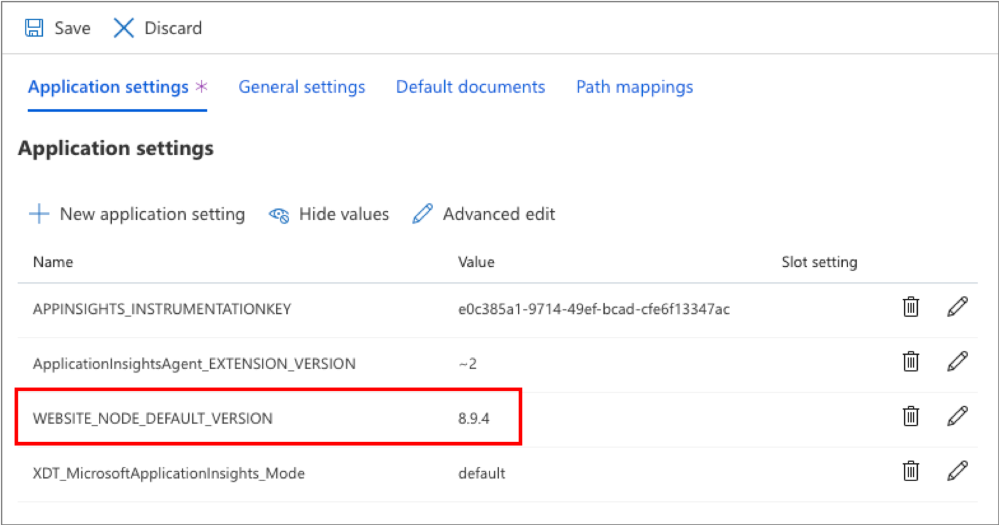

Suppose you are developing a photo sharing web app. You need your users to sign in, and be able to manage their own private folders, as well as being able to share folders and photos with other users. You do not want to create your own identity management and user authentication solution.

In this unit, you will lay the groundwork for this solution, by creating a basic Node.js web app, and deploying this app using the Azure App Service.

[!include]

### Create an App Service Plan

Start by creating an App Service Plan, ready for your web apps.

1. Sign into the [Azure portal](https://portal.azure.com/learn.docs.microsoft.com?azure-portal=true) using the same account you activated the sandbox with.
1. In the left menu in the portal, select **+Create a resource**.
1. In the marketplace search field, enter **App Service Plan** and then select the *App Service Plan* item from the dropdown list of search results. 
1. Select **Create** to open the **New App Service Plan** pane.
1. In the **New App Service Plan** pane, enter or select the following information:
    - App Service plan: **myAppServicePlan**
    - Subscription: Select **Concierge subscription**
    - Resource group: Select **Use existing**, and choose <rgn>[sandbox resource group name]</rgn>
    - Operating System: Select **Windows**
    - Location: Select a region near you, for the following list of sandbox regions. 

    [!include] 

1. Under **Pricing tier**, select **Change size**. In the Spec Picker window that appears, select the **Dev / Test** tab, select **F1**, then select **Apply**.
1. Select **Review and Create**, and then select **Create**.
1. Wait until the App Service plan has deployed before continuing with the exercise. You can verify status of the deployment through the notification bell icon on the top menu.

### Create a Web App

Now create a web app. Note that web app names must be unique across Azure, so you may need to add a random string to the app name.

1. In the left menu of the portal, select **+ Create a resource**, then in the **New** pane, select **Web**, and then select **Web App**.
1. In the **Web App** pane, enter or select the following information:
    - App name: **my-webapp-\<_random_number_\>**
    - Subscription: **Concierge subscription**
    - Resource group: Select **Use existing**, and choose <rgn>[sandbox resource group name]</rgn>
    - Publish: Keep the default selection
    - Runtime stack: Select Node 8.9
    - OS: Select **Windows**
    - App Service plan/Location: Ensure that **myAppServicePlan** previously created gets selected
    - Sku and size: Leave with default value
1. Select **Review and Create**, and then select **Create**.
1. Wait until the web App has deployed before continuing with the exercise. As you saw earlier in this exercise, you can verify status of the deployment through the notification bell icon on the top menu.

### Test a Web App

Before you do anything else, do a quick check that your web app has been successfully deployed.

1. In the left menu, click **Resource groups**, then click the available resource group, and then click your web app.
1. On the **my-webapp-\<_your_string_\>** pane, next to the URL for your app, select the **Click to copy** button.
1. Open a new browser tab, paste the URL that was copied to the clipboard, and press Enter.
1. Verify that you get the default page, and then close the browser tab.

### Verify Node.js version for the Web App

The app we'll deploy to the Web App is a Node.js app. To make sure it runs, we need to verify that the Node.js version is set for the Web App.

1. In the Web App pane in the portal, select **Configuration**.
1. Under **Application Settings**, verify that application setting for website node default version is set as seen below.

 

**Optional**

1. If application setting is not visible then select **+new application setting**.
1. In the new setting form, enter the following name and value for our new setting:
    - *Name* **WEBSITE_NODE_DEFAULT_VERSION**
    - *Value* **8.9.4**
1. Select **update** at the bottom of the page to update the list of settings. 
1. Select **Save** in the Configuration pane to save these changes.   

### Upload App Code

You'll now download a node.js Hello World zip from GitHub and modify it. You use Kudu to upload your modified application to Azure.

1. In your browser, go to https://github.com/Azure-Samples/nodejs-docs-hello-world/archive/master.zip.
1. Extract ZIP file to a local folder on your computer.
1. In the extracted files, locate **index.js**, and open this file using Notepad or other editor.
1. Change the string "Hello World" to "Welcome to my website!", and save the file.
1. Select all the files in the folder that contains index.js, and then zip these files to a new archive named **MyWebsite.zip**.
1. In a new browser tab, go to **https://my-webapp-\<_your_string_\>.scm.azurewebsites.net/ZipDeployUI**, replacing **\<_your_string_\>** with the string you used to make your app name unique.
1. On the Kudu ZipDeploy page, drag your **MyWebsite.zip** file onto the file items area.
1. Wait until you see a **Deployment successful message**.
1. Open a new browser tab, paste the URL for your web app, and press Enter.
1. Verify that you now see your customized welcome page that says *Welcome to my website!*

In this exercise, you deployed a basic Node.js web app that you'll use later with Azure App Service authentication.
