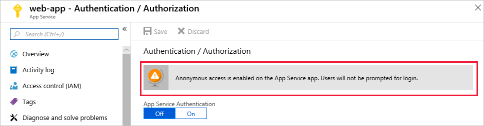
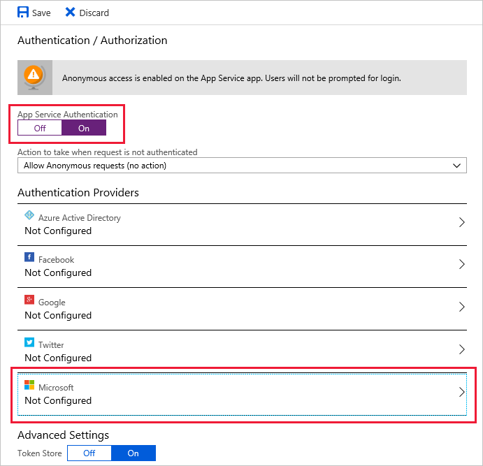
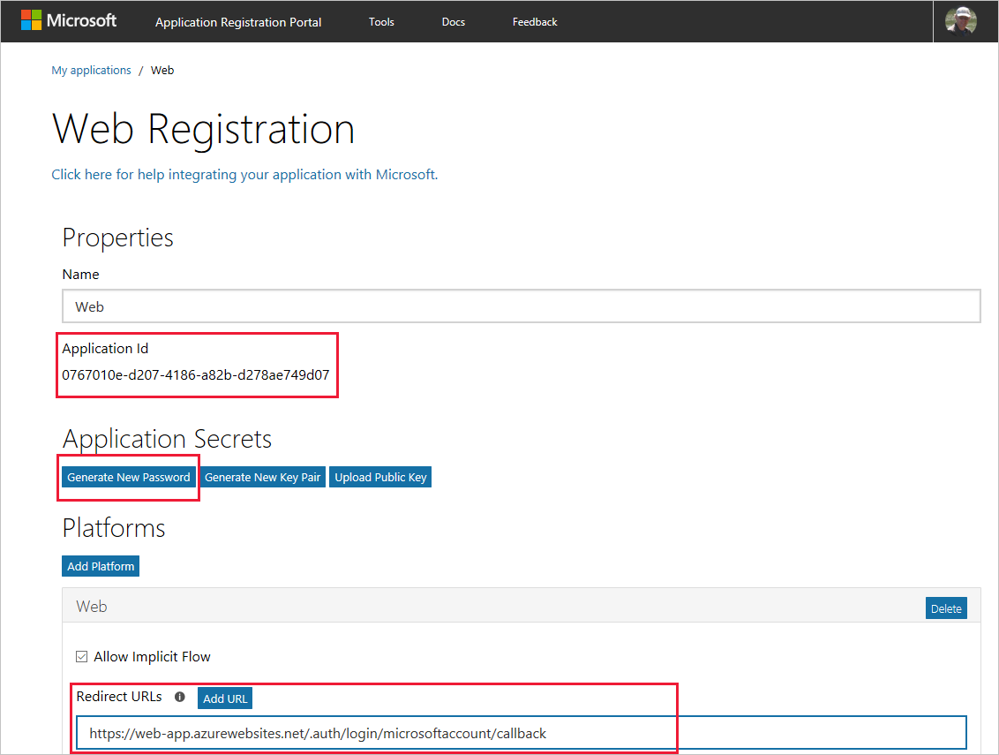
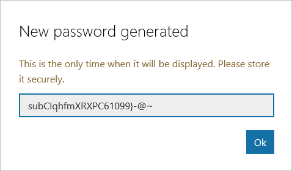
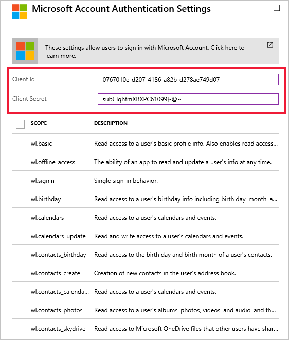
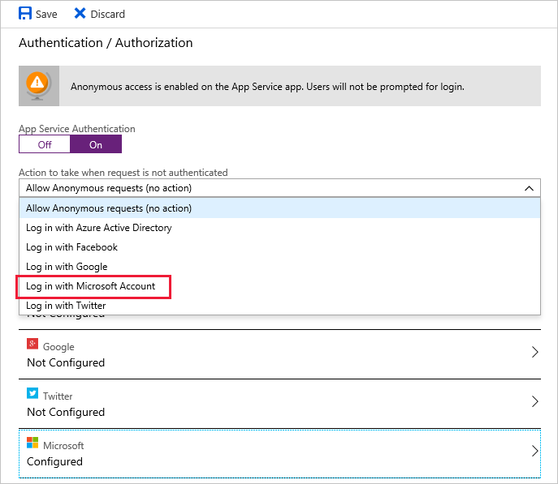

As the web administrator for an online clothing store, you have deployed a test app, and now you need to explore how different authentication providers can work with your applications. You have carried out a survey, and most of your customers have Microsoft accounts, so you will start by implementing a Microsoft login for your test web application. But you are also aware that some customers do not have a Microsoft account, so you need to be sure that other providers can also be supported concurrently.

We will take a look at authentication providers, and how to enable these providers in your web apps.

## Authenticated Users

An **authenticated user** is an identity that has successfully passed an authentication check using some form of credentials. This means the server or service knows with reasonable certainty who is using the service. Depending on the application, the authenticated user may then have been assigned specific user-related access rights to resources.

By contrast, anonymous access does not involve any account verification, and is often used to enable anyone to access public or non-sensitive information on a web site.

## Authentication Providers

An **authentication provider**, also sometimes called an **identity provider**, is a service that manages the authentication of a user with a set of stored credential information, which may include name, email address, password, bio-metric data, and so on. Examples of such services include Microsoft Accounts, Facebook identities, and Google sign-in. In addition to providing authentication to their own resources, authentication providers can support federated authentication by enabling trusted third-party services to make use of these authentication services. As a developer, such federation means that you do not have to write your own identity management and authentication code, nor do you have to support and secure the user credentials of all your users; this is all done by the authentication provider.

The Azure App service currently supports five authentication providers:

- Azure Active Directory
- Microsoft Account
- Facebook
- Google
- Twitter

## Authentication Flow

**Authentication endpoints** are specific app URIs for handling sign in, sign out, and other authentication operations. These endpoints can be called by your web app to initiate the authentication process, and to verify user identities while the app is being used. 

An **authentication token** is generated by the authentication provider, and may include information on the user's authentication status and a list of resources that the user may access. Whenever a user attempts to access a protected resource through their web browser, their security token is presented. The authentication service checks that the security token is valid by using the provider's sign-in endpoint, and if the security token is valid, the web app processes the user request.

Depending on whether you are doing everything within the browser, the authentication flow may differ slightly; for example, the authentication flow may vary between Javascript and a provider SDK for a language framework such as .NET.

In a browser script:
1. **Not authenticated**. User tries to access web app, but is not yet signed in.
1. **User sign-in**. Client is redirected to the federated Microsoft login page at `/.auth/login/<provider>`.
1. **Post-authentication**. The provider redirects the client to `/.auth/login/<provider>/callback`.
1. **Establish an authenticated session**. The Azure App Service adds an **authenticated** cookie to the response back to the client; this is the **AppServiceAuthSession** cookie.
1. **Deliver authenticated content**. The client includes the authentication cookie in subsequent requests (this is automatically handled by the browser).

Optional steps:
- **Obtain access token**. Use JavaScript in your web app to call the `/.auth/me` endpoint to get an access token; your app can use this token to access resources managed by Express, Graph, and other APIs.
- **Refresh token**. If the access token expires, use JavaScript in your app to call the `/.auth/refresh` endpoint, and then to call to the `/.auth/me` endpoint to obtain the refreshed token.
- **Sign out**. Provide a sign-out option in your app, by providing a link to the `/.auth/logout` endpoint.

When using a provider SDK, the steps are slightly different:
1. **User sign-in**. Client code is used to sign in the user with the provider's SDK, and the user's browser receives an authentication token.
1. **Post-authentication**. Client code sends the authentication token to `/.auth/login/<provider>` for validation.
1. **Establish an authenticated session**. The Azure App Service returns its own authentication token to client code.
1. **Deliver authenticated content**. Client code sends this authentication token within the `X-ZUMO-AUTH` header; (this is automatically handled by the client SDKs for Mobile Apps).

### Configuring an Authentication Provider

At the App Service level, you configure the way your apps will handle authentication.

- **App Service Authentication (OFF)**. This is the default setting, and means that authentication and authorization are not managed by the Azure App Service, and all client requests are allowed. Choose this option if you don't need authentication and authorization, or if you want to write your own authentication and authorization code.

- **App Service Authentication (ON)**. With authentication enabled, you can now set the default action if your app receives an unauthenticated client request by using the **Action to take when request is not authenticated** setting; the options are:

   - **Allow Anonymous requests (no action)**. With this setting, all requests are allowed. If a client has already been authenticated, App Service passes this authentication information to the app in the HTTP headers. If the client has not been authenticated, you will need to use app code to control what should happen next, such as redirection to the sign-in endpoint to force authentication.

   - **Sign in with \<provider\>**. With this setting, the Azure App Service redirects all anonymous requests to `/.auth/login/<provider>` for the provider you choose. The effect of this setting is that only authenticated requests are allowed. You don't need to write any authentication code in your app.

There are specific configuration options for each Authentication Provider that you enable; for example, the Microsoft, Facebook, Google, and Twitter providers, all require some form of key or ID and client secret:

| Provider  | Key name  | Password name   | Configurable scope?  |
|---|---|---|---|---|
| Microsoft Account | Client ID  | Client Secret  | Yes  |
| Facebook  | App ID  | App Secret | Yes  |
| Google  | Client ID  | Client Secret  |  No |
| Twitter  | API Key  | API Secret  | No |

For Microsoft Account authentication, the **App Registration Portal** is used to generate the Client ID and Client Secret, referred to as Application ID and Password in the portal.

The Microsoft and Facebook providers also support configurable **scopes**, so you can choose how much user information your app can request to access; for example, you might want your app to be able to read a user's birthdate from their profile in order to generate special offer alerts. However, it is up the user to agree to such requests; your app cannot obtain this data without permission.

### Sign Out

If you want your users to be able to sign out of your application, you'll need to enable your app to send a `GET` request to the app's `/.auth/logout` endpoint. After this request has been sent:

- Authentication cookies will be cleared from the current session.
- The current user's tokens will be deleted from the token store (if used).
- For Azure Active Directory and Google, a server-side sign-out is initiated on the identity provider.

>Token store is covered in Unit 6.

Here's a simple sign-out link in a webpage:

```html
<a href="/.auth/logout">Sign out</a>
```

### Redirect URLs

A Redirect URL is used to control your app's authentication and post-authentication behavior. For example, after a successful sign-in, you typically want to ensure that your users are redirected to your app's default page. Similarly, if you provide a **Sign-out** link, you might want to redirect signed out users back to your app's sign in page, to give users the option to sign in again.

For Microsoft Account authentication, the **App Registration Portal** is used to register redirect URLs.

### Using Multiple Authentication Providers in Your Web App

The Azure portal doesn't have an option for supporting multiple providers, so you need to first configure each identity provider you want to enable, then in the **Action to take when request is not authenticated** setting, select **Allow Anonymous requests (no action)**.

In your web app, add a sign-in link to each of the providers you enabled (`/.auth/login/<provider>`). For example:

```html
<a href="/.auth/login/aad">Log in with Azure AD</a>
<a href="/.auth/login/microsoftaccount">Log in with Microsoft Account</a>
<a href="/.auth/login/facebook">Log in with Facebook</a>
<a href="/.auth/login/google">Log in with Google</a>
<a href="/.auth/login/twitter">Log in with Twitter</a>
```

## Steps to Configure Authentication Providers and Endpoints

The following information summarizes the key steps for configuring the Microsoft authentication provider and endpoints.

### Open the configuration settings for authentication

To enable authentication, open your web app in the Azure portal, and then go to the **Authentication / Authorization** pane; the default setting is **Anonymous access is enabled on the App Service app. Users will not be prompted for login**:



To enable authentication, under **App Service Authentication**, select **On**, and in the list of available Authentication Providers, select the provider you want to use, such as **Microsoft**:



### Create authentication endpoints

Go to the **App Registration Portal** at https://apps.dev.microsoft.com/, and add a new app. Make a note of the **Application ID**, and add **Web** as a platform:



In the **Redirect URLs** box, enter **https://<_your_app_name_\>.azurewebsites.net/.auth/login/microsoftaccount/callback**; be sure to include the period (.) before auth (/.auth/login).

Under **Application Secrets**, select **Generate New Password**, and copy the password from the popup window, and save it to a temporary location.



### Configure the Microsoft Authentication provider

Using the Azure portal, in the **Microsoft Account Authentication Settings** blade, enter the  **Application ID** from the Registration Portal into the **Client ID** box, and the **Application Password** into the **Client Secret** box, then save the authentication settings.



### Configure the Microsoft Authentication provider for Forced Authentication

If you want your app to force users to authenticate, then on the **Authentication / Authorization** blade in the Azure portal, under **Action to take when request is not authenticated**, select **Login with Microsoft Account**, and then save the authentication settings.



In this unit, you looked at the authentication providers supported by the Azure App Service, and how to enable these providers in your web apps. You looked at the steps required to use the Microsoft authentication provider with a web app, and also at how you would support other providers. You'll use this knowledge in the next Unit, when you add Microsoft authentication to a web app.
