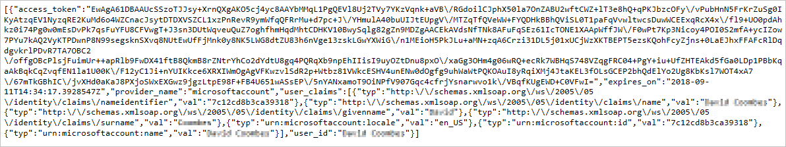
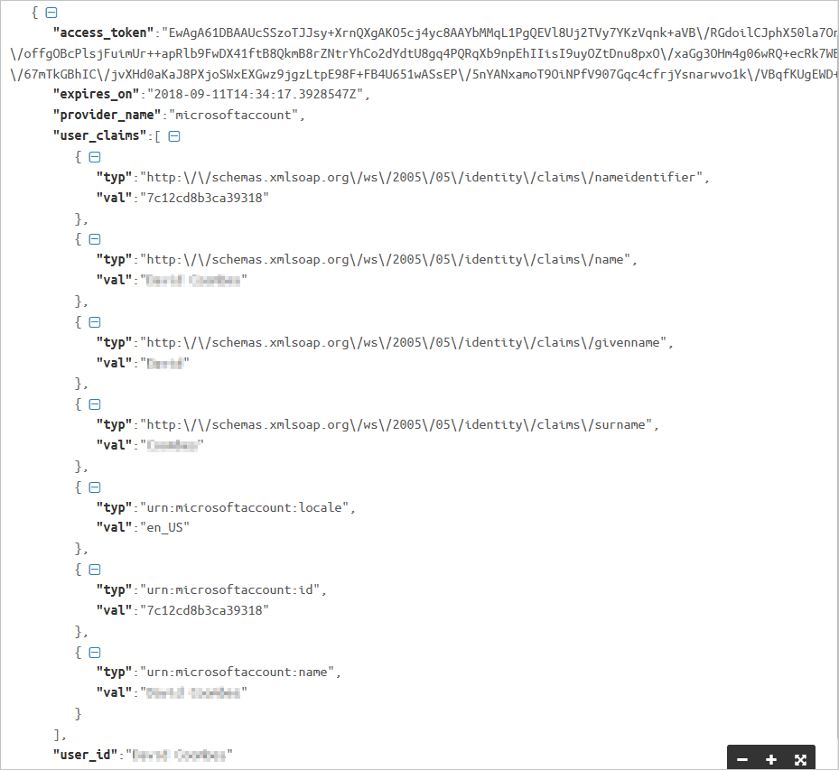
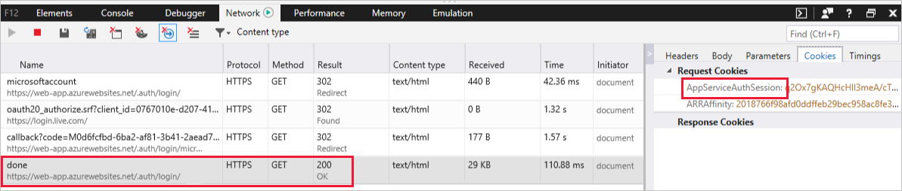

As the web administrator for an online store, you have now determined that the authentication services provided by the App Service are a good fit for your company. However, you are concerned that your customers may have worries around data privacy, so you want to ensure that your apps do not collect unnecessary information. You want to be sure that the authentication process is robust, but it is also easy to troubleshoot. Your apps are written in a range of languages, including .NET languages, Node, and Python, and you need your developers to be able to programmatically determine the type of authentication that is active for the current browser session.

We will take a look at how web apps can request user information during authentication, and how you can control this behavior. You will also look at authentication tokens, how they are used, and how you can use code in your apps to check for, and respond to, these tokens.

## Authentication tokens

An authentication or security token is a method for authenticating user requests to access resources. After authenticating to an identity service, a token is generated, and this token is then presented to any secure resource that the user wants to access. The resource checks with the identity service that the security token is valid before processing the user request. The token may include information on which resources the user is permitted to access.

As an analogy, a security token is a bit like an employee's security pass; the employee has to first pass security checks in order to obtain the pass (authenticate), and then presents the pass (token) to obtain access to particular rooms or workplace areas. At any time, security personnel may check back with the issuer of the pass, in order to confirm its validity.

### App Service Tokens

The security tokens used by the Azure App Service are in **JSON Web Token** (JWT) format. JWT is an open standard, and is used to create tokens that assert one or more **claims**. For example, if you are a web server administrator, when you authenticate to the server, a token might be generated that includes a claim *authenticated as server admin*. Your browser, or other client, then presents this token whenever it needs to assert or prove that it has *admin* authority. 

To verify that tokens are legitimate, they are signed by the identity provider's private key; the resource that the user attempts to access will have the provider's public key, and can therefore check that the token has been issued by the provider. Because JWT tokens are text files, in JSON format, parts of the token may also be encrypted using these keys to protect their content.  

The App Service uses specific tokens for particular purposes, so there are distinct tokens for verifying a user ID (**ID token**), asserting access permissions (**access token**), and after a token has expired then been refreshed (**refresh token**).

### Token store

The Azure App Service includes a **token store**, which can be used to hold tokens associated with your web app users. This store is enabled by default when you enable authentication with any provider. The token store caches tokens for use during the lifetime of an authenticated session only, and tokens are only accessible by the user that is associated with the token. 

In order to make use of the token store, you need to include code in your web app so that the app can retrieve, store, and refresh tokens. The token store can be disabled, if your app doesn't use tokens.

### Claims and Headers

In your web app, you might want to make use of the user claims within a token, such as *authenticated as admin*, *user principal name*, or *user email address*. One way to achieve this is through the HTTP request headers. For all supported language frameworks, the Azure App Service makes these claims available to your code by injecting them into the request headers; for example:

- `X-MS-CLIENT-PRINCIPAL-NAME`
- `X-MS-CLIENT-PRINCIPAL-ID`

You can view the available claims by using a web browser, and going to your app's `/.auth/me` endpoint. You should now be able to see various elements in the token, including:
- access_token
- expires_on
- provider_name
- user_claims
- user_id

If you expand **user_claims**, you'll see a list of the claims that have been returned; these claims might include:
- nameidentifier
- name
- givenname
- surname
- microsoft account: locale
- microsoft account:ID
- microsoft account: name

For browser-based apps, your app code can also check for the existence of an **AppServiceAuthSession** cookie; this cookie is only set after a successful authentication.

How you can use this information in your app depends on what app environment you are using. For example, when using Node.js, there are various JSON packages that you can use with your app to query header, token, and cookie information. If you are using .NET, or Python, you can use code to query authentication tokens.

## Procedures for Working with Authentication Tokens

There are several common procedures that you can use to help manage, test, and configure how your apps use authentication tokens.

### View Authentication Token in a Browser

When using Node.js, you can return the authentication token by using the following app code:

 ```javascript
var server = http.createServer(function(request, response) {

        response.writeHead(200, {"Content-Type": "text/html"});
        response.write("<a href='/.auth/me'>View token</a>");  
        response.end();

    });

```
The token is now displayed in the browser:



To view the token in an easier to read format, you can use a JSON viewer service, Visual Studio tools, or browser dev tools:



### Configure Provider Scope

The Microsoft authentication provider has a configurable scope, which enables you to select whether your app can request access to the following information:

- Basic profile info, including contacts list.
- Birthday info including birth day, month, and year.
- Calendars and events.
- Birth day and birth month of a user's contacts.
- Media, such as photos, videos, and audio, and their associated comments and tags.
- OneDrive files that other users have shared with the user.
- Personal, preferred, and business email addresses.
- Personal, business, and mobile phone numbers.
- Postal addresses.
- Employer and work position information.
- OneNote notebooks stored in OneDrive.

To protect user information from potential app access, either restrict the items in the scope, or turn off the scope completely.

To configure the Microsoft provider scope, so that your app can request additional user information, use the Azure portal, and select the **Microsoft** provider. You can now select the **Scope** checkbox, and choose the elements that you app can request permission to access.

Depending on how much information the user entered in their Microsoft Account profile, when you now view the JSON token, there may be additional items, such as **emailaddress** available.

### Use Dev Tools to View the AppServiceAuthSession Cookie

You can use your browser's developer tools to check for the AppServiceAuthSession cookie; this cookie is only set after successful authentication. For Microsoft Edge, Internet Explorer, and Chrome, press F12 to open the developer tools console.

Then, in the developer tools console, look for the cookies option; for example, in Microsoft Edge, cookies are an option when the network is selected. When you successfully authenticate to the web app (**200 OK** message), the **AppServiceAuthSession** cookie will be created.



In this Unit, you looked at authentication tokens, how they are used, and how you can use code in your apps to check for, and respond to, these tokens. You also looked at how web apps can request user information during authentication, and how you can restrict the amount of information an app can request to access. In the next Unit, you'll work with your app to manage tokens, as well as managing the scope of user claims for the Microsoft provider.
