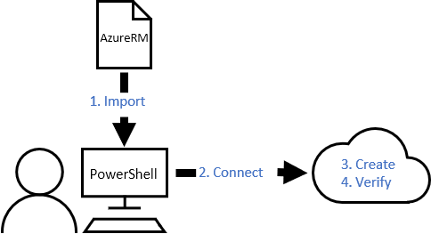

## Motivation
Azure PowerShell lets you write commands and execute them immediately. This is known as **interactive mode**.

Recall that the overall goal in the Customer Relationship Management (CRM) example is to create three test environments containing VMs. You will use resource groups to ensure the VMs are organized into separate environments: one for unit testing, one for integration testing, and one for acceptance testing. You only need to create the resource groups once, which means using the interactive mode of PowerShell is a good choice.

This section shows you how to use PowerShell interactively to login to your Azure subscription and create resource groups.

## What are PowerShell cmdlets?
A PowerShell command is called a **cmdlet** (pronounced "command-let"). A cmdlet is a command that manipulates a single feature. The term **cmdlet** is intended to imply "small command". By convention, cmdlet authors are encouraged to keep cmdlets simple and single purpose.

The base PowerShell product ships with cmdlets that work with features such as sessions and background jobs. You add modules to your PowerShell installation to get cmdlets that manipulate other features. For example, there are third-party modules to work with ftp, administer your operating system, access the file system, etc.

Cmdlets follow a verb-noun naming convention; for example, **Get-Process**, **Format-Table**, and **Start-Service**. There is also a convention for verb choice: "get" to retrieve data, "set" to insert or update data, "format" to format data, "out" to direct output to a destination, etc.

Cmdlet authors are encouraged to include a help file for each cmdlet. The **Get-Help** cmdlet displays the help file for any cmdlet:

```
Get-Help <cmdlet-name> -detailed
```

## What is AzureRM?
**AzureRM** is the formal name for the Azure PowerShell module containing cmdlets to work with Azure features (the **RM** in the name stands for **Resource Manager**). It contains hundreds of cmdlets that let you control nearly every aspect of every Azure resource. You can work with resource groups, storage, virtual machines, Azure Active Directory, containers, machine learning, etc.

## How to create a resource group
Next we'll create a resource group using a local installation of Azure PowerShell. 

There are four steps: 
1. Import the Azure cmdlets
1. Connect to your Azure subscription
1. Create the resource group
1. Verify that creation was successful (see below).



Each step corresponds to a different cmdlet.

### Import
At startup, PowerShell loads only the core cmdlets by default. This means the cmdlets you need to work with Azure won't be loaded. The most reliable way to load the cmdlets you need is to import them manually at the start of your PowerShell session.

You use the **Import-Module** cmdlet to load modules. This cmdlet has many parameters to handle a variety of situations. For example, it can load multiple modules, a specific module version, part of a module, etc. To load the entirety of one module, the syntax is simply:

```powershell
Import-Module <module-name>
```

> [!TIP] If you find that you work with Azure PowerShell frequently, there are two ways you can automate the module-loading process. You can add an entry to your PowerShell profile to import the Azure module at startup or use the latest versions of PowerShell which loads the containing module automatically when you use a cmdlet.

### Connect
Since you are working with a local install of Azure PowerShell, you will need to authenticate before you can execute Azure commands. The **Connect-AzureRmAccount** cmdlet prompts for your Azure credentials and then connects to your Azure subscription. It has many optional parameters, but if all you need is an interactive prompt, then no parameters are needed:

```powershell
Connect-AzureRmAccount
```

### Create
The **New-AzureRmResourceGroup** cmdlet creates a resource group. You must specify a name and location. The name must be unique within your subscription. The location determines where the metadata for your resource group will be stored (which may be important to you for compliance reasons). You use strings like "West US", "North Europe", or "West India" to specify the location. As with most of the Azure cmdlets, **New-AzureRmResourceGroup** has many optional parameters; however, the core syntax is:

```powershell
New-AzureRmResourceGroup -Name <name> -Location <location>
```

### Verify
The **Get-AzureRmResource** lists your Azure resources. This is useful here to verify whether creation of the resource group was successful.

```powershell
Get-AzureRmResource
```

To get a more concise view, you can send the output from the **Get-AzureRmResource** to the **Format-Table** cmdlet using a pipe '|'.

```powershell
Get-AzureRmResource | Format-Table
```

## Summary
PowerShell's interactive mode is appropriate for one-off tasks. In our example, we'll use the same resource group for the lifetime of the project which means creating it interactively is reasonable. Interactive mode is often quicker and easier for this task than writing a script and executing that script exactly once.