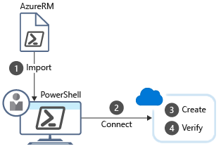

In **interactive mode**, PowerShell lets you write commands and execute them immediately.

Recall that the overall goal in the Customer Relationship Management (CRM) example is to create three test environments containing Virtual Machines. You use resource groups to ensure the VMs are organized into separate environments: one for unit testing, one for integration testing, and one for acceptance testing. You only need to create the resource groups once, so using the PowerShell interactive mode in this use case is a good choice.

When you enter a command into PowerShell, PowerShell matches the command to a *cmdlet*, then performs the requested action. First, we'll look at some common commands you can use, then we'll look into installing the Azure support for PowerShell.

## What are PowerShell cmdlets?

A PowerShell command is called a **cmdlet** (pronounced "command-let"). A cmdlet is a command that manipulates a single feature. The term **cmdlet** is intended to imply "small command." By convention, cmdlet authors are encouraged to keep cmdlets simple and single-purpose.

The base PowerShell product ships with cmdlets that work with features such as sessions and background jobs. You can add modules to your PowerShell installation to get cmdlets that manipulate other features. For example, there are third-party modules to work with ftp, administer your operating system, access the file system, and so on.

Cmdlets follow a verb-noun naming convention; for example, `Get-Process`, `Format-Table`, and `Start-Service`. There's also a convention for verb choice: "get" to retrieve data, "set" to insert or update data, "format" to format data, "out" to direct output to a destination, and so on.

Cmdlet authors are encouraged to include a help file for each cmdlet. The `Get-Help` cmdlet displays the help file for any cmdlet. For example, to get help on the `Get-ChildItem` cmdlet, enter the following statement in a Windows PowerShell session:

```powershell
Get-Help -Name Get-ChildItem -Detailed
```

## What is a PowerShell module?

Cmdlets are shipped in *modules*. A PowerShell Module is a dynamic-link library (DLL) that includes the code to process each available cmdlet. You load cmdlets into PowerShell by loading the module in which they're contained. You can get a list of loaded modules using the `Get-Module` command:

```powershell
Get-Module
```

This command outputs something like:

```Output
ModuleType Version    Name                                ExportedCommands
---------- -------    ----                                ----------------
Manifest   3.1.0.0    Microsoft.PowerShell.Management     {Add-Computer, Add-Content, Checkpoint-Computer, Clear-Con...
Manifest   3.1.0.0    Microsoft.PowerShell.Utility        {Add-Member, Add-Type, Clear-Variable, Compare-Object...}
Binary     1.0.0.1    PackageManagement                   {Find-Package, Find-PackageProvider, Get-Package, Get-Pack...
Script     1.0.0.1    PowerShellGet                       {Find-Command, Find-DscResource, Find-Module, Find-RoleCap...
Script     2.0.0      PSReadline                          {Get-PSReadLineKeyHandler, Get-PSReadLineOption, Remove-PS...
```

## What is the Az PowerShell module?

**Az** is the formal name for the Azure PowerShell module, which contains cmdlets to work with Azure features. It contains hundreds of cmdlets that let you control nearly every aspect of every Azure resource. You can work with resource groups, storage, virtual machines, Azure Active Directory, containers, machine learning, and so on. The **Az** module is an open-source component [available on GitHub](https://github.com/Azure/azure-powershell).

> [!NOTE]
> You might have seen or used Azure PowerShell commands that used a `-AzureRM` format. Because Az PowerShell modules now have all the capabilities of AzureRM PowerShell modules and more, we'll retire AzureRM PowerShell modules on 29 February 2024. To avoid service interruptions, [update your scripts](https://aka.ms/azpsmigrate) that use AzureRM PowerShell modules to use Az PowerShell modules by 29 February 2024. To automatically update your scripts, follow the [quickstart guide](/powershell/azure/quickstart-migrate-azurerm-to-az-automatically).

### Install the Az PowerShell module

The Az PowerShell module is available from a global repository called the PowerShell Gallery. You can install the module onto your local machine through the `Install-Module` cmdlet.

::: zone pivot="windows"

To install the latest Azure Az PowerShell module, run the following commands:

1. Open the **Start** menu and enter **PowerShell**.

1. Select the **PowerShell** icon.

1. Enter the following command and press <kbd>Enter</kbd>:

    ```powershell
    Install-Module -Name Az -Scope CurrentUser -Repository PSGallery
    ```

The previous command installs the module for your current user (controlled by the `Scope` parameter).

The command relies on NuGet to retrieve components. So depending on the version you've installed, you might be prompted to download and install the latest version of NuGet.

```Output
NuGet provider is required to continue
PowerShellGet requires NuGet provider version '2.8.5.201' or newer to interact with NuGet-based repositories. The NuGet
 provider must be available in 'C:\Program Files\PackageManagement\ProviderAssemblies' or
'C:\Users\<username>\AppData\Local\PackageManagement\ProviderAssemblies'. You can also install the NuGet provider by running
'Install-PackageProvider -Name NuGet -MinimumVersion 2.8.5.201 -Force'. Do you want PowerShellGet to install and import
 the NuGet provider now?
 [Y] Yes  [N] No  [S] Suspend  [?] Help (default is "Y"):
```

Enter **Y** and press <kbd>Enter</kbd>.

By default, the PowerShell Gallery isn't configured as a trusted repository for PowerShellGet. Each time you perform an installation from an untrusted repository, you're prompted to confirm you want to install the module with following output:

```Output
You are installing the modules from an untrusted repository. If you trust this repository, change its
InstallationPolicy value by running the Set-PSRepository cmdlet. Are you sure you want to install the modules from
'PSGallery'?
[Y] Yes  [A] Yes to All  [N] No  [L] No to All  [S] Suspend  [?] Help (default is "N"):
```

Enter **Y** or **A**, then press <kbd>Enter</kbd>.

#### Script execution failed

Depending on your security configuration, `Import-Module` might fail with something like the following output:

```Output
import-module : File C:\Program Files\PowerShell\Modules\az\6.3.0\Az.psm1 cannot be loaded
because running scripts is disabled on this system. For more information, see about_Execution_Policies at
https:/go.microsoft.com/fwlink/?LinkID=135170.
At line:1 char:1
+ import-module Az
+ ~~~~~~~~~~~~~~~~~~~~~
    + CategoryInfo          : SecurityError: (:) [Import-Module], PSSecurityException
    + FullyQualifiedErrorId : UnauthorizedAccess,Microsoft.PowerShell.Commands.ImportModuleCommand
```

It might also fail by not responding at all. In this case, press <kbd>Ctrl</kbd>+<kbd>C</kbd> to stop the program.

Both behaviors typically indicate that the execution policy is "Restricted," meaning you can't run  modules that you download from an external source, including the PowerShell Gallery. You can check by running the cmdlet `Get-ExecutionPolicy`. If the cmdlet returns "Restricted," then:

1. Use the `Set-ExecutionPolicy` cmdlet to change the policy to "RemoteSigned":

    ```powershell
    Set-ExecutionPolicy -ExecutionPolicy RemoteSigned -Scope CurrentUser
    ```

    You're prompted for permission:

    ```Output
    The execution policy helps protect you from scripts that you do not trust. Changing the execution policy might expose
    you to the security risks described in the about_Execution_Policies help topic at
    https:/go.microsoft.com/fwlink/?LinkID=135170. Do you want to change the execution policy?
    [Y] Yes  [A] Yes to All  [N] No  [L] No to All  [S] Suspend  [?] Help (default is "N"): Y
    ```

1. Enter **Y** or **A**, then press <kbd>Enter</kbd>.

1. At the command prompt, use the up arrow on your keyboard and rerun the `Install-Module` command for Azure.

You should be able to see the Az PowerShell module loading. After it completes, you'll be able to use `Import-Module` to load the cmdlets.

:::zone-end

::: zone pivot="linux,macos"

Installing Azure PowerShell on Linux or macOS uses the same commands.

1. In a terminal, run the following command to launch PowerShell.

    ```bash
    pwsh
    ```

1. Run the following command at the PowerShell prompt to install Azure PowerShell.

    ```powershell
    Install-Module -Name Az -Scope CurrentUser -Repository PSGallery -Force
    ```

1. If you're asked whether you trust modules from **PSGallery**, answer **Yes** or **Yes to All**.

:::zone-end

### Update a PowerShell module

You might get a warning or error message that indicates a version of the Azure PowerShell module is already installed. If so, you can issue the following command to update to the *latest* version.

```powershell
Update-Module -Name Az
```

As with the `Install-Module` cmdlet, answer **Yes** or **Yes to All** when prompted to trust the module. You can also use the `Update-Module` command to reinstall a module if you're having trouble with it.

## Example: How to create a resource group with Azure PowerShell

Once you've installed the Azure module, you can begin working with Azure. Let's do a common task: creating a Resource Group. As you know, we use resource groups to administer related resources together. Creating a new resource group is one of the first tasks you do when starting a new Azure solution.

There are four steps you need to perform:

1. Import the Azure cmdlets.

1. Connect to your Azure subscription.

1. Create the resource group.

1. Verify that creation was successful.

The following illustration shows an overview of these steps:



Each step corresponds to a different cmdlet.

### Import the Azure cmdlets

Beginning with PowerShell 3.0, modules are loaded automatically when you use a cmdlet within the module. It's no longer necessary to manually import PowerShell modules unless you've changed the default module autoloading settings.

### Connect

When you're working with a local install of Azure PowerShell, you need to authenticate before you can execute Azure commands. The `Connect-AzAccount` cmdlet prompts for your Azure credentials, then connects to your Azure subscription. It has many optional parameters, but if all you need is an interactive prompt, you don't need any parameters:

```azurepowershell
Connect-AzAccount
```

### Work with subscriptions

If you're new to Azure, you probably only have a single subscription. However, if you've been using Azure for a while, you might have created multiple Azure subscriptions. You can configure Azure PowerShell to execute commands against a particular subscription.

You can only be in one subscription at a time. Use the `Get-AzContext` cmdlet to determine which subscription is active. If it's not the correct one, you can change subscriptions using another cmdlet.

1. Get a list of all subscription names in your account with the `Get-AzSubscription` command.

1. Change the subscription by passing the name of the one to select.

```azurepowershell
Set-AzContext -Subscription '00000000-0000-0000-0000-000000000000'
```

If you need to look up the **Subscription ID**, go to the Azure portal and select **Subscriptions** on the home page.

### Get a list of all resource groups

You can retrieve a list of all Resource Groups in the active subscription.

```azurepowershell
Get-AzResourceGroup
```

To get a more concise view, you can send the output from the `Get-AzResourceGroup` to the `Format-Table` cmdlet using a pipe '|'.

```azurepowershell
Get-AzResourceGroup | Format-Table
```

The output looks something like this:

```Output
ResourceGroupName                  Location       ProvisioningState Tags TagsTable ResourceId
-----------------                  --------       ----------------- ---- --------- ----------
cloud-shell-storage-southcentralus southcentralus Succeeded                        /subscriptions/00000000-0000-0000...
ExerciseResources                  eastus         Succeeded                        /subscriptions/00000000-0000-0000...
```

### Create a resource group

As you know, when you're creating resources in Azure, you always place them into a resource group for management purposes. A resource group is often one of the first things you create when starting a new application.

You can create resource groups by using the `New-AzResourceGroup` cmdlet. You must specify a name and location. The name must be unique within your subscription. The location determines where the metadata for your resource group is stored (which might be important to you for compliance reasons). You use strings like "West US", "North Europe", or "West India" to specify the location. As with most of the Azure cmdlets, `New-AzResourceGroup` has many optional parameters. However, the core syntax is:

```powershell
New-AzResourceGroup -Name <name> -Location <location>
```

> [!NOTE]
> Remember, we'll be working in an active Azure sandbox, which creates the Resource Group for you. Use the preceding command if you prefer to work in your own subscription.

### Verify the resources

The `Get-AzResource` lists your Azure resources, which is useful here to verify the resources were created and the resource group creation was successful.

```powershell
Get-AzResource
```

Like the `Get-AzResourceGroup` command, you can get a more concise view through the `Format-Table` cmdlet:

```powershell
Get-AzResource | Format-Table
```

You can also filter it to specific resource groups to only list resources associated with that group:

```powershell
Get-AzResource -ResourceGroupName ExerciseResources
```

### Create an Azure Virtual Machine

Another common task you can do with PowerShell is to create VMs.

Azure PowerShell provides the `New-AzVm` cmdlet to create a virtual machine. The cmdlet has many parameters to let it handle the large number of VM configuration settings. Most of the parameters have reasonable default values, so we only need to specify five things:

- **ResourceGroupName**: The resource group into which the new VM should be placed.
- **Name**: The name of the VM in Azure.
- **Location**: The geographic location where the VM should be provisioned.
- **Credential**: An object containing the username and password for the VM admin account. We use the `Get-Credential` cmdlet. This cmdlet prompts for a username and password and packages it into a credential object.
- **Image**: The operating-system image to use for the VM, which is typically a Linux distribution or Windows Server.

```powershell
   New-AzVm
       -ResourceGroupName <resource group name>
       -Name <machine name>
       -Credential <credentials object>
       -Location <location>
       -Image <image name>
```

You can supply these parameters directly to the cmdlet as shown in the preceding example. Alternatively, you can use other cmdlets to configure the virtual machine, such as `Set-AzVMOperatingSystem`, `Set-AzVMSourceImage`, `Add-AzVMNetworkInterface`, and `Set-AzVMOSDisk`.

Here's an example that strings the `Get-Credential` cmdlet together with the `-Credential` parameter:

```powershell
New-AzVM -Name MyVm -ResourceGroupName ExerciseResources -Credential (Get-Credential) ...
```

The `AzVM` suffix is specific to VM-based commands in PowerShell. There are several others you can use:

| Command | Description |
|---------|-------------|
| `Remove-AzVM` | Deletes an Azure VM |
| `Start-AzVM` | Starts a stopped VM |
| `Stop-AzVM` | Stops a running VM |
| `Restart-AzVM` | Restarts a VM |
| `Update-AzVM` | Updates the configuration for a VM |

#### Example: Getting information for a VM

You can list the VMs in your subscription using the `Get-AzVM -Status` command. This command also supports entering a specific VM by including the `-Name` property. Here, we assign it to a PowerShell variable:

```powershell
$vm = Get-AzVM  -Name MyVM -ResourceGroupName ExerciseResources
```

The interesting thing is that now your VM is an *object* with which you can interact. For example, you can make changes to that object, then push changes back to Azure by using the `Update-AzVM` command:

```powershell
$ResourceGroupName = "ExerciseResources"
$vm = Get-AzVM  -Name MyVM -ResourceGroupName $ResourceGroupName
$vm.HardwareProfile.vmSize = "Standard_DS3_v2"

Update-AzVM -ResourceGroupName $ResourceGroupName  -VM $vm
```

The interactive mode in PowerShell is appropriate for one-off tasks. In our example, we use the same resource group for the lifetime of the project, so creating it interactively is reasonable. Interactive mode is often quicker and easier for this task than writing a script and executing that script exactly once.
