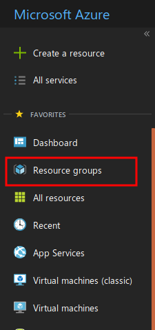

Suppose you work at a company that makes a suite of Linux admin tools. Your job is to help potential customers try your software before they buy it. Because the software makes root-level changes to the OS, you have decided to create a Linux VM for each trial customer. You create the VMs as needed and delete them at the end of the trial subscription. This way, each customer starts with a clean version of the OS. 

To keep these VMs separate from the VMs your company uses for internal testing, you will create a dedicated resource group to house them. You only need one resource group so using Azure PowerShell in interactive mode is a reasonable choice for this task.

## Steps to create a resource group

1. Launch PowerShell.

1. Import the module into the current session so you have access to the Azure cmdlets.

   ```powershell
   Import-Module AzureRM
   ```

1. Connect to Azure using the command shown below. After entering the command, authenticate by providing your Azure credentials.

   ```powershell
   Connect-AzureRmAccount
   ```

1. Create a resource group.

    ```powershell
    New-AzureRmResourceGroup -Name "TrialsResourceGroup" -Location "East US"
    ```

1. Verify the resource group was created successfully.

    ```powershell
    Get-AzureRmResource | Format-Table
    ```
Another way to check whether the resource group was created successfully is to use the Azure Portal. To do this, login to the Portal and navigate to the **Resource Groups** section (see below). The new resource group should be displayed in the list.



## Summary
This exercise shows a common pattern for an interactive PowerShell session. You used a standard cmdlet to import the AzureRM module and then the Azure PowerShell cmdlets to perform a specific task. You now have a resource group in your subscription and are ready to create VMs.