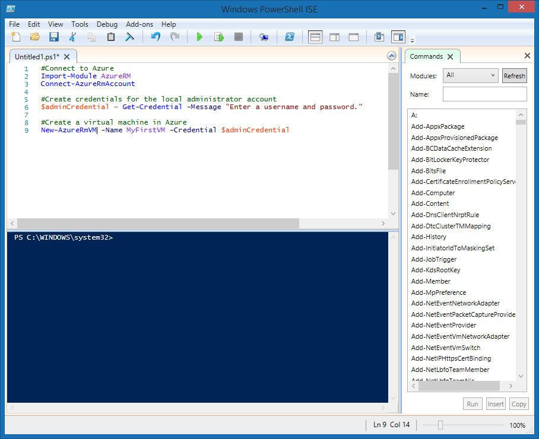

## Motivation
Complex or repetitive tasks often take a great deal of administrative time. Organizations prefer to automate these tasks to reduce costs and avoid errors.

This is important in the Customer Relationship Management (CRM) company example. There, you test your software on multiple Linux Virtual Machines (VMs) that you need to continuously delete and recreate. You want to use a PowerShell script to automate the creation of the VMs.

Beyond the core operation of creating a VM you have a few additional requirements for your script. 
- You will create multiple VMs, so you want to put the creation inside a loop
- You need to create VMs in three different resource groups, so the name of the resource group should be passed to the script as a parameter

In this section, you will see how to write and execute an Azure PowerShell script that meets these requirements.

## What is a PowerShell script?
A PowerShell script is a text file containing commands and control constructs. The commands are invocations of cmdlets. The control constructs are programming features like loops, variables, parameters, comments, etc. supplied by PowerShell.

PowerShell script files have a **.ps1** file extension. You can create and save these files with any text editor. 

> [!TIP]
> If you’re writing PowerShell scripts under Windows, you can use the Windows PowerShell Integrated Scripting Environment (ISE). This editor provides features such as syntax coloring and a list of available cmdlets.
>
>

Once you have written the script, execute it from the PowerShell command line by passing the name of the file preceded by a dot and a backslash:

    ```powershell
    .\myScript.ps1
    ```

## PowerShell techniques
PowerShell has many features found in typical programming languages. You can define variables, use branches and loops, capture command-line parameters, write functions, add comments, etc. We will need three features for our script: variables, loops, and parameters.

### Variables
PowerShell supports variables. Use **$** to declare a variable and **=** to assign a value. For example:

    ```powershell
    $loc = "East US"
    $iterations = 3
    ```

Variables can hold objects. For example, the following definition sets the **adminCredential** variable to the object returned by the **Get-Credential** cmdlet.

    ```powershell
    $adminCredential = Get-Credential
    ```

To obtain the value stored in a variable, use the **$** prefix and its name as shown below: 

    ```powershell
    $loc = "East US"
    New-AzureRmResourceGroup -Name "MyResourceGroup" -Location $loc
    ```

### Loops
PowerShell has several loops: **For**, **Do...While**, **For...Each**, etc. The **For** loop is the best match for our needs because we will execute a cmdlet a fixed number of times.

The core syntax is shown below; the example runs for two iterations and prints the value of **i** each time. The comparison operators are written **-lt** for "less than", **-le** for "less than or equal", **eq** for "equal", **ne** for "not equal", etc.

    ```powershell
    For ($i = 1; $i -lt 3; $i++)
    {
        $i
    }
    ```

### Parameters
When you execute a script, you can pass arguments on the command line. You can provide names for each parameter to help the script extract the values. For example:

    ```powershell
    .\setupEnvironment.ps1 -size 5 -location "East US"
    ```

Inside the script, you capture the values into variables. In this example, the parameters are matched by name:

    ```powershell
    param([string]$location, [int]$size)
    ```

You can omit the names from the command line. For example:

    ```powershell
    .\setupEnvironment.ps1 5 "East US"
    ```

Inside the script, you rely on position for matching when the parameters are unnamed:

    ```powershell
    param([int]$size, [string]$location)
    ```

## How to create a Linux Virtual Machine
Azure PowerShell provides the **New-AzureRmVm** cmdlet to create a Virtual Machine. The cmdlet has many parameters to let it handle the large number of VM configuration settings. Most of the parameters have reasonable default values so we only need to specify five things:
- **ResourceGroupName**: the resource group into which the new VM will be placed.
- **Name**: The name of the VM in Azure.
- **Location**: Geographic location where the VM will be provisioned.
- **Credential**: An object containing the username and password for the VM admin account. We will use the **Get-Credential** cmdlet to prompt for a username and password. **Get-Credential** packages the username and password into a credential object which it returns as its result.
- **Image**: Identity of the operating system to use for the VM. We will use "UbuntuLTS".

The syntax for the cmdlet is shown below:

```powershell
   New-AzureRmVm 
       -ResourceGroupName <resource group name> 
       -Name <machine name> 
       -Credential <credentials object> 
       -Location <location> 
       -Image <image name>
```

## Summary
The combination of PowerShell and Azure PowerShell gives you all the tools you need to automate Azure. In our CRM example, we will be able to create multiple Linux VMs using a parameter to keep the script generic and a loop to avoid repeated code. This means that a formerly complex operation can now be executed in a single step.