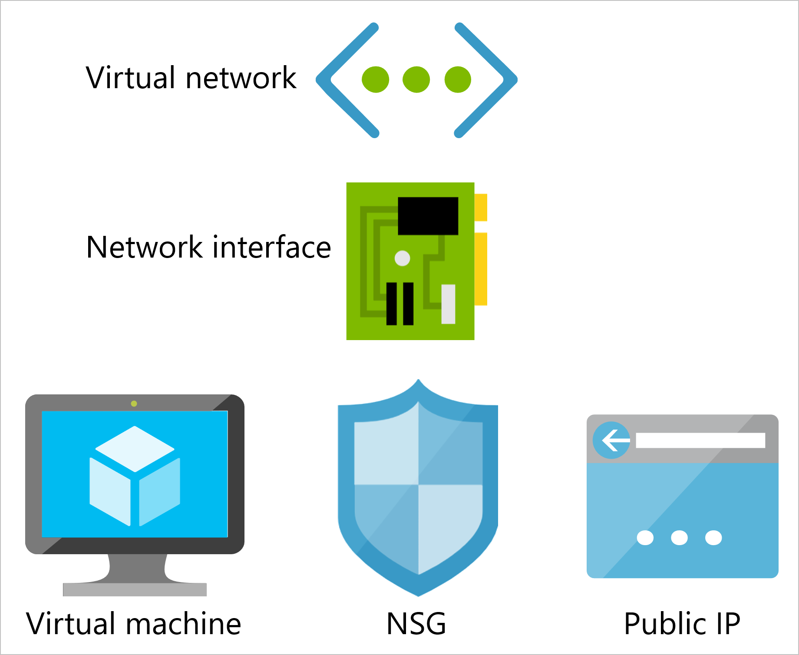

You've decided to research the different ways that Azure provides for automating the steps that are necessary to create the individual components for your public-facing web servers. Azure provides several methods to create virtual machines: you can use the Azure CLI, PowerShell, or the Azure portal. You could use a virtual machine template to deploy all the resources at once, but you'd like to have more control of each step. Therefore you've chosen to use Azure CLI commands to automate each part of your infrastructure creation process. By using this approach, you'll have better overall visibility about the progress of your deployment.

In this unit, you'll learn about the commands and parameters that you'll need to create the components that are required to set up the virtual machines for your web servers. You'll explore the options that are common for both Linux and Windows virtual machines, and you'll compare the options that are specific to each of these operating systems.

## Creating common components for virtual machines

To build a virtual machine that's publicly accessible via an external IP address, you'll also need to create several networking components: a Virtual Network, a public IP address, a Network Security Group (NSG) with rules, and a Network Interface (NIC).



### Creating a virtual network

Your first step is to create a virtual network; you must create your virtual network before you create your virtual machine. The following example shows the basic syntax for creating a virtual network using the Azure CLI:

```azurecli
az network vnet create \
    --name [virtual network name] \
    --subnet-name [subnet name]
    --resource-group [resource group name]  
```

As you can see in this example, you can create a basic virtual network by specifying only the name and subnet for your network, along with the resource group where your virtual network will be added.

When you use the Azure CLI to create a virtual network, Azure will return a JSON response that resembles the following abbreviated response:

```json
{
  "newVNet": {
    "addressSpace": {
      "addressPrefixes": [
        "10.0.0.0/16"
      ]
    },
    . . .
    "id": "/subscriptions/ssssssss-ssss-ssss-ssss-ssssssssssss/resourceGroups/[resource group name]/providers/Microsoft.Network/virtualNetworks/my-vnet",
    "location": "westus",
    "name": "my-vnet",
    "resourceGroup": "[resource group name]",
    . . .
  }
}
```

Where:

| Value | Description |
| --- | --- |
| `ssssssss-ssss-ssss-ssss-ssssssssssss` | This is the GUID for your Azure subscription. |
| `[resource group name]` | This is the name of the resource group that you specified in your `az network vnet create` command. |

There are several additional options that are available when you create a virtual network, and you can retrieve a list of these options with the following command:

```azurecli
az network vnet create --help
```

A few of the additional options that you might want to consider adding to your virtual network are:

| Parameter | Description |
| --- | --- |
| `--ddos-protection` | If you have a standard DDoS protection plan, set this parameter to `true` and supply the name with the `ddos-protection-plan` parameter. |
| `--dns-servers` | Specify this option if you'd like to use different DNS servers. |

### Creating a public IP address

If you're using a virtual machine as a web server, it will need to be accessible externally using a public IP address on port 80. IP addresses are dynamic by default, so they will change every time you shut down your virtual machine. (A private IP address is created when you deploy your virtual machine.)

```azurecli
az network public-ip create \
    --name [IP name] \
    --resource-group [resource group name]
```

As you can see in this example, you can create a public IP address by specifying only the name for your public IP address and the resource group where your IP address will be added.

When you use the Azure CLI to create a public IP address, Azure will return a JSON response that resembles the following abbreviated response:

```json
{
  "publicIp": {
    . . .
    "id": "/subscriptions/ssssssss-ssss-ssss-ssss-ssssssssssss/resourceGroups/[resource group name]/providers/Microsoft.Network/publicIPAddresses/my-public-ip",
    "location": "westus",
    "name": "my-public-ip",
    "resourceGroup": "[resource group name]",
    . . .
  }
}
```

There are several additional options that are available when you create a public IP address, and you can retrieve a list of these options with the following command:

```azurecli
az network public-ip create --help
```

A few of the additional options that you might want to consider when creating your public IP address are:

| Parameter | Description |
|---|---|
| `--dns-name` | Specifies a globally unique DNS entry; this is useful for when you want to access your virtual machine using a DNS name rather than the IP address. |
| `--allocation-method` | Specifies `Dynamic` or `Static` to define whether the IP address can change when virtual machine is powered down; `Dynamic` is the default. |
| `--sku` | Specifies `Basic` or `Standard` to define whether you need to have zone resiliency; `Basic` is the default, but you can pay for the `Standard` sku if you need zone resiliency. |
| `--version` | Specifies `IPv4` or `IPv6` to define the IP address type; `IPv4` is the default. |

### Creating a Network Security Group and rules

You can filter the traffic on your network by adding a Network Security Group (NSG), and Azure automatically creates a number of default rules for you when you create the NSG. After you have created your NSG, you can add more rules to allow or deny other kinds of traffic, like HTTP or SSH.

```azurecli
az network nsg create \
    --name [NSG name] \
    --resource-group [resource group name]
```

When you use the Azure CLI to create an NSG, Azure will return a JSON response that resembles the following abbreviated response:

```json
{
  "NewNSG": {
    "defaultSecurityRules": [
      {
        . . .
      }
    ],
    "id": "/subscriptions/ssssssss-ssss-ssss-ssss-ssssssssssss/resourceGroups/[resource group name]/providers/Microsoft.Network/networkSecurityGroups/my-nsg",
    "location": "westus",
    "name": "my-nsg",
    "resourceGroup": "[resource group name]",
    "type": "Microsoft.Network/networkSecurityGroups"
    . . .
  }
}
```

#### Example: creating an NSG rule for SSH access

The following example illustrates how to add an NSG rule that will allow SSH (port 22) traffic on your public IP address:

```azurecli
az network nsg rule create \
    --nsg-name [NSG name] \
    --name [SSH rule name] \
    --protocol tcp \
    --priority 1000 \
    --destination-port-range 22 \
    --access allow \
    --resource-group [resource group name]
```

When you use the Azure CLI to create a rule like the preceding Azure CLI example, Azure will return a JSON response that resembles the following abbreviated response:

```json
{
  "access": "Allow",
  . . .
  "id": "/subscriptions/ssssssss-ssss-ssss-ssss-ssssssssssss/resourceGroups/[resource group name]/providers/Microsoft.Network/networkSecurityGroups/my-nsg/securityRules/my-nsg-ssh-rule",
  "name": "my-nsg-ssh-rule",
  "priority": 1000,
  "protocol": "Tcp",
  "provisioningState": "Succeeded",
  "resourceGroup": "[resource group name]",
  . . .
  "type": "Microsoft.Network/networkSecurityGroups/securityRules"
}
```

In this example, the priority value is used to tell Azure the order in which rules are applied. By default, this rule will apply to all protocols, but you can specify the protocol; for example `Tcp`, `Udp`, `Esp`, or use `*` to have the rule applied to all kinds of traffic.

#### Example: creating an NSG rule for HTTP access

The following example illustrates how to add an NSG rule that will allow HTTP (port 80) traffic on your public IP address:

```azurecli
az network nsg rule create \
    --nsg-name [NSG name] \
    --name [HTTP rule name] \
    --protocol tcp \
    --priority 1001 \
    --destination-port-range 80 \
    --access allow \
    --resource-group [resource group name]
```

When you use the Azure CLI to create a rule like the preceding example, Azure will return a JSON response that resembles the following abbreviated response:

```json
{
  "access": "Allow",
  . . .
  "id": "/subscriptions/ssssssss-ssss-ssss-ssss-ssssssssssss/resourceGroups/[resource group name]/providers/Microsoft.Network/networkSecurityGroups/my-nsg/securityRules/my-nsg-http-rule",
  "name": "my-nsg-http-rule",
  "priority": 1001,
  "protocol": "Tcp",
  "provisioningState": "Succeeded",
  "resourceGroup": "[resource group name]",
  . . .
  "type": "Microsoft.Network/networkSecurityGroups/securityRules"
}
```

As you saw with the preceding SSH example, the priority value is used to tell Azure the order in which rules are applied. By default, this rule will apply to all protocols, but you can specify the protocol; for example `Tcp`, `Udp`, `Esp`, or use `*` to have the rule applied to all kinds of traffic.

### Creating a network interface

A network interface enables your virtual machine to communicate externally to the internet, or internally with your on-premises resources. Azure creates a NIC for you automatically when you create a virtual machine, but you can have greater control by creating a network interface manually.

```azurecli
az network nic create \
    --name [NIC name] \
    --vnet-name [virtual network name] \
    --subnet [subnet name] \
    --public-ip-address [IP name] \
    --network-security-group [NSG name] \
    --resource-group [resource group name]
```

When you use the Azure CLI to create a network interface, Azure will return a JSON response that resembles the following abbreviated response:

```json
{
  "NewNIC": {
    . . .
    "id": "/subscriptions/ssssssss-ssss-ssss-ssss-ssssssssssss/resourceGroups/[resource group name]/providers/Microsoft.Network/networkInterfaces/my-nic",
    . . .
    "name": "my-nic",
    . . .
    "provisioningState": "Succeeded",
    "resourceGroup": "[resource group name]",
    . . .
    "type": "Microsoft.Network/networkInterfaces",
    "virtualMachine": null
  }
}
```

Like other CLI commands, there are several additional options that are available when you create a network interface, and you can retrieve a list of these options with the following command:

```azurecli
az network nic create --help
```

A few of the additional options that you might want to consider when creating your network interfaces are:

| Parameter | Description |
|---|---|
| `accelerated-networking` | Enables single root I/O virtualization to give you accelerated networking performance. |
| `ip-forwarding` | Enables the virtual machine to receive and send network traffic with different IP addresses (that are not directly assigned to it). |

### Creating an availability set

Availability Sets are logical groupings for virtual machines, and are essential for reliable cloud solutions. For example, your company wants to ensure their machines have high availability. If an app relies a single virtual machine, any issues with that virtual machine or its domain will impact your app's reliability. When you're initially setting up your virtual machine infrastructure, you might not want to provision multiple virtual machines. However, because you can't add a virtual machine to an availability set after it's created, a best practice is to create and reference an availability set when you're settings up virtual machines, even if you're creating a single virtual machine.

```azurecli
az vm availability-set create \
    --name [availability set name] \
    --platform-fault-domain-count 3 \
    --platform-update-domain-count 3 \
    --resource-group [resource group name]
```

When you use the Azure CLI to create an availability set, Azure will return a JSON response that resembles the following abbreviated response:

```json
{
  "id": "/subscriptions/ssssssss-ssss-ssss-ssss-ssssssssssss/resourceGroups/[resource group name]/providers/Microsoft.Compute/availabilitySets/my-availability-set",
  "location": "westus",
  "name": "my-availability-set",
  "platformFaultDomainCount": 3,
  "platformUpdateDomainCount": 3,
  "resourceGroup": "[resource group name]",
  . . .
  "type": "Microsoft.Compute/availabilitySets",
  "virtualMachines": []
}
```

## Creating your virtual machine

After creating all of the common components that were listed in the preceding sections of this unit, there are a few remaining tasks for you to complete:

- Choose the operating system for your virtual machine

- Create the virtual machine using the Azure CLI

- Choose your virtual machine authentication options

### Choose the operating system for your virtual machine

::: zone pivot="linux-cloud"

To choose the operating system for your Linux virtual machine, use the Azure CLI to retrieve a list of the available operating systems:

```azurecli
az vm image list --query "[?publisher!='MicrosoftWindowsServer']"
```

Azure will return a JSON response that resembles the following excerpt:

```json
[
  {
    "offer": "CentOS",
    "publisher": "OpenLogic",
    "sku": "7.5",
    "urn": "OpenLogic:CentOS:7.5:latest",
    "urnAlias": "CentOS",
    "version": "latest"
  },
  {
    "offer": "CoreOS",
    "publisher": "CoreOS",
    "sku": "Stable",
    "urn": "CoreOS:CoreOS:Stable:latest",
    "urnAlias": "CoreOS",
    "version": "latest"
  },
  . . .
  {
    "offer": "RHEL",
    "publisher": "RedHat",
    "sku": "7-LVM",
    "urn": "RedHat:RHEL:7-LVM:latest",
    "urnAlias": "RHEL",
    "version": "latest"
  },
  {
    "offer": "UbuntuServer",
    "publisher": "Canonical",
    "sku": "18.04-LTS",
    "urn": "Canonical:UbuntuServer:18.04-LTS:latest",
    "urnAlias": "UbuntuLTS",
    "version": "latest"
  }
]
```

The various fields in the JSON response will describe the manufacturer and version for the available virtual machine operating systems; for example: the Linux variants that are listed are in the above excerpt are:

| Description | URN Alias |
| --- | --- |
| *CentOS 7.5* | `CentOS` |
| *CoreOS Stable* | `CoreOS` |
| *RedHat 7-LVM* | `RHEL` |
| *Ubuntu 18.04* | `UbuntuLTS` |

As you'll see later, you use the Uniform Resource Name Alias (`urnAlias`) when you create a virtual machine.

### Create the Linux virtual machine using the Azure CLI

To create your virtual machine, you'll combine all of the common components that you created earlier to create a command like the following example:

```azurecli
az vm create \
    --name [machine name] \
    --availability-set [availability set name] \
    --nics [NIC name] \
    --image [image name] \
    --admin-username [admin username] \
    --admin-password [secure password] \
    --resource-group [resource group name]
```

In the above example, if your organization had standardized on Ubuntu, you would use the **URN Alias** value from the preceding section of `UbuntuLTS` for the value of the `--image` parameter.

Azure will create your virtual machine, which might take a few minutes. When Azure has provisioned your virtual machine, it will return a JSON response that resembles the following response:

```json
{
  "fqdns": "",
  "id": "/subscriptions/ssssssss-ssss-ssss-ssss-ssssssssssss/resourceGroups/[resource group name]/providers/Microsoft.Compute/virtualMachines/my-linux-vm",
  "location": "westus",
  "macAddress": "mm-mm-mm-mm-mm-mm",
  "powerState": "VM running",
  "privateIpAddress": "iii.iii.iii.iii",
  "publicIpAddress": "eee.eee.eee.eee",
  "resourceGroup": "[resource group name]",
  "zones": ""
}
```

Where:

| Value | Description |
| --- | --- |
| `iii.iii.iii.iii` | This is the internal/private IP address for your virtual machine on your virtual network. |
| `eee.eee.eee.eee` | This is the external/public IP address for your virtual machine on the Internet. |

As you have seen with all of the Azure CLI commands thus far, there are several optional parameters that you can specify when you're creating a virtual machine, and you can retrieve a list of these options with the following command:

```azurecli
az vm create --help
```

If you run the above command, you'll notice that there are far more parameters than all the previous components you have examined.

### Choose your virtual machine authentication options

Azure supports several authentication methods to access virtual machines; for example: just-in-time access, simple usernames and passwords, or SSH keys. If your company decided to deploy and access virtual machines with SSH keys, you would need to add the `--generate-ssh-keys` parameter from the preceding example and remove `--admin-password` parameter:

```azurecli
az vm create \
    --name [machine name] \
    --availability-set [availability set name] \
    --nics [NIC name] \
    --image [image name] \
    --admin-username [admin username] \
    --generate-ssh-keys \
    --resource-group [resource group name]
```

When you run the above command, your SSH keys will be stored in the `~/.ssh/` folder of your user profile.

::: zone-end

::: zone pivot="windows-cloud"

To choose the operating system for your Windows virtual machine, use the Azure CLI to retrieve a list of the available operating systems:

```azurecli
az vm image list --publisher MicrosoftWindowsServer
```

Azure will return a JSON response that resembles the following example:

```json
[
  {
    "offer": "WindowsServer",
    "publisher": "MicrosoftWindowsServer",
    "sku": "2019-Datacenter",
    "urn": "MicrosoftWindowsServer:WindowsServer:2019-Datacenter:latest",
    "urnAlias": "Win2019Datacenter",
    "version": "latest"
  },
  {
    "offer": "WindowsServer",
    "publisher": "MicrosoftWindowsServer",
    "sku": "2016-Datacenter",
    "urn": "MicrosoftWindowsServer:WindowsServer:2016-Datacenter:latest",
    "urnAlias": "Win2016Datacenter",
    "version": "latest"
  },
  {
    "offer": "WindowsServer",
    "publisher": "MicrosoftWindowsServer",
    "sku": "2012-R2-Datacenter",
    "urn": "MicrosoftWindowsServer:WindowsServer:2012-R2-Datacenter:latest",
    "urnAlias": "Win2012R2Datacenter",
    "version": "latest"
  },
  {
    "offer": "WindowsServer",
    "publisher": "MicrosoftWindowsServer",
    "sku": "2012-Datacenter",
    "urn": "MicrosoftWindowsServer:WindowsServer:2012-Datacenter:latest",
    "urnAlias": "Win2012Datacenter",
    "version": "latest"
  },
  {
    "offer": "WindowsServer",
    "publisher": "MicrosoftWindowsServer",
    "sku": "2008-R2-SP1",
    "urn": "MicrosoftWindowsServer:WindowsServer:2008-R2-SP1:latest",
    "urnAlias": "Win2008R2SP1",
    "version": "latest"
  }
]
```

The various fields in the JSON response will describe the version information for each of the available virtual machine operating systems; for example: the Windows variants that are listed are in the above excerpt are:

| Description | URN Alias |
| --- | --- |
| Windows Server2019-Datacenter | Win2019Datacenter |
| Windows Server2016-Datacenter | Win2016Datacenter |
| Windows Server2012-R2-Datacenter | Win2012R2Datacenter |
| Windows Server2012-Datacenter | Win2012Datacenter |
| Windows Server2008-R2-SP1 | Win2008R2SP1 |

As you'll see later, you use the Uniform Resource Name Alias (`urnAlias`) when you create a virtual machine.

### Create the Windows virtual machine using the Azure CLI

Your organization has standardized on Windows Datacenter 2019, so the `urnAlias` value from the preceding section that you'll use create your virtual machine is `Win2019Datacenter`. To create your virtual machine, you'll combine all of the common components that you created earlier to create a command like the following example:

```azurecli
az vm create \
    --name [machine name] \
    --availability-set [availability set name] \
    --nics [NIC name] \
    --image [image name] \
    --admin-username [admin username] \
    --admin-password [secure password] \
    --resource-group [resource group name]
```

Azure will create your virtual machine, which might take a few minutes. When Azure has provisioned your virtual machine, it will return a JSON response that resembles the following response:

```json
{
  "fqdns": "",
  "id": "/subscriptions/ssssssss-ssss-ssss-ssss-ssssssssssss/resourceGroups/[resource group name]/providers/Microsoft.Compute/virtualMachines/my-windows-vm",
  "location": "westus",
  "macAddress": "mm-mm-mm-mm-mm-mm",
  "powerState": "VM running",
  "privateIpAddress": "iii.iii.iii.iii",
  "publicIpAddress": "eee.eee.eee.eee",
  "resourceGroup": "[resource group name]",
  "zones": ""
}
```

Where:

| Value | Description |
| --- | --- |
| `iii.iii.iii.iii` | This is the internal/private IP address for your virtual machine on your virtual network. |
| `eee.eee.eee.eee` | This is the external/public IP address for your virtual machine on the Internet. |

As you have seen with all of the Azure CLI commands thus far, there are several optional parameters that you can specify when you're creating a virtual machine, and you can retrieve a list of these options with the following command:

```azurecli
az vm create --help
```

If you run the above command, you'll notice that there are far more parameters than all the previous components you have examined.

For example, if your company had purchased *Azure Hybrid Benefit*, you could choose to use your current on-premises Windows Server licenses to run Windows virtual machines on Azure in order to lower costs. To enable this option, you would add the `--license-type Windows_Server` parameter to the create command.

### Choose your virtual machine authentication options

Azure supports several authentication methods to access virtual machines; for example: just-in-time access, simple usernames and passwords, or Windows Remote Management (WinRM).

::: zone-end

In the next exercise, you'll use the knowledge from this unit to create virtual machine.
