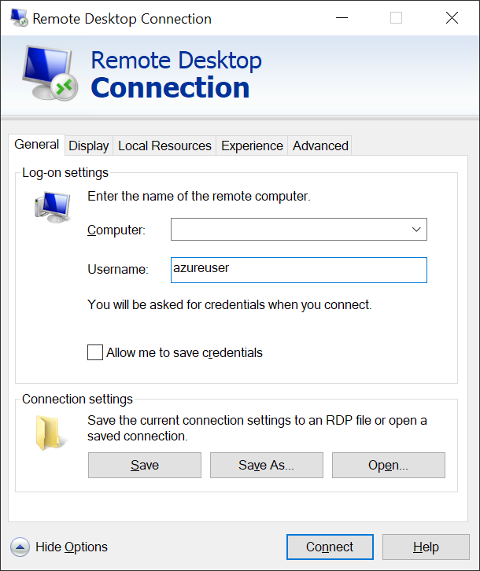
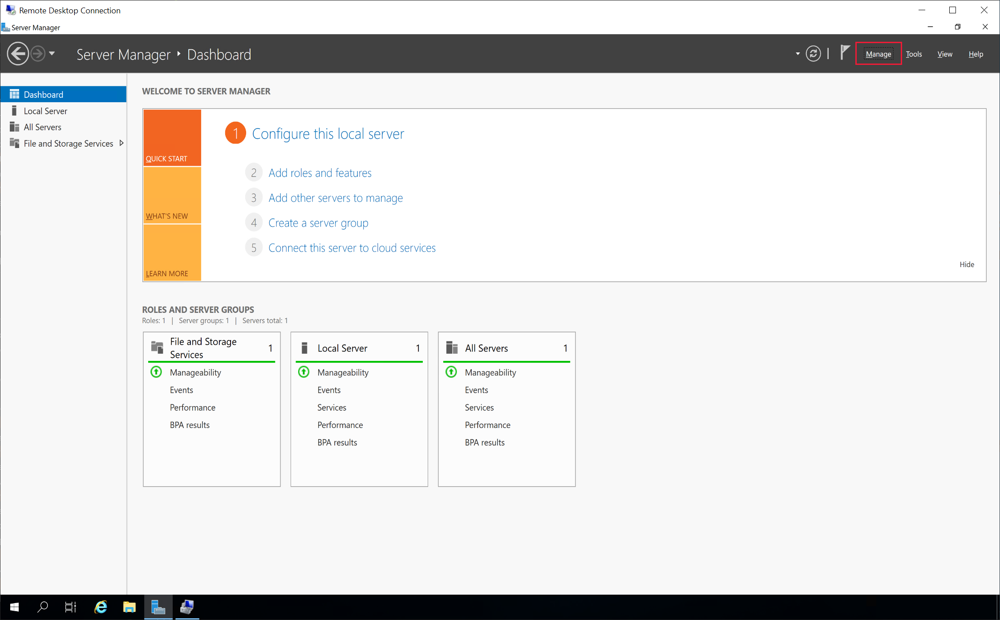
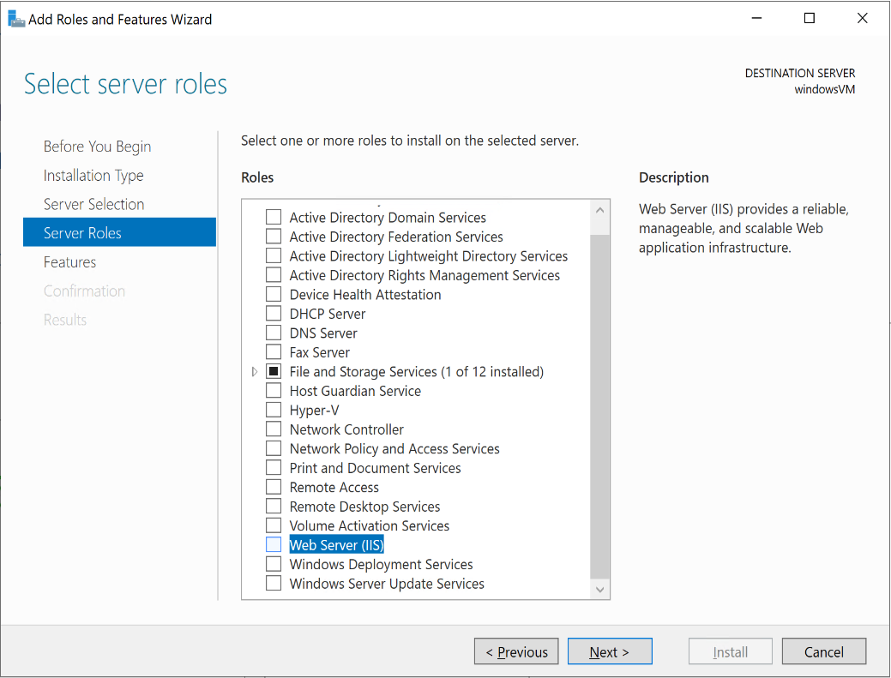

In the previous unit, you learned how you can use the Azure CLI to create all of the necessary components to create a virtual machine running in Azure. Your company uses a mixture of Linux and Windows virtual machines, and by using the Azure CLI commands, you can build your virtual machine infrastructure in Azure in an automated and easily repeatable way.

After you have created your virtual machines, you'll need to log into those machines in order to check what's installed on the virtual machine image by default. On your Linux machines, you'll use SSH to connect to the machine. On your Windows machines, you'll use a Remote Desktop connection to connect to the machine.

In this exercise, you'll deploy all the components you need to have a publicly accessible virtual machine that will be used as a web server. Next, you'll connect to the virtual machine and check for installed components.

[!include[](../../../includes/azure-exercise-subscription-prerequisite.md)]

## Create the common components needed for your virtual machine

In this section of the exercise, you'll use the Azure CLI in the sandbox Cloud Shell to create the common components that you'll need for your virtual machine.

1. Enter the following command to create a resource group.

    ```azurecli
    az group create \
        --name my-resource-group-name \
        --location westus 
    ```

    This example specifies `westus` for the `location`, but you should choose the Azure region that is closest to you for the `location`. For a list of locations, enter `az account list-locations` in the Azure CLI.

1. Enter the following command to create a virtual network.

    ```azurecli
    az network vnet create \
        --name my-vnet \
        --address-prefix 192.168.0.0/16 \
        --subnet-name my-subnet \
        --subnet-prefix 192.168.1.0/24 \
        --resource-group my-resource-group-name
    ```

1. Enter the following command to create a public IP address.

    ```azurecli
    az network public-ip create \
        --name my-public-ip \
        --resource-group my-resource-group-name
    ```

    In the exercises for this module, you'll use your public IP address to connection to your virtual machine. However, for normal operations you might want to add the optional `--dns-name` parameter to specify the unique DNS name for your virtual machine.

1. Enter the following command to create a Network Security Group (NSG).

    ```azurecli
    az network nsg create \
        --name my-nsg \
        --resource-group my-resource-group-name
    ```

1. Enter the following command to create a rule to allow HTTP access to your virtual machine.

    ```azurecli
    az network nsg rule create \
        --nsg-name my-nsg \
        --name my-nsg-http-rule \
        --protocol tcp \
        --priority 1001 \
        --destination-port-range 80 \
        --access allow \
        --resource-group my-resource-group-name
    ```

    This rule adds a single protocol to the list of default protocols for your NSG. However, for normal operations you might want to add other protocols for your specific environment, and you can add protocols to your NSG later. For example, later in this exercise you'll add a remote communication protocol to allow access to your virtual machine.

1. Enter the following command to create a Network Interface.

    ```azurecli
    az network nic create \
        --name my-nic \
        --vnet-name my-vnet \
        --subnet my-subnet \
        --public-ip-address my-public-ip \
        --network-security-group my-nsg \
        --resource-group my-resource-group-name
    ```

1. Enter the following command to create an availability set.

    ```azurecli
    az vm availability-set create \
        --name my-availability-set \
        --platform-fault-domain-count 3 \
        --platform-update-domain-count 3 \
        --resource-group my-resource-group-name
    ```

::: zone pivot="linux-cloud"

## Create a Linux virtual machine

Not that you have created all of the necessary networking infrastructure, your next task is to use the Azure CLI to create your virtual machine.

1. Enter the following command to create an additional NSG rule to allow SSH access to your Linux virtual machine after it has been created.

    ```azurecli
    az network nsg rule create \
        --nsg-name my-nsg \
        --name my-nsg-ssh-rule \
        --protocol tcp \
        --priority 1000 \
        --destination-port-range 22 \
        --access allow \
        --resource-group my-resource-group-name
    ```

1. Enter the following command to create an Ubuntu virtual machine that will use SSH keys for authentication.

    ```azurecli
    az vm create \
        --name my-linux-vm \
        --availability-set my-availability-set \
        --nics my-nic \
        --image UbuntuLTS \
        --admin-username azureuser \
        --generate-ssh-keys \
        --resource-group my-resource-group-name
    ```

1. Wait for Azure to create the virtual machine, and then copy the `publicIpAddress` value from the JSON response. For example:

    ```json
    {
        "fqdns": "my-public-dns.westus.cloudapp.azure.com",
        "id": "/subscriptions/ssssssss-ssss-ssss-ssss-ssssssssssss/resourceGroups/my-resource-group-name/providers/Microsoft.Compute/virtualMachines/my-linux-vm",
        "location": "westus",
        "macAddress": "mm-mm-mm-mm-mm-mm",
        "powerState": "VM running",
        "privateIpAddress": "iii.iii.iii.iii",
        "publicIpAddress": "eee.eee.eee.eee",
        "resourceGroup": "my-resource-group-name",
        "zones": ""
    }
    ```

    Copy the value of the `publicIpAddress` field, which is represented by `eee.eee.eee.eee` in this JSON example. You'll use this value for your public/external IP address in the next section of this exercise.

## Connect the virtual machine using SSH

After you have created your Linux virtual machine, you'll use the public IP address from the preceding section to connect to the machine.

1. Connect to your virtual machine with SSH.

    ```bash
    ssh azureuser@eee.eee.eee.eee
    ```

    Replace `eee.eee.eee.eee` with the value of the `publicIpAddress` that you copied earlier.

1. When the SSH client prompts you to continue connection, enter **yes**.

    ```bash
    Are you sure you want to continue connecting (yes/no)?
    ```

1. Check to see if the Nginx or PHP is installed by trying to execute them. For example:

    ```bash
    azureuser@my-linux-vm:~$ nginx
    
    Command 'nginx' not found, but can be installed with:
    
    sudo apt install nginx-core
    sudo apt install nginx-extras
    sudo apt install nginx-full
    sudo apt install nginx-light
    
    azureuser@my-linux-vm:~$ php
    
    Command 'php' not found, but can be installed with:
    
    sudo apt install php7.2-cli
    sudo apt install hhvm
    ```

    The Ubuntu image that you used to create your virtual machine doesn't have Nginx or PHP installed, so you should see error messages like the preceding example.

::: zone-end

::: zone pivot="windows-cloud"

## Create a Windows virtual machine

Not that you have created all of the necessary networking infrastructure, your next task is to use the Azure CLI to create your virtual machine.

1. Enter the following command to create an additional NSG rule to allow Remote Desktop access to your Windows virtual machine after it has been created.

    ```azurecli
    az network nsg rule create \
        --nsg-name my-nsg \
        --name my-nsg-rdp-rule \
        --protocol tcp \
        --priority 300 \
        --destination-port-range 3389 \
        --access allow \
        --resource-group my-resource-group-name
    ```

1. Enter the following command to create a secure password that you'll use to access the virtual machine.

    ```bash
    export SECUREPASSWORD=$(date +%s | sha256sum | base64 | head -c 32)
    echo $SECUREPASSWORD
    ```

    Copy the secure password value that is displayed, as you'll use that to connect to your virtual machine later.

1. Enter the following command to create a Windows virtual machine that will your secure password for authentication.

    ```azurecli
    az vm create \
        --name my-windows-vm \
        --image Win2019Datacenter \
        --availability-set my-availability-set \
        --nics my-nic \
        --admin-username azureuser \
        --admin-password $SECUREPASSWORD \
        --resource-group my-resource-group-name
    ```

1. Wait for Azure to create the virtual machine, and then copy the `publicIpAddress` value from the JSON response. For example:

    ```json
    {
        "fqdns": "",
        "id": "/subscriptions/ssssssss-ssss-ssss-ssss-ssssssssssss/resourceGroups/my-resource-group-name/providers/Microsoft.Compute/virtualMachines/my-windows-vm",
        "location": "westus",
        "macAddress": "mm-mm-mm-mm-mm-mm",
        "powerState": "VM running",
        "privateIpAddress": "iii.iii.iii.iii",
        "publicIpAddress": "eee.eee.eee.eee",
        "resourceGroup": "my-resource-group-name",
        "zones": ""
    }
    ```

    Copy the value of the `publicIpAddress` field, which is represented by `eee.eee.eee.eee` in this JSON example. You'll use this value for your public/external IP address in the next section of this exercise.

## Connect the virtual machine with Remote Desktop

1. On your local Windows machine, open the **Remote Desktop Connection** application.

    

    1. Enter the public IP address you copied above in the **Computer** field.
    
    1. Click **Show Options** at the bottom of the window.

        

    1. Enter **azureuser** in the **User name** field.
    
    1. Click **Connect**.

1. In the Windows Security pop-up, enter the value of your `$SECUREPASSWORD` from earlier, and then click **OK**.

1. If you're prompted to connect due to an unknown certificate, click **Yes**.

1. In the Remote Desktop Connection pop-up, select **Connect**.

1. When you're connected over remote desktop, Windows Server will automatically open the **Server Manager**.

    

    1. In the top right, select **Manage**.

    1. In the **Add Roles and Feature Wizard** window, select **Next**.

    1. On the **Installation Type** page, select **Role-based or feature-based installation**, and then click **Next**.

    1. On the **Server Selection** page, verify that your virtual machine should is selected, and then click **Next**.

        

    1. On the **Server Roles** page, scroll down and note that **Web Server (IIS)** isn't selected.

    1. Click **Cancel** to close the **Add Roles and Feature Wizard** window.

::: zone-end

## Test to see if a web server is running on your virtual machine

Check to see if a webpage is returned for the public IP address:

1. In your browser, open a tab using the web address `http://eee.eee.eee.eee`. Replace the IP address in the URL with the `publicIpAddress` value that you copied earlier.

1. Your browser will return an error page that the connection is refused. This is because you have not yet installed a web server in your virtual machine.

Congratulations! You have created an Azure virtual machine using the Azure CLI.
