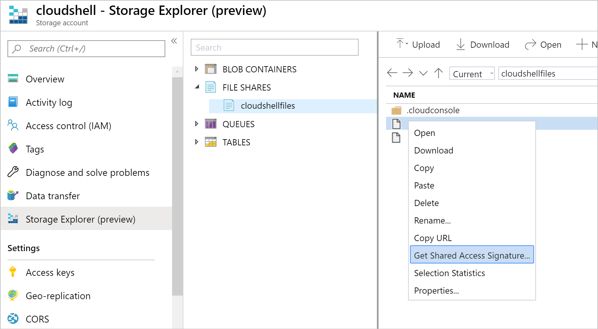
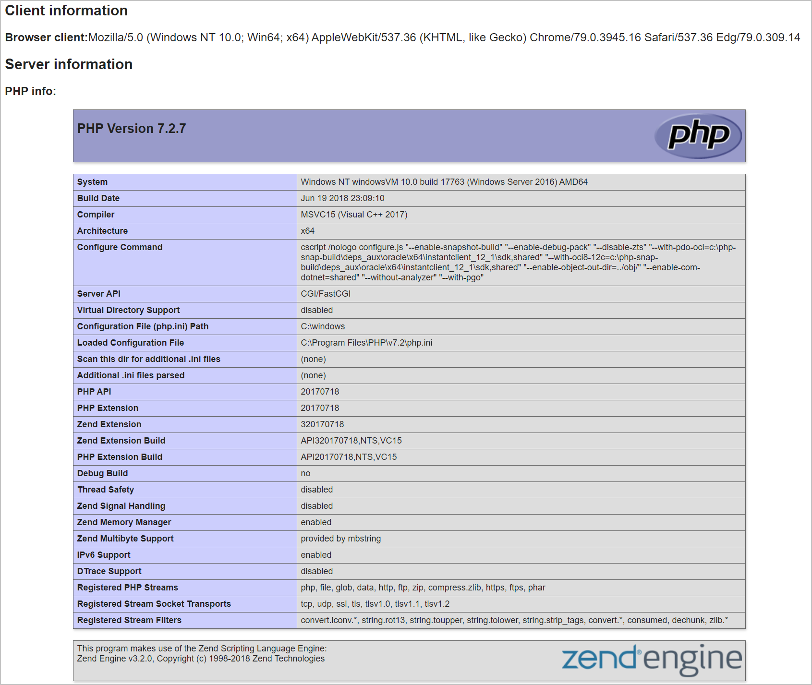

In the previous units, you learned how to create a virtual machine, and how to automate the installation and configuration of a web server and PHP in order to host dynamic web content. On a Linux virtual machine, the installation and configuration tasks are automated by using a custom cloud-init file, whereas the installation and configuration tasks are automated on a Windows virtual machine by using a custom PowerShell script.

For your first task in this exercise, you'll delete the virtual machine that you created in the previous exercise; once that virtual machine is deleted, you'll have a clean environment for starting over and creating a new virtual machine that you'll use to automate the installation and configuration of a web server and PHP. When your virtual machine is up and running in Azure, you'll browse to a dynamic PHP webpage to verify that everything is working, and to review the details of your virtual machine environment.

::: zone pivot="linux-cloud"

## Install and configure software on a new Linux virtual machine

### Delete your exiting Linux virtual machine

Your first step is to remove the existing virtual machine you created in the previous exercise. Using the Cloud Shell, use the following command to delete the existing virtual machine:

```azurecli
az vm delete \
    --name my-linux-vm \
    --yes \
    --resource-group my-resource-group-name
```

### Create a *cloud-init.yaml* file to configure a virtual machine

1. In the Cloud Shell, open the code editor to create a new *cloud-init.yaml* file.

    ```bash
    code cloud-init.yaml
    ```

1. Add the following configuration settings to your *cloud-init.yaml* file; these settings will install the Nginx and PHP packages:

    ```yaml
    #cloud-config
    package_upgrade: true
    packages:
        - nginx
        - php7.2  
        - php7.2-fpm
    ```

1. Append the following configuration settings to the bottom of your *cloud-init.yaml* file; these settings will enable Nginx to serve webpages using PHP, and create a default home page for your web server that uses `phpinfo()` to return information about your virtual machine:

    ```yaml
    write_files:
      - owner: www-data:www-data
        path: /etc/nginx/sites-available/default
        content: |
          server {
            listen 80 default_server;
            listen [::]:80 default_server;
            root /home/azureuser/serverInfo;
            index index.php index.html index.htm;
            location / {
              try_files $uri $uri/ =404;
            }
            location ~* \.php$ {
                fastcgi_index   index.php;
                fastcgi_pass    unix:/run/php/php7.2-fpm.sock;
                include         fastcgi_params;
                fastcgi_param   SCRIPT_FILENAME    $document_root$fastcgi_script_name;
                fastcgi_param   SCRIPT_NAME        $fastcgi_script_name;
            }
          }
      - owner: azureuser:azureuser
        path: /home/azureuser/serverInfo/index.php
        content: |
          <!DOCTYPE html>
          <html lang="en">
              <head>
                  <meta charset="UTF-8">
                  <title>PHP Status Page</title>
                  <meta name="description" contents="Default home page for deployed virtual machines">
              </head>
              <body>
                <div>
                  <h2>Client information</h2>
                  <p><strong>Browser client:</strong><?php echo $_SERVER['HTTP_USER_AGENT']; ?></p>
                </div>
                <div>
                  <h2>Server information</h2>
                  <p><strong>PHP info:</strong></p>
                  <div>
                    <?php phpinfo(); ?>
                  </div>
                </div>
                <footer>
                    Server name: <?php echo php_uname("n"); ?>
                </footer>
              </body>
          </html>    
    ```

1. For your final step, append the following configuration settings to the bottom of your *cloud-init.yaml* file; these settings will ensure that both Nginx and PHP services are running:

    ```yaml
    runcmd:
      - service nginx restart
      - service php7.2-fpm restart
    ```

1. Your completed *cloud-init.yaml* file should resemble the following example:

    ```yaml
    #cloud-config
    package_upgrade: true
    packages:
        - nginx
        - php7.2  
        - php7.2-fpm
    write_files:
      - owner: www-data:www-data
        path: /etc/nginx/sites-available/default
        content: |
          server {
            listen 80 default_server;
            listen [::]:80 default_server;
            root /home/azureuser/serverInfo;
            index index.php index.html index.htm;
            location / {
              try_files $uri $uri/ =404;
            }
            location ~* \.php$ {
                fastcgi_index   index.php;
                fastcgi_pass    unix:/run/php/php7.2-fpm.sock;
                include         fastcgi_params;
                fastcgi_param   SCRIPT_FILENAME    $document_root$fastcgi_script_name;
                fastcgi_param   SCRIPT_NAME        $fastcgi_script_name;
            }
          }
      - owner: azureuser:azureuser
        path: /home/azureuser/serverInfo/index.php
        content: |
          <!DOCTYPE html>
          <html lang="en">
              <head>
                  <meta charset="UTF-8">
                  <title>PHP Status Page</title>
                  <meta name="description" contents="Default home page for deployed virtual machines">
              </head>
              <body>
                <div>
                  <h2>Client information</h2>
                  <p><strong>Browser client:</strong><?php echo $_SERVER['HTTP_USER_AGENT']; ?></p>
                </div>
                <div>
                  <h2>Server information</h2>
                  <p><strong>PHP info:</strong></p>
                  <div>
                    <?php phpinfo(); ?>
                  </div>
                </div>
                <footer>
                    Server name: <?php echo php_uname("n"); ?>
                </footer>
              </body>
          </html>    
    runcmd:
      - service nginx restart
      - service php7.2-fpm restart
    ```

1. Type <kbd>CTRL+S</kbd> to save your *cloud-init.yaml* file, then type <kbd>CTRL+Q</kbd> to close the editor.

### Create a Linux virtual machine using a *cloud-init.yaml* file

Now that you've created a cloud-init file that contains the configuration steps for your virtual machine, you can use it with the Azure CLI command to create a Linux virtual machine.

Using the Cloud Shell, use the following command to create an Ubuntu virtual machine using your *cloud-init.yaml* file:

```azurecli
az vm create \
    --name my-linux-vm \
    --availability-set my-availability-set \
    --nics my-nic \
    --image UbuntuLTS \
    --admin-username azureuser \
    --generate-ssh-keys \
    --custom-data cloud-init.yaml \
    --resource-group my-resource-group-name
```

It may take Azure several minutes to create the virtual machine. When it has finished, copy the value of the `publicIpAddress` field, which is represented by `eee.eee.eee.eee` in this JSON example:

```json
{
  "fqdns": "",
  "id": "/subscriptions/ssssssss-ssss-ssss-ssss-ssssssssssss/resourceGroups/my-resource-group-name/providers/Microsoft.Compute/virtualMachines/my-linux-vm",
  "location": "westus",
  "macAddress": "mm-mm-mm-mm-mm-mm",
  "powerState": "VM running",
  "privateIpAddress": "iii.iii.iii.iii",
  "publicIpAddress": "eee.eee.eee.eee",
  "resourceGroup": "my-resource-group-name",
  "zones": ""
}
```

::: zone-end

::: zone pivot="windows-cloud"

## Install and configure software on a new Windows virtual machine

### Delete your exiting Windows virtual machine

Your first step is to remove the existing virtual machine you created in the previous exercise. Using the Cloud Shell, use the following command to delete the existing virtual machine:

```aszurecli
az vm delete \
    --name my-windows-vm \
    --yes \
    --resource-group my-resource-group-name
```

### Create a PowerShell script to configure a virtual machine

1. In the Cloud Shell, open the code editor to create a new *setup.ps1* file in the Cloud Drive folder of your user profile:

    ```bash
    cd ~/clouddrive
    code setup.ps1
    ```

1. Add the following commands to your *setup.ps1* file; these commands will install the IIS, FastCGI, and IIS Manager packages:

    ```powershell
    # Add IIS, CGI, and IIS Manager to the web server
    Install-WindowsFeature -Name "Web-Server";
    Install-WindowsFeature -Name "Web-CGI";
    Install-WindowsFeature -Name "Web-Mgmt-Console";
    ```

1. Append the following commands to the bottom of your *setup.ps1* file; these commands will download and install the Web Platform Installer (WPI):

    ```powershell
    # Install the WebPlatform installer
    New-Item -ItemType Directory -Path 'c:\temp\wpi'
    Invoke-WebRequest -Uri 'https://download.microsoft.com/download/C/F/F/CFF3A0B8-99D4-41A2-AE1A-496C08BEB904/WebPlatformInstaller_amd64_en-US.msi' -OutFile 'c:\temp\wpi\WebPlatformInstaller_amd64_en-US.msi'
    Start-Process msiexec.exe -Wait -ArgumentList '/I c:\temp\wpi\WebPlatformInstaller_amd64_en-US.msi /quiet'
    ```

1. Append the following commands to the bottom of your *setup.ps1* file; these commands will install and configure PHP:

    ```powershell
    # Install PHP
    & (Join-Path "$env:programfiles" "microsoft\Web Platform Installer\webpicmd.exe") /Install /Products:"PHP72x64,VC12Redist" /AcceptEula
    
    # Add index.php to the Default Documents.
    Add-WebConfiguration -Filter /system.webServer/defaultDocument/files -AtIndex 0 -PSPath IIS:\ -Value @{value="index.php"}
    ```

1. Append the following commands to the bottom of your *setup.ps1* file; these commands will remove the existing IIS home page and create a dynamic home page that will return the status of the `phpinfo()` function for your server:

    ```powershell
    # remove the default IIS page
    Remove-Item -Path C:\inetpub\wwwroot\iisstart.htm -Force

    # Create index.php
    New-Item -ItemType File -Path "C:\inetpub\wwwroot\" -Name index.php -Value @'
    <!DOCTYPE html>
    <html lang="en">
        <head>
        <meta charset="UTF-8">
        <title>PHP Status Page</title>
        <meta name="description" contents="Default home page for deployed virtual machines">
        </head>
        <body>
        <div>
            <h2>Client information</h2>
            <p><strong>Browser client:</strong><?php echo $_SERVER['HTTP_USER_AGENT']; ?></p>
        </div>
        <div>
            <h2>Server information</h2>
            <p><strong>PHP info:</strong></p>
            <div>
            <?php phpinfo(); ?>
            </div>
        </div>
        <footer>
            Server name: <?php echo php_uname("n"); ?>
        </footer>
        </body>
    </html>
    '@
    ```

1. Your completed *setup.ps1* file should resemble the following example:

    ```powershell
    # Add IIS, CGI, and IIS Manager to the web server
    Install-WindowsFeature -Name "Web-Server";
    Install-WindowsFeature -Name "Web-CGI";
    Install-WindowsFeature -Name "Web-Mgmt-Console";

    # Install the WebPlatform installer
    New-Item -ItemType Directory -Path 'c:\temp\wpi'
    Invoke-WebRequest -Uri 'https://download.microsoft.com/download/C/F/F/CFF3A0B8-99D4-41A2-AE1A-496C08BEB904/WebPlatformInstaller_amd64_en-US.msi' -OutFile 'c:\temp\wpi\WebPlatformInstaller_amd64_en-US.msi'
    Start-Process msiexec.exe -Wait -ArgumentList '/I c:\temp\wpi\WebPlatformInstaller_amd64_en-US.msi /quiet'

    # Install PHP
    & (Join-Path "$env:programfiles" "microsoft\Web Platform Installer\webpicmd.exe") /Install /Products:"PHP72x64,VC12Redist" /AcceptEula
    
    # Add index.php to the Default Documents.
    Add-WebConfiguration -Filter /system.webServer/defaultDocument/files -AtIndex 0 -PSPath IIS:\ -Value @{value="index.php"}

    # remove the default IIS page
    Remove-Item -Path C:\inetpub\wwwroot\iisstart.htm -Force

    # Create index.php
    New-Item -ItemType File -Path "C:\inetpub\wwwroot\" -Name index.php -Value @'
    <!DOCTYPE html>
    <html lang="en">
        <head>
        <meta charset="UTF-8">
        <title>PHP Status Page</title>
        <meta name="description" contents="Default home page for deployed virtual machines">
        </head>
        <body>
        <div>
            <h2>Client information</h2>
            <p><strong>Browser client:</strong><?php echo $_SERVER['HTTP_USER_AGENT']; ?></p>
        </div>
        <div>
            <h2>Server information</h2>
            <p><strong>PHP info:</strong></p>
            <div>
            <?php phpinfo(); ?>
            </div>
        </div>
        <footer>
            Server name: <?php echo php_uname("n"); ?>
        </footer>
        </body>
    </html>
    '@
    ```

1. Type <kbd>CTRL+S</kbd> to save your *setup.ps1* file, then type <kbd>CTRL+Q</kbd> to close the editor.

### Create a Windows virtual machine using a PowerShell script

Now that you've created a PowerShell script that contains the configuration steps for your virtual machine, you can use it to configure a Windows virtual machine.

1. Enter the following command to create a secure password that you'll use to access the virtual machine.

    ```bash
    export SECUREPASSWORD=$(date +%s | sha256sum | base64 | head -c 32)
    echo $SECUREPASSWORD
    ```

1. Enter the following command to create a Windows virtual machine.

    ```azurecli
    az vm create \
        --name my-windows-vm \
        --image Win2019Datacenter \
        --availability-set my-availability-set \
        --nics my-nic \
        --admin-username azureuser \
        --admin-password $SECUREPASSWORD \
        --resource-group my-resource-group-name
    ```

    It may take Azure several minutes to create the virtual machine. When it has finished, copy the value of the `publicIpAddress` field, which is represented by `eee.eee.eee.eee` in this JSON example:

    ```json
    {
      "fqdns": "",
      "id": "/subscriptions/ssssssss-ssss-ssss-ssss-ssssssssssss/resourceGroups/my-resource-group-name/providers/Microsoft.Compute/virtualMachines/my-linux-vm",
      "location": "westus",
      "macAddress": "mm-mm-mm-mm-mm-mm",
      "powerState": "VM running",
      "privateIpAddress": "iii.iii.iii.iii",
      "publicIpAddress": "eee.eee.eee.eee",
      "resourceGroup": "my-resource-group-name",
      "zones": ""
    }
    ```

1. Use the following steps to make your PowerShell script publicly accessible:

    1. Open the [Azure portal](https://portal.azure.com/learn.docs.microsoft.com?azure-portal=true) in a new browser window using the same account that you used when you started the sandbox.
   
    1. In the portal menu, select **Storage accounts**.

    1. Select your Cloud Shell account, then select **Storage Explorer (preview)**.

    1. Expand **FILE SHARES**, and then select your Cloud Shell entry.

    1. Right-click **setup.ps1**, then select **Get Shared Access Signature...**.

        

    1. In the side panel, select **Create**.

    1. Copy the **URI** value, you'll use this in the next step to install and configure IIS. Your URI should resemble the following example:

        ```output
        https://cloudshell00000000.file.core.windows.net/cloudshellfiles/setup.ps1?sp=rl&st=yyyy-mm-ddThh:mm:ssZ&se=yyyy-mm-ddThh:mm:ssZ&sv=yyyy-mm-dd&sig=AbCdEfGhIjKlMnOpQrStUvWxYz&sr=f
        ```

    1. Click **Close**.

1. Switch back to the Cloud Shell, and use the `az vm extension` command to run your PowerShell script:

    ```azurecli
    az vm extension set \
        --name CustomscriptExtension \
        --publisher Microsoft.compute \
        --vm-name my-windows-vm \
        --resource-group my-resource-group-name \
        --settings '{ "fileUris": ["SHARED_ACCESS_URI"], "commandToExecute": "powershell.exe ./setup.ps1" }'
    ```

    Where `SHARED_ACCESS_URI` is the URI of your shared access signature from earlier in this exercise.

1. It may take Azure several minutes to install and configure IIS with PHP. When it has finished, you should see a JSON response that is similar to the following example:

    ```json
    {
      "autoUpgradeMinorVersion": true,
      "forceUpdateTag": null,
      "id": "/subscriptions/ssssssss-ssss-ssss-ssss-ssssssssssss/resourceGroups/my-resource-group-name/providers/Microsoft.Compute/virtualMachines/my-windows-vm/extensions/CustomscriptExtension",
      "instanceView": null,
      "location": "westus",
      "name": "CustomscriptExtension",
      "protectedSettings": null,
      "provisioningState": "Succeeded",
      "publisher": "Microsoft.compute",
      "resourceGroup": "my-resource-group-name",
      "settings": {
        "commandToExecute": "powershell.exe ./setup.ps1",
        "fileUris": [
          "https://cloudshell00000000.file.core.windows.net/cloudshellfiles/setup.ps1?sp=rl&st=yyyy-mm-ddThh:mm:ssZ&se=yyyy-mm-ddThh:mm:ssZ&sv=yyyy-mm-dd&sig=AbCdEfGhIjKlMnOpQrStUvWxYz&sr=f"
        ]
      },
      "tags": null,
      "type": "Microsoft.Compute/virtualMachines/extensions",
      "typeHandlerVersion": "1.10",
      "virtualMachineExtensionType": "CustomscriptExtension"
    }
    ```

::: zone-end

## Verify that the web server is running on your virtual machine

Open a web browser, and browse to the IP address that you copied from the JSON response when Azure created your virtual machine; you should see the dynamic home page that contains the output from the `phpinfo()` function.



Congratulations! You have installed and configuration a web server with PHP on an Azure virtual machine using the Azure CLI.
