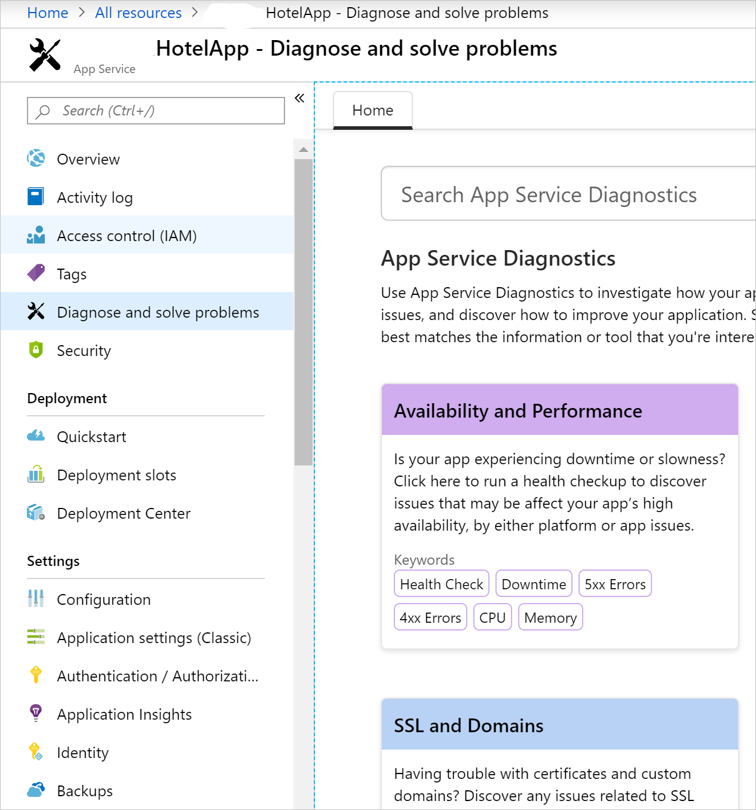

In this unit, the application event log is analyzed through Kudu console.

## Access the Application Event Log through Azure Portal

1. Go to the [Azure portal](https://portal.azure.com/learn.docs.microsoft.com?azure-portal=true).
1. In the Azure Portal, open the **&lt;yourname&gt;HotelApp** app in **All resources**.
1. Select **Diagnose and solve problems**.

1. Select **Diagnostic Tools** menu option.
1. Select **Application Event Logs** under **Support Tools**.
1. Review the latest error provided by *IIS AspNetCoreModule* or *IIS AspNetCoreModule V2* in the **Source** column.

## Access the Application Event Log through Kudu Console

1. Go back to the **&lt;yourname&gt;HotelApp** overview pane.
1. Under the **Development Tools** section, open **Advanced Tools**. 
1. Select the **Go** button. Use the same Sandbox login credentials when the login page opens.This opens Kudu Console in a new window.

1. Open **Debug Console** in the top navigation bar and select **CMD**.
1. Open **LogFiles** folder.
1. Open **kudu** folder.
1. Open **trace** folder.
1. Examine the file ending with **eventlog.xml** using the edit button on the left and scroll to the bottom to see the most recent events.

## Run the app in Kudu Console

You can run the app in Kudu console Remote Execution Console to discover useful information that is not immediately visible in the Application Event Log.

1. Under the **Development Tools** section in the Azure Portal, open **Advanced Tools**. 
1. Select the **Go** button. This opens Kudu Console in a new window.
1. Open **Debug Console** in the top navigation bar and select **CMD**.
Run the following commands in the command prompt:
1. `cd D:\Program Files\dotnet`
1. Run the app: `dotnet \home\site\wwwroot\HotelApp.dll`

The console output from the app, showing any errors, is piped to the Kudu console.

The error message in the screenshot points out the "Content root... does not exist" error.
