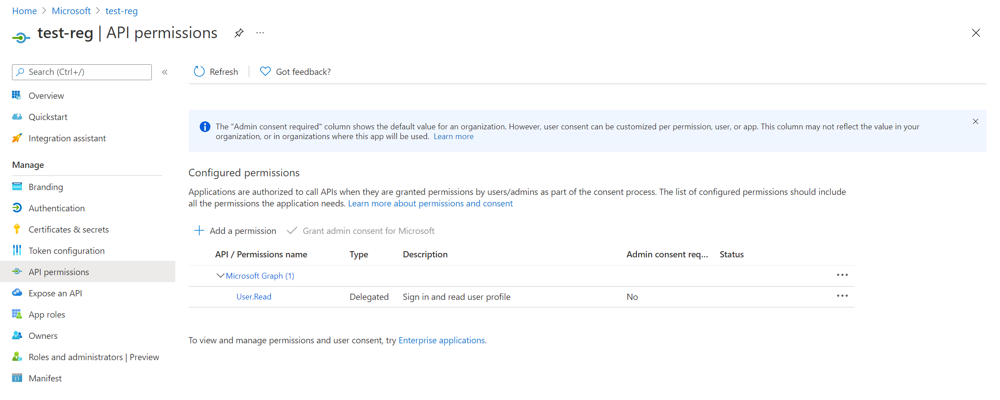

In this exercise, you will configure the application with permissions and use MSAL to access user profile information from the Microsoft Graph (MS Graph) API.

## Add Microsoft Graph permissions to App registration

1. In the app's registration screen, click on the **API permissions** blade in the left to open the page where we add access to the APIs that your application needs.
   - Click the **Add permissions** button and then,

   - Ensure that the **Microsoft APIs** tab is selected.

   - In the *Commonly used Microsoft APIs* section, click on **Microsoft Graph**.

   - In the **Delegated permissions** section, select the **User.Read** in the list.  This particular permission is for accessing the information of the signed-in user from the `https://graph.microsoft.com/v1.0/me` endpoint.

   - Click on the **Add permissions** button in the bottom.

   

## Run the application

1. Make certain that your Tomcat server is running and you have privileges to deploy a web app to it. Make certain that your server host address is `http://localhost:8080`.

2. Compile and package the project using **Maven**:

    ```Shell
    cd ~/javawebapp/2-Authorization-I/call-graph
    mvn clean package
    ```

3. Find the resulting `.war` file in `./target/msal4j-servlet-graph.war`. To deploy to Tomcat, copy this `.war` file to the `/webapps/` directory in your Tomcat installation directory and start the Tomcat server.

4. Open your browser and navigate to `http://localhost:8080/msal4j-servlet-graph/`. You will be redirected to login with Azure AD. On successful login, you should see a page as shown in the below image.

    

5. Click the **Call Graph** button to make a call to Microsoft Graph's `/me` endpoint and see the user details displayed.

## Overview of authentication code for MS Graph access

1. In the `./src/main/resources/authentication.properties` file, the value of `aad.scopes` is set to the **User.Read** scope.

    Scopes tell Azure AD the level of access that the application is requesting and map to the permissions in the app registration. Based on the requested scopes, Azure AD presents a consent dialogue to the user upon signing in. If the user consents to one or more scopes , the scopes consented to are encoded into the resulting `access_token` returned in the authentication response. 


2. When the user navigates to `/call_graph`, the application creates an instance of the IGraphServiceClient (Java Graph SDK), passing along the signed-in user's access token. The Graph client from hereon places the access token in the Authorization headers of its requests. The app then asks the Graph Client to call the  `/me` endpoint to yield details for the currently signed-in user.

    The following code is all that is required for an application developer to write for accessing the `/me` endpoint, provided that they already have a valid access token for Graph Service with the `User.Read` scope.

    ```Java
    //CallGraphServlet.java
    User user = GraphHelper.getGraphClient(contextAdapter).me().buildRequest().get();
    ```


