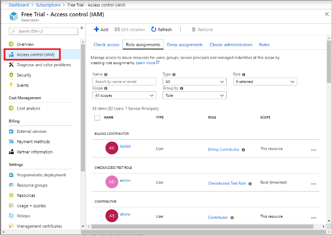
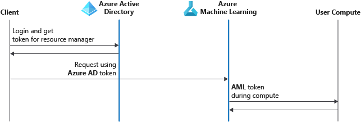

**Azure role-based access control (Azure RBAC)** is an authorization system that allows fine-grained access management of Azure ML resources. It allows you to manage team members access to Azure cloud resources by assigning roles. These roles determine what assets team members can use in the workspace, and what they can do with those resources. This can be important if your team works with sensitive data such as hospital records that contain private medical information, or if you wish to restrict access to critical assets for junior team members within Azure ML. By using these roles, you can realistically reflect your organizations structure, ensuring responsibilities and critical assets are portioned to the correct individuals.

## User roles

Azure RBAC roles can be assigned to individuals and groups to determine their rights to access data or use resources within Azure ML. These rights are assigned on a permission-based system, with set access and restrictions being clearly defined. This control is applied at the workspace level and can only be changed by administrators or owners of the specific workspace within Azure ML. An Azure ML workspace comes with three default roles when it's created. You can add users to the workspace and assign one of these roles:

* **Owner** has full access to the workspace, including the ability to view, create, edit, or delete assets in a workspace. Additionally, you can change role assignments
* **Contributor** can view, create, edit, or delete assets in a workspace. For example, contributors can create an experiment, create or attach a compute cluster, submit a run, and deploy a web service.
* **Reader** can only perform read-only actions in the workspace. Readers can list and view assets, including datastore credentials in a workspace. Readers can’t create or update these assets.
* **Custom roles** allow you to customize access to specific control or data plane operations within a workspace. For example, submitting a run, creating a compute, deploying a model or registering a dataset.

### Custom roles

If the default roles don't meet your organization’s need for more selective access control, you can create your own custom roles. Custom roles give you the flexibility to develop permission-based rules for individuals’ or groups that provide access for team members while defining your own security stipulations to secure data or resources. You can make a role available at a specific workspace level, a specific resource group level, or a subscription level by defining the scope of your custom role, which we can see in the example JSON below.

Custom roles can be created by defining possible actions permitted and NotActions to restrict specific activities or access. You can create custom roles using Azure portal, Azure PowerShell, Azure CLI, or the REST API. Below we can see a custom role JSON request for a data scientist:

```JSON
{
    "Name": "Data Scientist Custom",
    "IsCustom": true,
    "Description": "Can run experiment but can't create or delete compute or deploy production endpoints.",
    "Actions": [
        "Microsoft.MachineLearningServices/workspaces/*/read",
        "Microsoft.MachineLearningServices/workspaces/*/action",
        "Microsoft.MachineLearningServices/workspaces/*/delete",
        "Microsoft.MachineLearningServices/workspaces/*/write"
    ],
    "NotActions": [
        "Microsoft.MachineLearningServices/workspaces/delete",
        "Microsoft.MachineLearningServices/workspaces/write",
        "Microsoft.MachineLearningServices/workspaces/computes/*/write",
        "Microsoft.MachineLearningServices/workspaces/computes/*/delete", 
        "Microsoft.Authorization/*",
        "Microsoft.MachineLearningServices/workspaces/computes/listKeys/action",
        "Microsoft.MachineLearningServices/workspaces/listKeys/action",
        "Microsoft.MachineLearningServices/workspaces/services/aks/write",
        "Microsoft.MachineLearningServices/workspaces/services/aks/delete",
        "Microsoft.MachineLearningServices/workspaces/endpoints/pipelines/write"
    ],
    "AssignableScopes": [
        "/subscriptions/<subscription_id>/resourceGroups/<resource_group_name>/providers/Microsoft.MachineLearningServices/workspaces/<workspace_name>"
    ]
}

````
Note the Actions and NotActions above which define the permissions for the custom role and the assigned scope that is at the specific workspace level. In this example, the data scientist’s actions are defined through a wildcard (represented by the * sign) which extends a permission to everything that matches the action string you provide. So, in the above example the wildcard (represented by the * sign) string adds all permissions related to any read, write, action, or deletion within the workspace.

However, if we then look at the NotActions above, we can see restrictions on the deletion or creation of workspaces or new compute resources among others. Azure RBAC is an additive model, so the final permissions given to the custom role are the sum of these permissions and restrictions.

## System

A common challenge for developers is the management of secrets and credentials used to secure communication between different components. Azure ML relies on **Azure Active Directory (Azure AD)** for authentication and/or communication between other Azure cloud resources. Azure AD is a cloud-based identity and access management service, which helps your employees' sign-in and access cloud resources on Azure.

### Authentication with Azure AD

In general, there are three authentication workflows that you can use when connecting to the workspace:

* **Interactive**: You use your account in Azure AD to either directly authenticate, or to get a token that is used for authentication. Interactive authentication is used during experimentation and iterative development. Interactive authentication enables you to control access to resources, such as a web service, on a per-user basis.
* **Service principal:** You create a service principal account in Azure AD, and use it to authenticate or get a token. A service principal is used when you need an automated process to authenticate to the service without requiring user interaction. For example, a continuous integration and deployment script that trains and tests a model every time the training code changes.
* **Azure CLI session:** You use an active Azure CLI session to authenticate. Azure CLI authentication is used during experimentation and iterative development, or when you need an automated process to authenticate to the service using a pre-authenticated session. You can sign in to Azure via the Azure CLI on your local workstation, without storing credentials in Python code or prompting the user to authenticate.
* **Managed identity:** When using the Azure ML SDK on an Azure Virtual Machine, you can use a managed identity for Azure. This workflow allows the VM to connect to the workspace using the managed identity, without storing credentials in Python code or prompting the user to authenticate. Azure ML compute clusters can also be configured to use a managed identity to access the workspace when training models.

Azure ML provides built-in roles for common management scenarios. An individual who has a profile in Azure AD can assign these roles to users, groups, service principals, or managed identities to grant or deny access to resources and operations on Azure ML resources.

You can use the **Identity and Access Management tab** for a resource in the Azure portal to configure Azure RBAC and maintain inventory on Azure ML resources. The roles are applied to users, groups, service principals, and managed identities in the Azure AD. You can use built-in roles or custom roles for individuals and groups. In the image below we can see Azure RBAC controls found within the Identity and Access Management tab on the Azure portal:



### Managed Identities

When configuring the Azure ML workspace in a trustworthy manner, it's important to ensure that different cloud services associated with the workspace have the correct level of access. Managed identities allow you to authenticate to any service that supports Azure AD authentication by providing an automatically managed identity for applications or services to use when connecting to Azure ML or other Azure cloud services.

Once you have a managed identity, you can request tokens via a token endpoint on the resource such as the virtual machine. These tokens then work with your existing X to permit users to do actions, such as pull keys from Azure Key Vault or any other secret. Similarly, if a user has a managed identity on a virtual machine, they can request a different token for another Azure service, like Azure Blob Storage. If that user has an Azure RBAC role that permits using that storage, then that token can be used to authenticate and either read or push data to storage without any credentials in their code. For example, an application may use a managed identity to access resources like Azure Key Vault where developers can store credentials in a secure manner or to access storage accounts.

```NOTEBOX: Managed identities can only be used with Azure ML when using the Azure ML SDK on an Azure Virtual Machine or Azure ML compute cluster. This workflow allows the VM to connect to the workspace using the managed identity instead of the individual user's Azure AD account, and without storing credentials in code.

Azure ML compute clusters also support managed identities to authenticate access to Azure resources without including credentials in your code. There are two types of managed identities:

* A system-assigned managed identity is enabled directly on the Azure ML compute cluster. The life cycle of a system-assigned identity is directly tied to the compute cluster. If the compute cluster is deleted, Azure automatically cleans up the credentials and the identity in Azure AD.
* A user-assigned managed identity is a standalone Azure resource provided through Azure Managed Identity service. You can assign a user-assigned managed identity to multiple resources, and it persists for as long as you want. These are relatively complex, and we do not recommend using this unless required.

Below we can see the basic architecture of the authentication process of compute resources with Azure AD:

