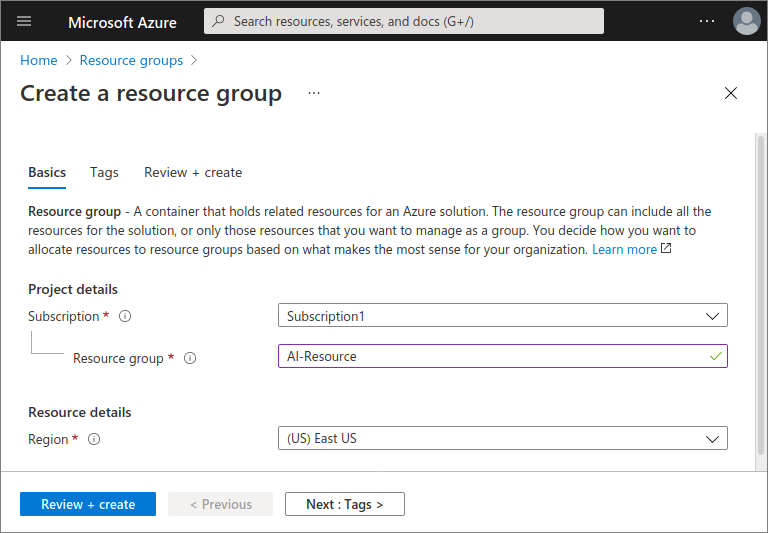
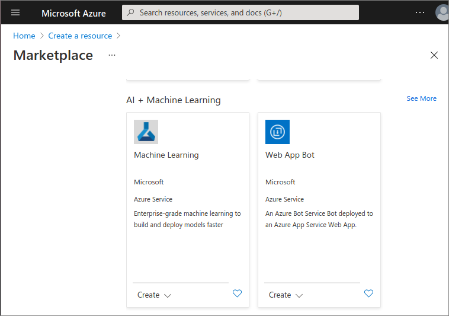
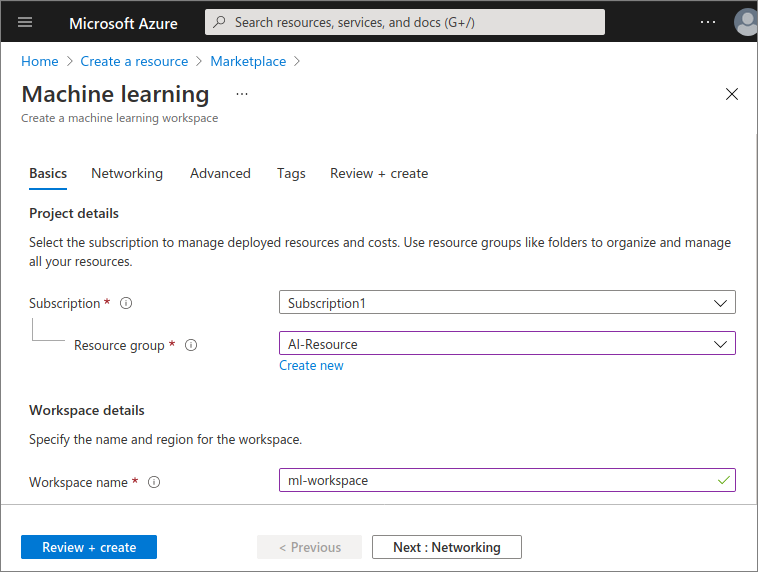
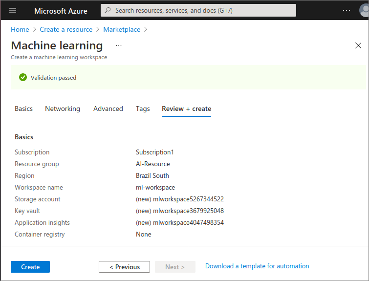

 A [Machine Learning Workspace.](https://docs.microsoft.com/en-us/azure/machine-learning/concept-workspace) is probably one of the most interesting resources to Data Scientists and ML Engineers.

It is the top level resource where you work with artifacts needed in Azure Machine Learning, such as datasets, models and user roles.

In this exercise we will setup an Azure Ml Workspace, which will be used in following exercises and modules.

## Prerequisites

- Azure Account and a Subscription

If you don't have an Azure subscription yet, please follow the instructions in the link below:

[Create a subscription in the Azure portal.](https://docs.microsoft.com/en-us/azure/cost-management-billing/manage/create-subscription#create-a-subscription-in-the-azure-portal)

## Sign in to Azure

Sign in to the [Azure portal.](https://portal.azure.com)

## Create a Resource Group

A Resource Group is where administrators can create logical groups of resources, like storage volumes, virtual machines and ML workspaces, so they can more easily track costs, apply access controls and monitor activity.

Let's create a Resource Group for this exercise:

1. In the Azure Portal, select **Resource Groups**:

   

2. Click **New** in the resource groups list:

   

3. Fill in the form to add a new Resource Group

   - Select your previously created subscription.
   - Use **AI-Resource** as the Resource group's name.
   - Select your preferred region.

   

## Create ML Workspace

To create a ML Workspace, follow these steps:

1. Select **Create a resource** in the Azure Portal:

   

2. Ckick on **See all**.

   

3. Scroll down until the **AI + Machine Learning** option is visible.

   

4. Fill in the form, selecting your current subscription and the resource group we had previsously created (AI-Resource). Use **ml-workspace** as the workspace name:

   

5. Click on the **Review + create** button to load a review confirmation screen:

   

6. Click on **Create** to start deploying your new workspace (this can take a few minutes).

> [!IMPORTANT]
> Notice that the deployment above created other resources:  
>  
> - A [storage account](https://azure.microsoft.com/services/storage/) - used to store files used by the Workspace as well as data for experiments and model training.
>   - An [Application Insights](https://azure.microsoft.com/services/application-insights/) instance, used to monitor predictive services in the Workspace.
>   - An [Azure Key Vault instance](https://azure.microsoft.com/services/key-vault/), used to manage secrets such as authentication keys and credentials used by the Workspace.
>   - A [container registry](https://azure.microsoft.com/services/container-registry/), created as-needed to manage containers for deployed models.

### Summary

Congratulations!

In this unit you've covered the following topics:

- Creating a Resource group
- Creating a Machine Learning Workspace

### More Resources

To read more about Custom Roles visit:

- [What is an Azure Machine Learning workspace?](https://docs.microsoft.com/azure/machine-learning/concept-workspace)
- [Manage Azure Resource Manager resource groups by using the Azure portal](https://docs.microsoft.com/azure/azure-resource-manager/management/manage-resource-groups-portal#what-is-a-resource-group)