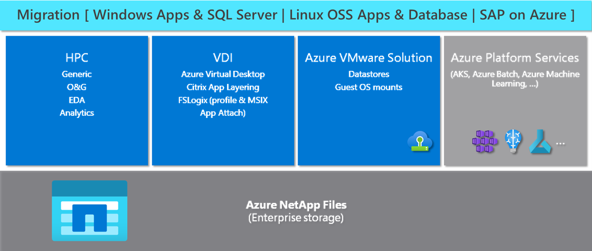

Azure NetApp Files is an enterprise storage service that offers to accelerate and simplify the migration of various workload categories. Azure NetApp Files provides a high-performance, scalable, and secure storage service for running mission-critical applications and workloads in Azure. 

For businesses looking to migrate their applications and workloads to Azure, Azure NetApp Files provides a seamless experience for migrating Windows Apps and SQL server, Linux OSS Apps and Databases, and SAP on Azure. In addition to migration, Azure NetApp Files provides a platform for running specialized workloads in High-Performance Computing.

Azure NetApp Files’ integration with Azure native services like Azure Kubernetes Service, Azure Batch, and Azure Machine Learning provides users with a seamless experience and enables them to leverage the full power of Azure's cloud-native services.

The following diagram depicts the key use cases supported in Azure NetApp Files.

Azure NetApp Files is a versatile and scalable storage service that provides an ideal platform for migrating various workload categories, running specialized workloads, and integrating with Azure native services.

## Solutions for different workloads

Use the following links to learn more about the solutions architectures for various workloads.

- [Linux OSS Apps and Database solutions](/azure/azure-netapp-files/azure-netapp-files-solution-architectures#linux-oss-apps-and-database-solutions)
- [Windows Apps and SQL Server solutions](/azure/azure-netapp-files/azure-netapp-files-solution-architectures#windows-apps-and-sql-server-solutions)
- [SAP on Azure solutions](/azure/azure-netapp-files/azure-netapp-files-solution-architectures#sap-on-azure-solutions)
- [Azure VMware Solution solutions](/azure/azure-netapp-files/azure-netapp-files-solution-architectures#azure-vmware-solution-solutions)
- [Virtual Desktop Infrastructure solutions](/azure/azure-netapp-files/azure-netapp-files-solution-architectures#virtual-desktop-infrastructure-solutions)
- [HPC solutions](/azure/azure-netapp-files/azure-netapp-files-solution-architectures#hpc-solutions)
- [Azure platform services solutions](/azure/azure-netapp-files/azure-netapp-files-solution-architectures#azure-platform-services-solutions)
