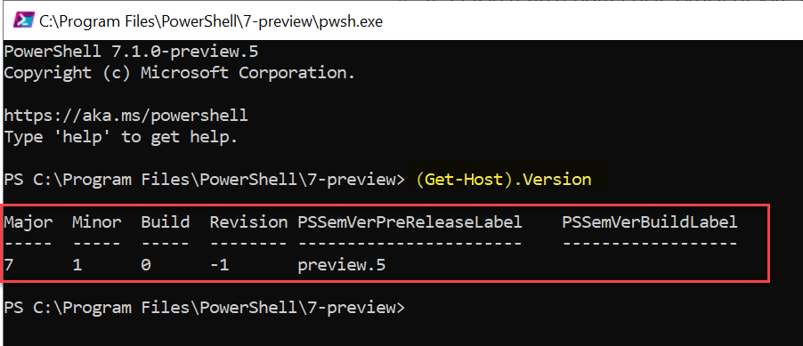
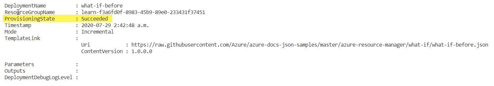

> [!NOTE]
> The first time you activate a sandbox and accept the terms, your Microsoft account is associated with a new Azure directory named Microsoft Learn Sandbox. You're added to a special subscription named Concierge Subscription.

Here, you will deploy a simple Azure Resource Manager (ARM) template from a sample repository that deploys a Virtual Network (VNet) in your sandbox subscription.  Once the deployment is complete, you will then deploy a template that is slightly different:

1. A change od address space in a virtual subnet
1. An additional Subnet in the virtual network

The second deployment will include the *what-if* operation in order to review the expected changes.

This exercise uses the [Azure Resource Manager Tools for Visual Studio Code](https://marketplace.visualstudio.com/items?itemName=msazurermtools.azurerm-vscode-tools). Be sure to install this extension in Visual Studio Code.

## What-if prerequisites

### PowerShell

To use what-if in PowerShell, you must have version **4.2 or later of the Az module**.

Before installing the required module, make sure you have PowerShell Core (6.x or 7.x). If you have PowerShell 5.x or earlier, [update your version of PowerShell](https://docs.microsoft.com/powershell/azure/install-az-ps?view=azps-4.4.0&WT.mc_id=MSLearn-ARM-pierrer). You can't install the required module on PowerShell 5.x or earlier.

To verify the PowerShell version you can use the following command in a PowerShell session:

```powershell
(Get-Host).Version
```



To install this module use the following command in an elevated privileged (running PowerShell as administrator) PowerShell session:

```powershell
Install-Module -Name Az -Force
```

if you have an older version of the Az Module, and need to update it, use the following command, again in an elevated privileged (running PowerShell as administrator) PowerShell session:

```powershell
Update-Module -Name Az
```

### Azure CLI

To use what-if in Azure CLI, you must have Azure CLI 2.5.0 or later. If needed, [install the latest version of Azure CLI](https://docs.microsoft.com/cli/azure/install-azure-cli?view=azure-cli-latest&WT.mc_id=MSLearn-ARM-pierrer).

## Deploy the first ARM Template

To deploy this template to Azure, you need to sign in to your Azure account from the Visual Studio Code terminal.

:::image type="content" source="../media/vscode-terminal.gif" alt-text="Open the integrated terminal in Visual Studio Code." border="true":::

 Be sure you are signing in to the same account that activated the sandbox.

### Sign in to Azure

1. From the terminal in Visual Studio Code, run this command to sign in to Azure. Running this command will open a browser that allows you to sign in to your account.

    ```powershell
    Connect-AzAccount
    ```

1. Once you are logged in, you see a list of the subscriptions associated with this account in the terminal. If you activated the sandbox.
1. Get the subscription ID. The command will list your subscriptions and their IDs. The subscription ID is the second column. Look for Concierge Subscription and copy the second column. It will look something like cf49fbbc-217c-4eb6-9eb5-a6a6c68295a0

    ```powershell
    Get-AzSubscription
    ```

1. Change your active subscription to the Concierge Subscription. Be sure to substitute {Your subscription ID} with the ID of the Concierge Subscription you just got in the last command.

    ```powershell
    $context = Get-AzSubscription -SubscriptionId {Your subscription ID}
    Set-AzContext $context
    ```

### Set the default resource group

1. You now need to set the resource group created for you in the sandbox as the default resource group.  do perform that operation you first need to get the resource group name by using the following command.

    ```powershell
    Get-AzResourceGroup
    ```

    and use the name of the resource name provided by the last command in this command. (It will look like something like **learn-a73131a1-b618-48b8-af70-21af7ca420c4**) This allows you to omit that parameter from the rest of the Azure PowerShell commands in this exercise.

    > [!NOTE] Normally, when you use a PowerShell or an Azure CLI command to deploy a template you need to specify the target **resource group** name.  In the exercise in this module we are bypassing this requirement by setting the context of our deployment by specifying our sandbox resource group name in the step below by using the **[Set-AzDefault](https://docs.microsoft.com/powershell/module/az.accounts/set-azdefault?view=azps-4.5.0&WT.mc_id=MSlearn-ARM-pierrer)** Powershell command.

    ```powershell
    Set-AzDefault -ResourceGroupName {Resource Group Name}
    ```

### Deploy the first template to Azure

Now that you have setup your subscription in the Visual Studio Code (VS Code) terminal, you deploy the ARM template to Azure. The ARM template doesn't have any resources yet, so you won't see resources created. However, you'll see a successful deployment.

For every deployment you need a **deployment name**, if you don't provide a name for the deployment, the name of the template file is used by default. For example, if you deploy a template named azuredeploy.json and don't specify a deployment name, the deployment is named azuredeploy.  However, using unique meaningful deployment names for each deployment provides you with additional simplicity when reviewing deployments and troubleshooting events and  maintain unique entries in the deployment history.  Since every time you run a deployment, an entry is added to the resource group's deployment history with the deployment name. If you run another deployment and give it the same name, the earlier entry is replaced with the current deployment.  Also, when you specify a unique name for each deployment, you can run them concurrently without conflict.

1. Deploy the template using the following PowerShell AZ module commands in the terminal.

    ```powershell
    New-AzResourceGroupDeployment `
    -TemplateUri "https://raw.githubusercontent.com/Azure/azure-docs-json-samples/master/azure-resource-manager/what-if/what-if-before.json"
    ```

    You see ```Running...``` in the terminal. When that finishes, the results of the above command should be something like the following

    


1. To validate the results in the Azure portal, navigate to [Azure](https://portal.azure.com?azure-portal=true) and make sure you are in the sandbox subscription. To do that, select your avatar in the upper right corner of the page. Choose **Switch directory**. In the list, choose the **Microsoft Learn Sandbox** directory.

    1. On the left side panel, choose *Resource groups*.
    1. Select <rgn>[sandbox resource group name]</rgn>.
    1. In the *Overview*, you see one deployment succeeded.
    1. Select *1 Succeeded* to see the details of the deployment.

:::image type="content" source="../media/3-portal-deployment-success.png" alt-text="Azure portal interface for the deployments with the one deployment listed and a succeeded status." border="true":::

Select *what-if-before* to see what resources were deployed. In this case, one VNet (address space 10.0.0.0/16) with 2 subnets.

:::image type="content" source="../media/3-portal-deployment-details.png" alt-text="Azure portal interface for the specific deployment with no resources listed." border="true":::

:::image type="content" source="../media/3-portal-deployment-details-2.png" alt-text="Azure portal interface for the specific deployment with VNet resource listed." border="true":::

Leave the page open in your browser. You will check on deployments again.

## Deploy the modified template in the same environment

Now that you've deployed the template, you're ready to test the *what-if* operation. This time you will deploy a template that changes the virtual network you deployed in un the first part.  The difference in the second templates are:

- The original tag was removed
- A subnet has been removed
- And the address prefix has changed.

1. In order to perform that operation, use the following PowerShell command

    ```powershell
    New-AzResourceGroupDeployment `
      -Whatif `
      -TemplateUri "https://raw.githubusercontent.com/Azure/azure-docs-json-samples/master/azure-resource-manager/what-if/what-if-after.json"
    ```

1. The what-if output appears similar to:

:::image type="content" source="../media/3-portal-deployment-whatif-results.png" alt-text="Azure portal interface for the deployments with the one deployment listed and a succeeded status." border="true":::

You'll notice that the result is colour coded in addition to a "prefix"

- Purple and "~" for any modifications
- Green and "+" for new resources to be created
- Orange and "-" for deletion.

## Deploy using the Complete mode and confirmation option

To preview changes before deploying a template, you need to be in  use the **-confirm** switch parameter with the deployment command. If the changes are as you expected, acknowledge that you want the deployment to complete.  In this next steps you will deploy an empty template over your existing environment.  So, in theory, because of the "complete" mode it will try to remove\delete any resources in the target environment that are not defined in the template.  Basically, everything.

1. to run the deployment in complete mode with a confirmation prompt, use the following PowerShell command:

    ```powershell
    New-AzResourceGroupDeployment `
    -Mode Complete `
    -Confirm `
    -TemplateUri "https://raw.githubusercontent.com/Azure/azure-docs-json-samples/master/empty-template/azuredeploy.json"
    ```

:::image type="content" source="../media/whatif-complete-confirm.png" alt-text="Azure portal interface for the complete deployments and prompt to execute." border="true":::

The result will ask you to confirm with the following prompt:

Are you sure you want to execute the deployment?
[Y] Yes  [A] Yes to All  [N] No  [L] No to All  [S] Suspend  [?] Help (default is "Y"):

1. To execute and clean out your environment type "A" for "[A] Yes to All".  Once it completes with the following results

:::image type="content" source="../media/whatif-complete-confirm-results.png" alt-text="Azure portal interface for the specific deployment with VNet resource listed." border="true":::

1. Navigate back to the open browser you used earlier, and verify that there were 2 successful deployment.

    1. The first one you deployed
    1. The complete one that removed all resources, and the VNet is no longer there.

:::image type="content" source="../media/3-portal-deployment-complete-details.png" alt-text="Azure portal interface for the complete deployment with VNet resource no longer listed." border="true":::
