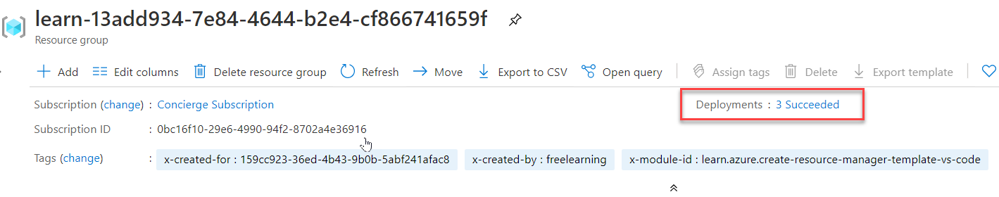

### Sign in to Azure

1. From the terminal in Visual Studio Code, run this command to sign in to Azure. Running this command will open a browser that allows you to sign in to your account.

    ```powershell
    Connect-AzAccount
    ```

1. Once you are logged in, you see a list of the subscriptions associated with this account in the terminal. If you activated the sandbox the *Concierge Subscription* should be in this list.
1. To get the subscription ID. The command will list your subscriptions and their IDs in a easy to read table format. The subscription ID is the second column. Look for Concierge Subscription and copy the second column. It will look something like *cf49fbbc-217c-4eb6-9eb5-a6a6c68295a0*

    ```powershell
    Get-AzSubscription
    ```

1. Change your active subscription to the Concierge Subscription. Be sure to substitute {Your subscription ID} with the ID of the Concierge Subscription you just got in the last command.

    ```powershell
    $context = Get-AzSubscription -SubscriptionId {Your subscription ID}
    Set-AzContext $context
    ```

### Set the default resource group

1. You now need to set the resource group created for you in the sandbox as the default resource group. To perform that operation you first need to get the resource group name by using the following command.

    ```powershell
    Get-AzResourceGroup
    ```

    and use the name of the resource name provided by the last command in this command. (It will look like something like **learn-a73131a1-b618-48b8-af70-21af7ca420c4**) This allows you to omit that parameter from the rest of the Azure PowerShell commands in this exercise.

    > [!NOTE] Normally, when you use a PowerShell or an Azure CLI command to deploy a template you need to specify the target **resource group** name.  In the exercise in this module we are bypassing this requirement by setting the context of our deployment by specifying our sandbox resource group name in the step below by using the **[Set-AzDefault](https://docs.microsoft.com/powershell/module/az.accounts/set-azdefault?view=azps-4.5.0&azure-portal=true)** Powershell command.

    ```powershell
    Set-AzDefault -ResourceGroupName {Resource Group Name}
    ```

## Deploying a linked template

In this exercise, we will review and deploy a template that includes two linked templates.

1. To add a linked template to your ARM template, add a *Microsoft.Resources/deployments* resource and the *templateLink* property configured with the location of the template.

    In the sample template below, you will notice that there are two variable that define remote or external templates located on a GitHub repo.

    - "linked-template": "https://raw.githubusercontent.com/Azure/azure-quickstart-templates/master/101-storage-account-create/azuredeploy.json"
    - "linked-template-2": "https://raw.githubusercontent.com/Azure/azure-docs-json-samples/master/azure-resource-manager/what-if/what-if-before.json"

    Review the template and note the *"type": "Microsoft.Resources/deployments"* sections that define where and how the linked templates will be deployed.

    The first linked template deploys a storage account.  It consumes the parent parameters and deploys the storage template.

    The second linked template is configured to depend on the storage deployment, and to deploy a virtual network template.

    ```json
    {
    "$schema": "https://schema.management.azure.com/schemas/2019-04-01/deploymentTemplate.json#",
    "contentVersion": "1.0.0.0",
    "parameters": {
        "name": {
            "type": "string",
            "defaultValue": "linkeddemo001"
        }
    },
    "variables": {
        "linked-template": "https://raw.githubusercontent.com/Azure/azure-quickstart-templates/master/101-storage-account-create/azuredeploy.json",
        "linked-template-2": "https://raw.githubusercontent.com/Azure/azure-docs-json-samples/master/azure-resource-manager/what-if/what-if-before.json"
    },
    "resources": [
        {
            "name": "storage",
            "type": "Microsoft.Resources/deployments",
            "apiVersion": "2019-10-01",
            "properties": {
                "mode": "Incremental",
                "templateLink": {
                    "uri": "[variables('linked-template')]",
                    "contentVersion": "1.0.0.0"
                },
                "parameters": {
                    "location": { "value": "[resourceGroup().location]" }
                }
            }
        },
        {
            "name": "identity",
            "type": "Microsoft.Resources/deployments",
            "apiVersion": "2019-10-01",
            "dependsOn": [
                "[resourceId('Microsoft.Resources/deployments','storage')]"
            ],
            "properties": {
                "mode": "Incremental",
                "templateLink": {
                    "uri": "[variables('linked-template-2')]",
                    "contentVersion": "1.0.0.0"
                }
            }
        }
    ],
    "outputs": {}
    }
    ```

1. To get started copy and paste the content of the template displayed above, into a file in a local directory.  **C:\JSON\linkedtemplate.json** for example.

    Once you have saved that file locally, you can proceed to deploy it using the PowerShell command to deploy at the resource group level we talked about in the last unit. Namely, [New-AzResourceGroupDeployment](https://docs.microsoft.com/powershell/module/az.resources/new-azresourcegroupdeployment?view=azps-4.4.0&azure-portal=true)

    ```powershell
        $templateFile="C:\JSON\linkedtemplate.json"
        $today=Get-Date -Format "MM-dd-yyyy"
        $DeploymentName="DeployLinkedTemplate-"+"$today"

        New-AzResourceGroupDeployment `
        -Name $DeploymentName `
        -TemplateFile $templateFile
    ```

    Once it completes, you should have results like this:

    

1. To validate the results in the Azure portal, navigate to [Azure](https://portal.azure.com?azure-portal=true) and make sure you are in the sandbox subscription. To do that, select your avatar in the upper right corner of the page. Choose **Switch directory**. In the list, choose the **Microsoft Learn Sandbox** directory.

    1. On the left side panel, choose *Resource groups*.
    1. Select <rgn>[sandbox resource group name]</rgn>.
    1. In the *Overview*, you see the deployment has succeeded.
    1. Select *3 Succeeded* to see the details of the deployment. *(There may be more completed deployment depending on whether you performed the previous unit's exercises)*

    

1. You will notice that you deployed one template but 3 are listed in the deployment pane of the portal. Those three deployments correspond to the main template and the two linked templates.

    
