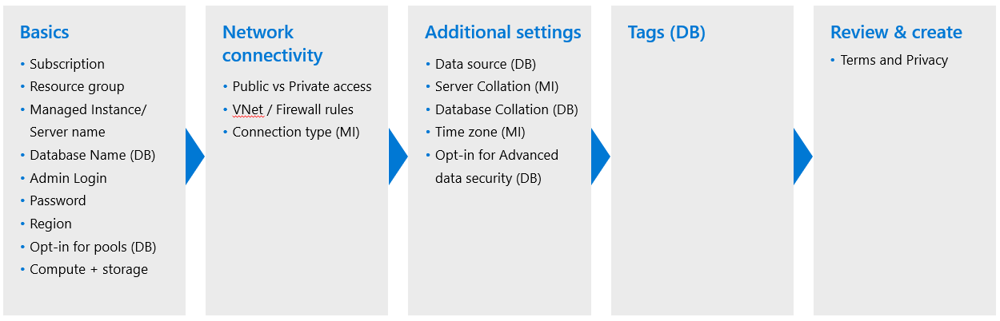

Once you've selected a workload to either migrate to or create in Azure SQL, you need to plan your deployment, deploy accordingly, and verify that the deployment was successful. In this unit, you'll learn various methods for each step in the process.  

### Pre-deployment planning

Before you start deploying things in Azure, it's important to understand what your requirements are and how they map to offerings in Azure SQL. Using what you learned in the Azure SQL introduction module, it's time to make a plan. You need to answer the following questions:

* Deployment method: Azure portal or command-line tools?
* Deployment option: VM, DB, Elastic Pool, MI, or Instance Pool?
* Purchasing model: DTU or vCore?
* Service tier (SLO): General purpose, business critical, or hyperscale?
* Hardware: Gen4, Gen5, or something new?
* Sizing: number of vCores and data max size?  

In addition, and perhaps prior to answering the question above, you need to pick a workload that is either going to be migrated to Azure SQL or be "born in the cloud". If you are migrating, there are many tools and resources available to help you plan, assess, migrate, and optimize your database(s) and application. Resources are provided at the end of this module.  

#### Resource limit considerations

Aside from limits, rates, and capabilities discussed in the Azure SQL introduction module (like IOPS or In-Memory OLTP), there are other resource limits, which are affected by your choice of Azure SQL Managed Instance, Azure SQL Database, or options within these choices:  

* Memory
* Max log size
* Size of tempdb
* Max concurrent workers
* Backup retention

The limits for Azure SQL Managed Instance and Azure SQL Database are dependent on your choice of purchasing model, service tier, and number of vCores (or DTU). Within a General Purpose Azure SQL Database, your choice of Provisioned or Serverless compute will also affect these limits. You should review what's included in what you plan to deploy, before deploying, to ensure you are starting out with what you may need.  

It is also important to know that Azure SQL resources have overall resource limits *per subscription* and *per region*. If you need to increase your limits, it is possible to request a quota increase in the Azure portal.

## Deploy

Once you've completed your pre-deployment planning, it's time to put your plan into action. In this stage, you'll deploy Azure SQL (using the Azure portal or command-line), determine network configuration, and make an initial connection.  

For Azure SQL Database and Azure SQL Managed Instance, there are essentially five blades in the Azure portal to fill in during a deployment.  



In the following unit, you'll dive deeper into the decision points available through a deployment of Azure SQL Database.  

### Key deployment implementation details

While Azure is taking care of the deployment for you, there are some deployment implementation details that you should be aware of. All of the services are built on the Azure backbone known as *Azure Service Fabric*.  Understanding the backend of how some of these services are deployed and scaled on Azure Service Fabric will help you understand various behaviors that you may see.

**Azure SQL Managed Instance**

Behind the scenes, for Azure SQL Managed Instance, Azure deploys a dedicated ring (sometimes referred to as a *virtual cluster*) for your service. This architecture helps in providing security and native virtual network support. However, because of this architecture, deployment and scaling operations can take longer. For example, when you scale up or down, Azure deploys a new virtual cluster for you and then seeds it with your data. You can think of every instance as running on a single virtual machine. Azure SQL Instance pools were introduced to help with the long deployment time, because you can pre-deploy a "pool" of dedicated resources, making deploying into a pool and scaling within a pool much faster (and with a higher packing density).  

**Azure SQL Database**

Azure SQL database is contained by a logical database server. While there is a dedicated SQL instance behind the scenes, as a user you do not have access to the full surface area. The logical database server is used so you have something to connect to, as well as for grouping and managing certain permissions and configurations together. Within each logical database server, there is a logical master database, which can provide instance-level diagnostics.

**Azure SQL Database - Hyperscale**

The Hyperscale tier within Azure SQL Database (not yet in Azure SQL Managed Instance) has a different architecture than SQL Server. The Azure SQL team rearchitected Hyperscale for the cloud, and this architecture includes a multi-layer caching system, which can help with both speed and scale. Scaling and other operations no longer become size of data related and can be completed in constant time (a matter of minutes). The use of remote storage also allows for snapshot backups. In a later module of the Azure SQL fundamentals learning path, you will learn more details related to the architecture and how it affects performance and availability. One callout to consider during the deployment phase is that once you move a database to the Hyperscale tier, it is not possible to "go back" to the General purpose or Business critical tiers.

## Verify

Once you've completed your deployment, it's time to verify that deployment. In this stage, typically you'll check the results in the Azure portal or Azure CLI, run some queries that verify your deployment configuration, and tweak as necessary.  

For Azure SQL Managed Instance and Azure SQL Database, the first thing you might do is check the status of the database or instance with the Azure portal or the Azure CLI. Next, you can review the deployment details and activity log to ensure there were no failures or active issues.

For Azure SQL Managed Instance, you then might check the ERRORLOG, which is a common thing to do in SQL Server on-premises or in an Azure VM. This capability is not available in Azure SQL Database.  

Finally, you would likely confirm your network is configured properly, obtain the server name, and connect in a tool like SQL Server Management Studio (SSMS) or Azure Data Studio (ADS). There are several queries you can run to better understand what you've deployed and verify it was deployed correctly:  

```sql
SELECT @@VERSION
SELECT * FROM sys.databases
SELECT * FROM sys.objects
SELECT * FROM sys.dm_os_schedulers
SELECT * FROM sys.dm_os_sys_info*
SELECT * FROM sys.dm_os_process_memory*
SELECT * FROM sys.dm_exec_requests
SELECT SERVERPROPERTY('EngineEdition')
SELECT * FROM sys.dm_user_db_resource_governance
SELECT * FROM sys.dm_os_job_object
```

*Not available in Azure SQL Database

What you may notice is there are two queries that are not available in Azure SQL Database related to OS system information and OS process memory. These queries are not available because with Azure SQL Database, some things related to the OS are abstracted away from you, since you're just getting a database.  

Additionally, the last two queries are only available in Azure SQL. The first, `sys.dm_user_db_resource_governance`, will return the actual configuration and capacity settings used by resource governance mechanisms in the current database or elastic pool. The second, `sys.dm_os_job_object` will return a single row describing the configuration of the job object that managers the SQL Server process, as well as resource consumption statistics.

The next two exercises will go through all the details involved in deploying an Azure SQL Database or an Azure SQL Managed Instance, and you will leverage the sandbox environment to deploy Azure SQL Database. After deployment, you'll leverage various verification queries and pre-run SQL Notebooks in Azure Data Studio to compare SQL Database, SQL Managed Instance, and SQL Server 2019.  
