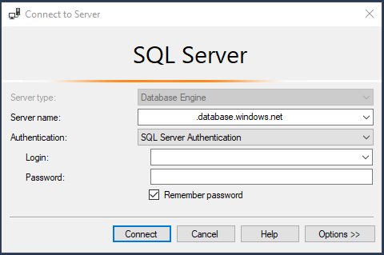
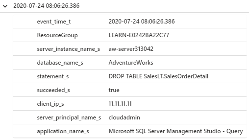

In this, you'll see how a common error can be recovered using point in time restore (PITR). This is easy to do in the portal or programmatically, but in this exercise you'll see how to do it with the Azure CLI.

### Set up: Use scripts to deploy Azure SQL Database

In the right-hand terminal, you'll see the Azure Cloud Shell, which is a way to interact with Azure using a browser. Before you start the labs, you will run a script there in order to create your environment, an Azure SQL Database with the AdventureWorks database. In the script, there will be some prompts, for a password and your local IP address.  

In order to get the IP address required, you must disconnect from any VPN service and run `(Invoke-WebRequest -Uri "https://ipinfo.io/ip").Content` in a local PowerShell window (not in this browser).  

This script should take 3-5 minutes to complete. Make sure to note your password, unique ID, and region as it will not be shown again.

**Don't forget to note your password, unique ID, and region. You will need these throughout the module.**  

```powershell
# Prompt for username and password
$adminSqlLogin = "cloudadmin"
$password = Read-Host "Your username is 'cloudadmin'. Please enter a password for your Azure SQL Database server that meets the password requirements"
# Prompt for local ip address
$ipAddress = Read-Host "Disconnect your VPN, open PowerShell on your machine and run '(Invoke-WebRequest -Uri "https://ipinfo.io/ip").Content'. Please enter the value (include periods) next to 'Address': "
# Get resource group and location and random string
$resourceGroup = Get-AzResourceGroup | Where ResourceGroupName -like learn* | Select-Object -Property ResourceGroupName | Select-Object -Index 0
$resourceGroupName = $resourceGroup.ResourceGroupName
$randomString = Get-Random -Minimum 100000 -Maximum 1000000
$storageAccountName = "mslearnsa"+$randomString
$rg = Get-AzResourceGroup | Where ResourceGroupName -like learn*
$location = $rg.Location
# The logical server name has to be unique in the system
$serverName = "aw-server$($randomString)"
# The sample database name
$databaseName = "AdventureWorks"
# The storage account name has to be unique in the system
$storageAccountName = $("sql$($randomString)")
# Create a new server with a system wide unique server name
$server = New-AzSqlServer -ResourceGroupName $resourceGroupName `
    -ServerName $serverName `
    -Location $location `
    -SqlAdministratorCredentials $(New-Object -TypeName System.Management.Automation.PSCredential -ArgumentList $adminSqlLogin, $(ConvertTo-SecureString -String $password -AsPlainText -Force))
# Create a server firewall rule that allows access from the specified IP range and all Azure services
$serverFirewallRule = New-AzSqlServerFirewallRule `
    -ResourceGroupName $resourceGroupName `
    -ServerName $serverName `
    -FirewallRuleName "AllowedIPs" `
    -StartIpAddress $ipAddress -EndIpAddress $ipAddress 
$allowAzureIpsRule = New-AzSqlServerFirewallRule `
    -ResourceGroupName $resourceGroupName `
    -ServerName $serverName `
    -AllowAllAzureIPs
# Create a database 
$database = New-AzSqlDatabase  -ResourceGroupName $resourceGroupName `
    -ServerName $serverName `
    -DatabaseName $databaseName `
    -SampleName "AdventureWorksLT" `
    -Edition "GeneralPurpose" -Vcore 2 -ComputeGeneration "Gen5"
# Enable Advanced data security
$advancedDataSecurity = Enable-AzSqlServerAdvancedDataSecurity `
    -ResourceGroupName $resourceGroupName `
    -ServerName $serverName
# Create a Storage Account 
$storageAccount = New-AzStorageAccount -ResourceGroupName $resourceGroupName `
    -AccountName $storageAccountName `
    -Location $location `
    -Type "Standard_LRS"
# Set up Log Analytics
$WorkspaceName = $serverName + "-la"
$workspace = New-AzOperationalInsightsWorkspace -Location $location -Name $WorkspaceName -Sku Standard -ResourceGroupName $resourceGroupName
Set-AzSqlServerAudit -ResourceGroupName $resourceGroupName -ServerName $serverName -LogAnalyticsTargetState Enabled -WorkspaceResourceId $workspace.ResourceId
Set-AzSqlDatabaseAudit -ResourceGroupName $resourceGroupName -ServerName $serverName -LogAnalyticsTargetState Enabled -WorkspaceResourceId $workspace.ResourceId -DatabaseName $databaseName
Write-Host "Please note your unique ID for future exercises in this module:"  
Write-Host $randomString
Write-Host "Your resource group name is:"
Write-Host $resourceGroupName
Write-Host "Your resources were deployed in the following region:"
Write-Host $location
Write-Host "Your server name is:"
Write-Host $serverName
```

Open SSMS and create a new connection to your logical server.  

For server name, input the name of your Azure SQL Database logical server. You may need to refer to the [Azure portal](https://portal.azure.com/learn.docs.microsoft.com) to get this, e.g. *aw-server`<unique ID>`.database.windows.net*.  

Change the authentication to **SQL Server Authentication**, and input the corresponding Server Admin Login and Password (the one you provided during deployment in the previous exercise).  

Check the **Remember password** box and select **Connect**.  

> **Note**: Depending on your local configuration (e.g. VPN), your client IP address may differ from the IP address the Azure portal used during deployment. If it does, you'll get a pop-up which reads "Your client IP address does not have access to the server. Sign in to an Azure account and create a new firewall rule to enable access." If you get this message, sign-in using the account you're using for the sandbox, and add a firewall rule for your client IP address. You can complete all of these steps using the pop-up wizard in SSMS.  

  

### Set up: Configure Auditing with Log Analytics

In this exercise, you'll learn how to use auditing through Log Analytics to determine when `DROP` statements have occurred. In order to do this, you must first configure auditing.

1. Enable auditing on the Azure SQL Database logical server  

    Open the [Azure portal](https://portal.azure.com/learn.docs.microsoft.com) and navigate to your Azure SQL Database. In the left-hand task menu, under Security, select **Auditing**. Select **View server settings**. You can apply auditing at the server level, which then applies to all databases within the Azure SQL Database logical server.  

      

    Next, set **Auditing** to **ON**.  

2. Configure auditing with Log Analytics  

    In this step, you'll configure Log Analytics. 

    Select **Log Analytics (Preview)** and the **Configure** button.  

      

    Next, select **+ Create New Workspace**.  

      

    Fill in the information according to the subscription, resource group, and location, that you are using to complete this module.  We recommend naming your Log Analytics Workspace **azuresql`<unique ID>`-la**, using your unique ID for your resources. Select **OK**.  

      

    This may take a few moments to validate and create. You should now see your Log Analytics account.  

3. Select save

    Select **Save**.  

      

### Process for PITR

Before you go any further, it's important to understand the recommended process for doing point in time restore (PITR):  

1. A table or database is deleted on accident.
1. Determine the time that you need to go back to. This should be **before** the error or mistake took place.  
1. Complete PITR via PowerShell or the Azure portal to go back to this time. This deploys a new database and restores a copy of your database, e.g. **AdventureWorks-copy**.  
1. Confirm the new database (e.g. **AdventureWorks-copy**) is in the correct state (before the accident occurred).  
1. Rename the original database, e.g. **AdventureWorks** to **AdventureWorks-old**.
1. Rename the new database to the original database name, e.g. **AdventureWorks-copy** to **AdventureWorks**.  
1. Delete the original database, e.g. **AdventureWorks-old**.  

In this exercise, you'll follow the steps that go along with the process above.  

1. Delete a table on *accident*

    First, let's confirm that the table we'll *accidentally* delete does exist and have data in it. Let's take a look at some of the values in `SalesLT.OrderDetail`.  

    **Navigate to SSMS** and **check/update your connection**. You'll want to make sure that the connection you use is connecting to the logical server, but not a specific database (e.g. set to `<default>` in screenshot below). You should also confirm that **Additional Connection Parameters** is contains no text.  

    

    Next, right-click on your AdventureWorks database and create a new query. Run the following query and review the results.  

    ```sql
    SELECT TOP 10 * from SalesLT.SalesOrderDetail
    ```

      

    For whatever reason, let's create a scenario where someone accidentally deletes that table. Today, you will be that someone.  

    **Using the same query window**, run the following query and note the completion time.

    ```sql
    DROP TABLE SalesLT.SalesOrderDetail
    ```

    **Important!** Save the completion time, you may need it later, for example `Completion time: 2020-06-22T09:20:27.1859237-07:00`.

    **Set up variables**

    Finally, before you get into the steps, run the follow code in the Azure Cloud Shell to configure your environment in the Azure Cloud Shell.  

    ```powershell
    $resourceGroup = Get-AzResourceGroup | Where ResourceGroupName -like learn*
    $database_name = "AdventureWorks"
    $server = Get-AzureRmSqlServer -ResourceGroupName $resourceGroup.ResourceGroupName
    $database_name_copy = "$($database_name)-copy"
    $database_name_old = "$($database_name)-old"
    $logical_server = $server.ServerName
    $resource_group = $resourceGroup.ResourceGroupName

    # Specify your default resource group and Azure SQL Database logical server
    az configure --defaults group=$resource_group sql-server=$logical_server

    # Confirm the defaults have been set
    az configure --list-defaults
    ```

    The `group` and `sql-server` parameters returned should match the name of your Microsoft Learn resource group and your Azure SQL Database logical server.

2. Determine the time you need to go back to using Audit logs  

    The first step is to figure out when you should restore the database. In order to complete step 1, you need to know when the last "good" transaction occurred, before the "bad" one, so you can restore to before the "bad" transaction but after the last "good" one.  

    One way to determine the drop time, is if you have access to the `Completion time` of the `DROP` statement, which you noted in the previous step.  

    A new way may be to use the Audit logs in the Azure portal. Navigate to your Azure SQL Database in the [Azure portal](https://portal.azure.com/learn.docs.microsoft.com?azure-portal=true), e.g. **AdventureWorks**. In the left-hand menu, under Security, select **Auditing** and then select **View audit logs**.  

    

    Then, click on **Log Analytics**. If you see a *Get Started* screen, select **OK**. This then takes you to a query editor but it is not T-SQL. This view allows you to query logs using Kusto query language or KQL, which is meant to be easy to use for querying logs for SQL professionals.  

      

    Next, copy the below KQL query and paste it into the query editor in the Log Analytics view in the Azure portal (replace the existing query).

    ```kql
    search database_name_s == "AdventureWorks"
    | where Category == 'SQLSecurityAuditEvents' and statement_s like 'DROP'
    | project format_datetime(event_time_t, 'yyyy-MM-dd hh:mm:ss.fff'), ResourceGroup, server_instance_name_s, database_name_s,  statement_s, succeeded_s,client_ip_s, server_principal_name_s, application_name_s
    | sort by event_time_t desc
    ```

    Once you've updated the above query in the Log Analytics query editor, select **Run** and review the results. It should be similar to below, but with a different date/time.

    If you see other `DROP`s, you should select the one related to the table you just dropped.  

    

    Note that the logs can take a few minutes to show up here. If you are waiting for longer than 3-5 minutes, you can leverage the `Completion time` you noted in the previous step (but you need to convert to GMT). But know, that in a real world situation, it is highly unlikely you will be able to get to that window with the completion time, so using auditing can help greatly.  

    In this example, the date/time is `2020-02-10 09:28:54.509`. The required format is slightly different. Update it using this example as a reference and to the definition of `$before_error_time`.  

    * Log Analytics format: `2020-02-10 09:28:54.509`
    * Required format: `2020-02-10T21:28:54.509`  

    ```powershell
    $before_error_time ="2020-02-10T21:28:54.509"
    ```

2. Complete PITR using the Azure CLI  

    In the next step you'll use `az cli db restore` to restore to before the table was deleted.  

    ```powershell
    # Restore the database to the time before the database was deleted
    az sql db restore --dest-name $database_name_copy --name $database_name --time $before_error_time --verbose
    ```

    This above command will take about 5-10 minutes. This is because, in the background, Azure is deploying a new Azure SQL Database in your Azure SQL Database logical server that has all the same configuration options as the original. After it's deployed, it will then restore the database into that new Azure SQL Database.  

    You can check the status by refreshing your view of databases in **SSMS** by right-clicking on **Databases** and selecting **Refresh**. Once the database has been deployed, you will see the restore is now in progress.  

      

    Once you see this, it should only be 2-3 minutes more. You will know it is done, because the command will complete. Also, you will no longer see "(Restoring...)" next to the copy database when you initiate a refresh.  

    If you notice it is taking longer than above stated times, it could be due to your Microsoft Learn environment. There are a limited number of restore requests that can be processed/submitted at once for a single subscription. If you want to learn more about the limits and related details for PITR while you wait, you can [read more to learn the details related to recovering an Azure SQL database by using automated database backups](https://docs.microsoft.com/azure/sql-database/sql-database-recovery-using-backups).  

3. Confirm the new database is in the correct state (before the accident occurred)

    In order to do this, refresh your connection to the Azure SQL Database logical server in SSMS (right-click on the logical server and select **Refresh**).  

    Then, right-click on your new database, e.g. **AdventureWorks-copy** and select **New Query**.  

      

    Use the following query to confirm the table exists.  

    ```sql
    SELECT TOP 10 * from SalesLT.SalesOrderDetail
    ```

    You should get something similar to the following screenshot, which confirms your database has been restored to where you want it to be.

      

4. Rename the original database  

    This step involves renaming the original database to something similar to **AdventureWorks-old** so you can later rename the new database to the original database name. As long as your applications use retry logic, this will make it so no connection strings need to be changed.  

    You're likely very familiar with how to rename databases in SSMS, but here you will see how it can be easily done using the Azure Cloud Shell.  

    If at any point your database appears unavailable (e.g. you can't connect to the databases in SSMS if you refresh the connection), it could be due to updates happening to the DNS table. So while the database isn't physically unavailable, it is unresolvable. If you wait a minute or so, you should be able to resume normal activities.  

    ```powershell
    az sql db rename --name $database_name --new-name $database_name_old
    ```

5. Rename the new database to the original database name  

    Now that the original database name is no longer taken, you can rename the copy database to that of the original, again using the Azure Cloud Shell.  

    ```powershell
    az sql db rename --name $database_name_copy --new-name $database_name
    ```

6. Delete the original database  

    Finally, you have no need for the old database, so you can delete it with `az sql db delete`.

    ```powershell
    az sql db delete --name $database_name_old --yes
    Write-Host "Database deleted"
    ```

    And you can confirm it no longer exists with the following command.

    ```powershell
    az sql db list -o table
    ```

You've now seen how you can leverage point in time restore (PITR) in Azure SQL Database. PITR is also available in Azure SQL Managed Instance, **for databases not the whole instance**. You can use almost the same commands except with `az sql midb` as opposed to `az sql db`.
