In this exercise you will learn how to monitor and troubleshoot a performance problem with Azure SQL using familiar and new tools and capabilities.

## Set up: Use scripts to deploy Azure SQL Database

You first need to deploy a database for this exercise. You will use a Powershell script with the Azure Cloud Shell.

1. Deploy with Powershell and the Azure Cloud Shell

    In the right-hand terminal, you'll see the Azure Cloud Shell, which is a way to interact with Azure using a browser. Before you start the labs, you will run a script there in order to create your environment, an Azure SQL Database with the AdventureWorks database. In the script, there will be some prompts, for a password and your local IP address.

    In order to get the IP address required, you **must disconnect from any VPN** service and run `(Invoke-WebRequest -Uri "https://ipinfo.io/ip").Content` in a local PowerShell window (not in this browser).  

    This script should take 3-5 minutes to complete. Make sure to note your password, unique ID, and region as it will not be shown again. Copy the script and paste it into the Cloud Shell and hit enter. You will need to hit enter for the last command to get the server name.

    **Don't forget to note your password, unique ID, and server name. You will need these throughout the module.**  

    ```powershell
    # Prompt for password
    $adminSqlLogin = "cloudadmin"
    $password = Read-Host "Your username is 'cloudadmin'. Please enter a password for your Azure SQL Database server that meets the password requirements"
    # Prompt for local ip address
    $ipAddress = Read-Host "Disconnect your VPN, open PowerShell on your machine and run '(Invoke-WebRequest -Uri "https://ipinfo.io/ip").Content'. Please enter the value (include periods) next to 'Address': "
    # Get resource group and location and random string
    $resourceGroup = Get-AzResourceGroup | Where ResourceGroupName -like learn* | Select-Object -Property ResourceGroupName | Select-Object -Index 0
    $resourceGroupName = $resourceGroup.ResourceGroupName
    $randomString = Get-Random -Minimum 100000 -Maximum 1000000
    $storageAccountName = "mslearnsa"+$randomString
    $rg = Get-AzResourceGroup | Where ResourceGroupName -like learn*
    $location = $rg.Location
    # The logical server name has to be unique in the system
    $serverName = "aw-server$($randomString)"
    # The sample database name
    $databaseName = "AdventureWorks"
    # The storage account name has to be unique in the system
    $storageAccountName = $("sql$($randomString)")
    # Create a new server with a system wide unique server name
    $server = New-AzSqlServer -ResourceGroupName $resourceGroupName `
        -ServerName $serverName `
        -Location $location `
        -SqlAdministratorCredentials $(New-Object -TypeName System.Management.Automation.PSCredential -ArgumentList $adminSqlLogin, $(ConvertTo-SecureString -String $password -AsPlainText -Force))
    # Create a server firewall rule that allows access from the specified IP range and all Azure services
    $serverFirewallRule = New-AzSqlServerFirewallRule `
        -ResourceGroupName $resourceGroupName `
        -ServerName $serverName `
        -FirewallRuleName "AllowedIPs" `
        -StartIpAddress $ipAddress -EndIpAddress $ipAddress 
    $allowAzureIpsRule = New-AzSqlServerFirewallRule `
        -ResourceGroupName $resourceGroupName `
        -ServerName $serverName `
        -AllowAllAzureIPs
    # Create a database 
    $database = New-AzSqlDatabase  -ResourceGroupName $resourceGroupName `
        -ServerName $serverName `
        -DatabaseName $databaseName `
        -SampleName "AdventureWorksLT" `
        -Edition "GeneralPurpose" -Vcore 2 -ComputeGeneration "Gen5"
    # Enable Advanced data security
    $advancedDataSecurity = Enable-AzSqlServerAdvancedDataSecurity `
        -ResourceGroupName $resourceGroupName `
        -ServerName $serverName
    # Create a Storage Account 
    $storageAccount = New-AzStorageAccount -ResourceGroupName $resourceGroupName `
        -AccountName $storageAccountName `
        -Location $location `
        -Type "Standard_LRS"
    Write-Host "Please note your unique ID for future exercises in this module:"  
    Write-Host $randomString
    Write-Host "Your resource group name is:"
    Write-Host $resourceGroupName
    Write-Host "Your resources were deployed in the following region:"
    Write-Host $location
    Write-Host "Your server name is:"
    Write-Host $serverName
    ```

1. Open SSMS and create a new connection to your logical server.  

    For server name, input the name of your Azure SQL Database logical server that was displayed from the Cloud Shell. You may need to refer to the [Azure portal](https://portal.azure.com/learn.docs.microsoft.com) to get this, e.g. *aw-server`<unique ID>`.database.windows.net*.

    Change the authentication to **SQL Server Authentication**, and input the corresponding login **cloudadmin** and password you provided for the Cloud Shell script.  

    Check the **Remember password** box and select **Connect**.  

    > [!NOTE]
    > Depending on your local configuration (e.g. VPN), your client IP address may differ from the IP address the Azure portal used during deployment. If it does, you'll get a pop-up which reads "Your client IP address does not have access to the server. Sign in to an Azure account and create a new firewall rule to enable access." If you get this message, sign-in using the account you're using for the sandbox, and add a firewall rule for your client IP address. You can complete all of these steps using the pop-up wizard in SSMS.  

    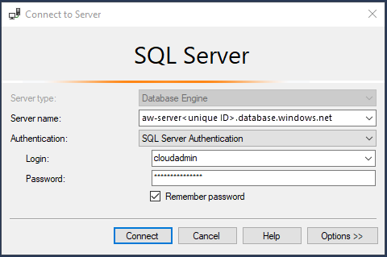  

## Prepare the exercise by loading and editing scripts

All scripts for this exercise can be found in the folder *04-Performance\monitor_and_scale* in the GitHub repository or zip file you downloaded.

1. Setup to monitor Azure SQL Database

    > [!TIP]
    > To open a script file in the context of a database in SSMS, click on the database in Object Explorer and then use the File/Open menu in SSMS.

    Launch SQL Server Management Studio (SSMS) and load a query *in the context of the database* to monitor the Dynamic Management View (DMV) **sys.dm_exec_requests** from the script **dmexecrequests.sql** which looks like the following:

    ```sql
    SELECT er.session_id, er.status, er.command, er.wait_type, er.last_wait_type, er.wait_resource, er.wait_time
    FROM sys.dm_exec_requests er
    INNER JOIN sys.dm_exec_sessions es
    ON er.session_id = es.session_id
    AND es.is_user_process = 1;
    ```

1. Load another query to observe resource usage

    In another session for SSMS *in the context of the database* load a query to monitor a Dynamic Management View (DMV) unique to Azure SQL Database called **sys.dm_db_resource_stats** from a script called **dmdbresourcestats.sql**

    ```sql
    SELECT * FROM sys.dm_db_resource_stats;
    ```

    This DMV will track overall resource usage of your workload against Azure SQL Database such as CPU, I/O, and memory.

1. Prepare the workload script

    Edit the script **sqlworkload.cmd** (which will use the ostress.exe program)

    - Substitute your unique_id you saved from the deployment script to put in the correct server name.
    - Substitute the password for the login for the Azure SQL Database Server for the **-P parameter**.

## Run the workload

Now run a workload of the T-SQL query to observe its performance simulating concurrent users.

1. Examine the workload query from the script **topcustomersales.sql**.

    This database is not large so the query to retrieve customer and their associated sales information ordered by customers with the most sales shouldn't generate a large result set. It is possible to tune this query by reducing the number of columns from the result set but these are needed for demonstration purposes of this activity.

    ```sql
    DECLARE @x int
    DECLARE @y float
    SET @x = 0;
    WHILE (@x < 10000)
    BEGIN
    SELECT @y = sum(cast((soh.SubTotal*soh.TaxAmt*soh.TotalDue) as float))
    FROM SalesLT.Customer c
    INNER JOIN SalesLT.SalesOrderHeader soh
    ON c.CustomerID = soh.CustomerID
    INNER JOIN SalesLT.SalesOrderDetail sod
    ON soh.SalesOrderID = sod.SalesOrderID
    INNER JOIN SalesLT.Product p
    ON p.ProductID = sod.ProductID
    GROUP BY c.CompanyName
    ORDER BY c.CompanyName;
    SET @x = @x + 1;
    END
    GO
    ```

1. Run the workload from the command line using the script sqlworkload.cmd

    This script will use 10 concurrent users running the workload query 2 times (Notice the script itself runs a single batch but loops 10,000 times. It also assigned the result to a variable therefore eliminating almost all result set traffic to the client. This is not necessary but helps show a "pure" CPU workload run all on the server).

    > [!TIP]
    > If you are not seeing CPU usage behavior with this workload for your environment you can adjust the **-n parameter** for number of users and **-r parameter** for iterations.

    From a powershell command prompt, change to the directory for this module activity:

    ```powershell
    cd <base directory>\04-Performance\monitor_and_scale
    ```

    Run the workload with the following command

    ```powershell
    .\sqlworkload.cmd
    ```

    Your screen at the command prompt should look similar to the following

    ```output
    [datetime] [ostress PID] Max threads setting: 10000
    [datetime] [ostress PID] Arguments:
    [datetime] [ostress PID] -S[server].database.windows.net
    [datetime] [ostress PID] -isqlquery.sql
    [datetime] [ostress PID] -U[user]
    [datetime] [ostress PID] -dAdventureWorks0406
    [datetime] [ostress PID] -P********
    [datetime] [ostress PID] -n10
    [datetime] [ostress PID] -r2
    [datetime] [ostress PID] -q
    [datetime] [ostress PID] Using language id (LCID): 1024 [English_United States.1252] for character formatting with NLS: 0x0006020F and Defined: 0x0006020F
    [datetime] [ostress PID] Default driver: SQL Server Native Client 11.0
    [datetime] [ostress PID] Attempting DOD5015 removal of [directory]\sqlquery.out]
    [datetime] [ostress PID] Attempting DOD5015 removal of [directory]\sqlquery_1.out]
    [datetime] [ostress PID] Attempting DOD5015 removal of [directory]\sqlquery_2.out]
    [datetime] [ostress PID] Attempting DOD5015 removal of [directory]\sqlquery_3.out]
    [datetime] [ostress PID] Attempting DOD5015 removal of [directory]\sqlquery_4.out]
    [datetime] [ostress PID] Attempting DOD5015 removal of [directory]\sqlquery_5.out]
    [datetime] [ostress PID] Attempting DOD5015 removal of [directory]\sqlquery_6.out]
    [datetime] [ostress PID] Attempting DOD5015 removal of [directory]\sqlquery_7.out]
    [datetime] [ostress PID] Attempting DOD5015 removal of [directory]\sqlquery_8.out]
    [datetime] [ostress PID] Attempting DOD5015 removal of [directory]\sqlquery_9.out]
    [datetime] [ostress PID] Starting query execution...
    [datetime] [ostress PID]  BETA: Custom CLR Expression support enabled.
    [datetime] [ostress PID] Creating 10 thread(s) to process queries
    [datetime] [ostress PID] Worker threads created, beginning execution...
    ```

## Observe performance of the workload

Use T-SQL DMVs to observe the performance of the workload.

1. Observe query performance with DMVs

    Use the query in SSMS to monitor dm_exec_requests (**dmexecrequests.sql**) to observe active requests. Run this query 5 or 6 times and observe some of the results

    ```sql
    SELECT er.session_id, er.status, er.command, er.wait_type, er.last_wait_type, er.wait_resource, er.wait_time
    FROM sys.dm_exec_requests er
    INNER JOIN sys.dm_exec_sessions es
    ON er.session_id = es.session_id
    AND es.is_user_process = 1;
    ```

    You should see many of the requests have a status = RUNNABLE and last_wait_type = SOS_SCHEDULER_YIELD. One indicator of many RUNNABLE requests and many SOS_SCHEDULER_YIELD waits is a possible lack of CPU resources for active queries.

    > [!NOTE]
    > You may see one or more active requests with a command = SELECT and a wait_type = XE_LIVE_TARGET_TVF. These are queries run by services managed by Microsoft to help power capabilities like Performance Insights using Extended Events. Microsoft does not publish the details of these Extended Event sessions.

1. Observe overall resource usage with another DMV

    Run the query in SSMS to monitor **sys.dm_db_resource_stats** (**dmdbresourcestats.sql**). Run the query to see the results of this DMV 3 or 4 times.

    ```sql
    SELECT * FROM sys.dm_db_resource_stats;
    ```

    This DMV records of snapshot of resource usage for the database every 15 seconds (kept for 1 hour).  You should see the column **avg_cpu_percent** close to 100% for several of the snapshots. (at least in the high 90% range). This is a symptom of a workload pushing the limits of CPU resources for the database.

    For a SQL Server on-premises environment you would typically use a tool specific to the Operating System like Windows Performance Monitor to track overall resource usage such a CPU. If you ran this example on a on-premises SQL Server or SQL Server in a Virtual Machine with 2 CPUs, you would see near 100% CPU utilization on the server.

    > [!NOTE]
    > Another DMV called, **sys.resource_stats**, can be run in the context of the master database of the Azure Database Server to see resource usage for all Azure SQL Database databases associated with the server. This view is less granular and shows resource usage every 5 minutes (kept for 14 days).

1. Let the workload complete and take note of its overall duration.

    When the workload completes you should see results like the following and a return to the command prompt

    ```output
    [datetime] [ostress PID] Total IO waits: 0, Total IO wait time: 0 (ms)
    [datetime] [ostress PID] OSTRESS exiting normally, elapsed time: 00:01:22.637
    ```

    Your duration time may vary but this typically takes at least 1-3 minutes. Make sure to let this run to completion. When the workload is done you will be put back at the command prompt.

## Use the Query Store for further analysis

Query Store is a capability in SQL Server to track performance execution of queries. Performance data is stored in the user database. Query Store is not enabled by default for databases created in SQL Server but is on by default for Azure SQL Database (and Azure SQL Managed Instance).

Query Store comes with a series of system catalog views to view performance data. SQL Server Management Studio (SSMS) provides reports using these views.

1. Look at queries consuming the most resources in SSMS

    Using the Object Explorer in SSMS, open the Query Store Folder to find the report for **Top Resource Consuming Queries**

    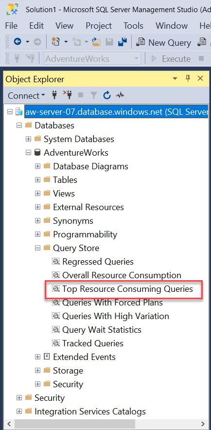

    Select the report to find out what queries have consumed the most avg resources and execution details of those queries. Based on the workload run to this point, your report should look something like the following:

    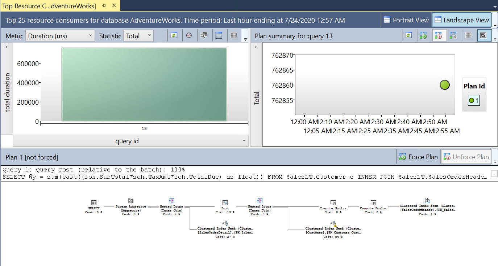

    The query shown is the SQL query from the workload for customer sales. This report has 3 components: Queries with the high total duration (you can change the metric), the associated query plan and runtime statistics, and the associated query plan in a visual map.

    If you click on the bar chart for the query (the query_id may be different for your system), your results should look like the following:

    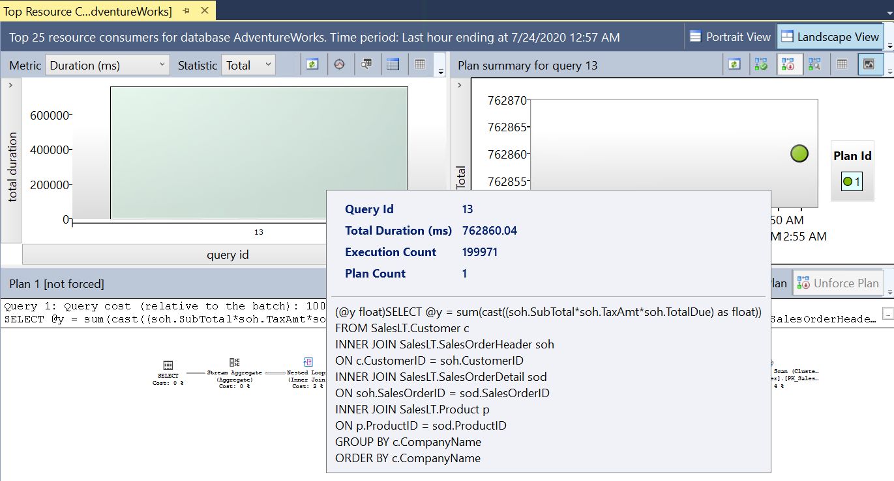

    You can see the total duration of the query and query text.

    Right of this bar chart is a chart for statistics for the query plan associated with the query. Hover over the dot associated with the plan. Your results should look like the following:

    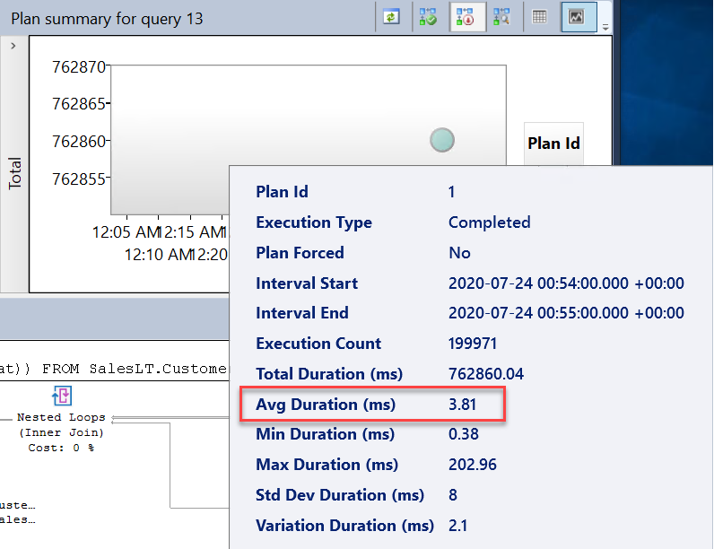

    Note the average duration of the query. Your times may vary but the key will be to compare this average duration to the average wait time for this query and eventually the average duration when we introduce a performance improvement.

    The final component is the visual query plan. The query plan for this query looks like the following:

    

    Given the small nature of rows in the tables in this database, this query plan is not inefficient. There could be some tuning opportunities but not much performance will be gained by tuning the query itself.

1. Observe waits to see if they are affecting performance

    We know from earlier diagnostics that a high number of requests constantly were in a RUNNABLE status along with almost 100% CPU. Query Store comes with reports to look at possible performance bottlenecks to due waits on resources.

    Below the Top Resource Consuming Queries report in SSMS is a report called Query Wait Statistics. Click on this report and hover over the bar chart. Your results should look like the following:

    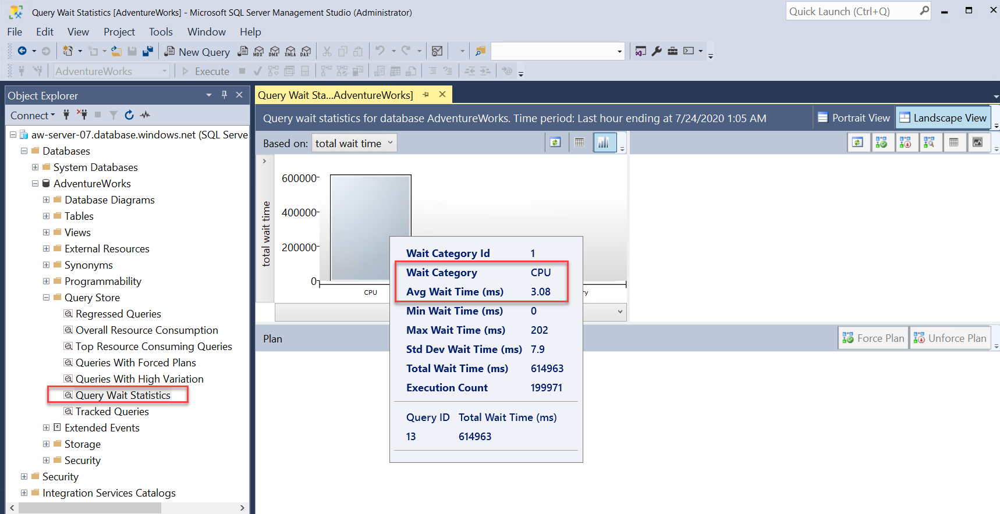

    You can see the top wait category is CPU (this is equivalent to the wait_type SOS_SCHEDULER_YIELD which can be seen in **sys.dm_os_wait_stats**) and the average wait time. Furthermore, the top query waiting for CPU is the query from the workload we are using.

    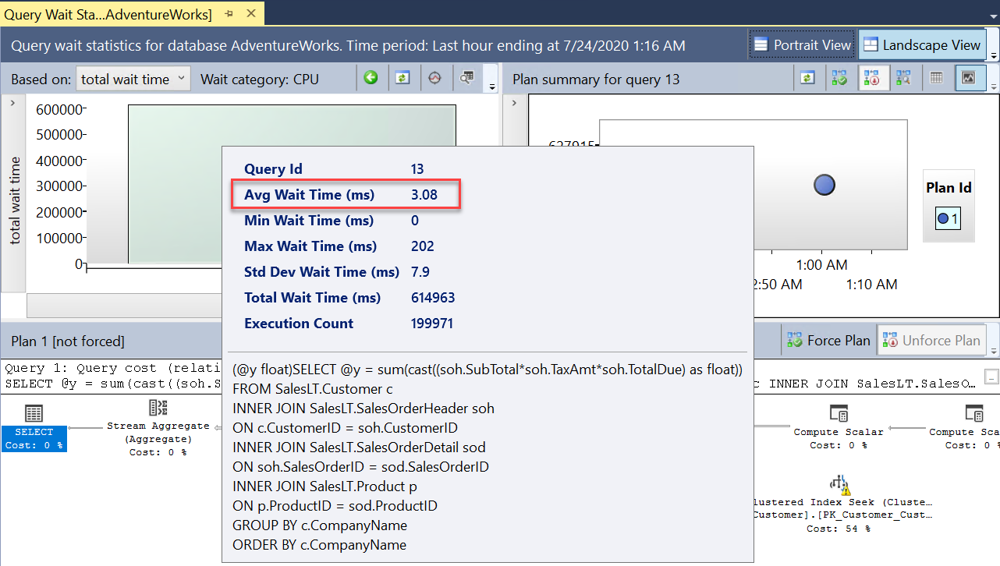

    Notice that the average wait time for CPU for this query is a high % of the overall average duration for the query.

    Given the evidence to this point, without any query tuning, our workload requires more CPU capacity than we have deployed for our Azure SQL Database.

You can close both Query Store reports for now. You will use the same reports in the next exercise.

## Observing performance with Azure Monitor

Let's use one other method to view the resource usage of our workload. Azure Monitor provides performance metrics which you can view in various methods including Azure Portal.

1. Use Azure Metrics to observe performance

    Navigate to the Azure Portal for your deployment. Find the Azure SQL Database deployed. In the Overview page for an Azure SQL database, the standard default view in the Monitoring pane is called **Compute Utilization**:

    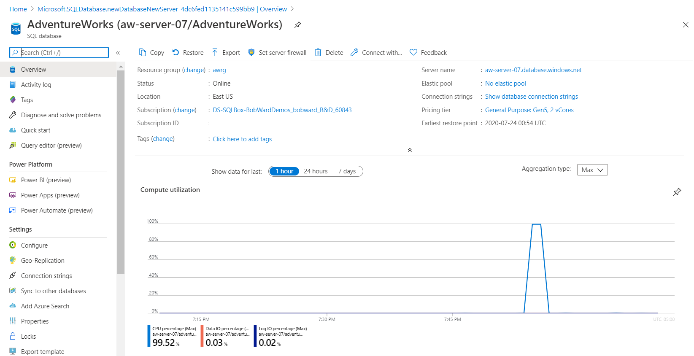

    Notice in this example, the CPU utilization is near 100% for a recent time range. This chart will show resource usage (defaults to CPU and I/O) over the last hour and is refreshed continually. If you click on the chart you can customize the chart (Ex. bar chart) and look at other resource usage.

1. Use Azure Metric Explorer

    Another method to see the same compute utilization metrics and others automatically collected by Azure Monitor for Azure SQL Database is to use the **Metrics Explorer** under Monitoring in the portal (The Compute Utilization is a just a pre-defined view of the Metrics Explorer) If you click on Metrics you will see the following:

    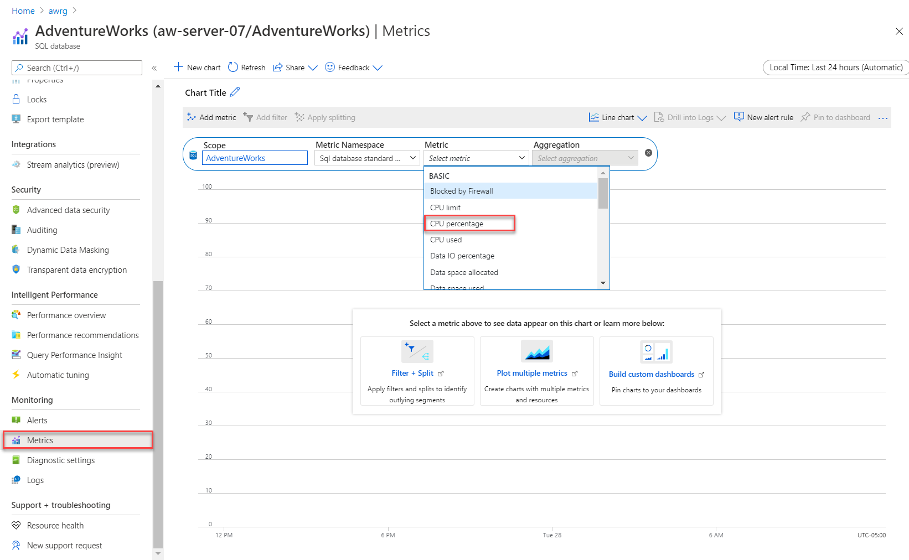

    As you can see in the screenshot there are several metrics you can use to view with the Metrics Explorer. The default view of Metrics Explorer is for a 24-hour period showing a 5 minute granularity. The Compute Utilization view is the last hour with a 1-minute granularity (which you can change). To see the same view, select CPU percentage and change the capture for 1 hour. The granularity will change to 1-minute and should look like the following:

    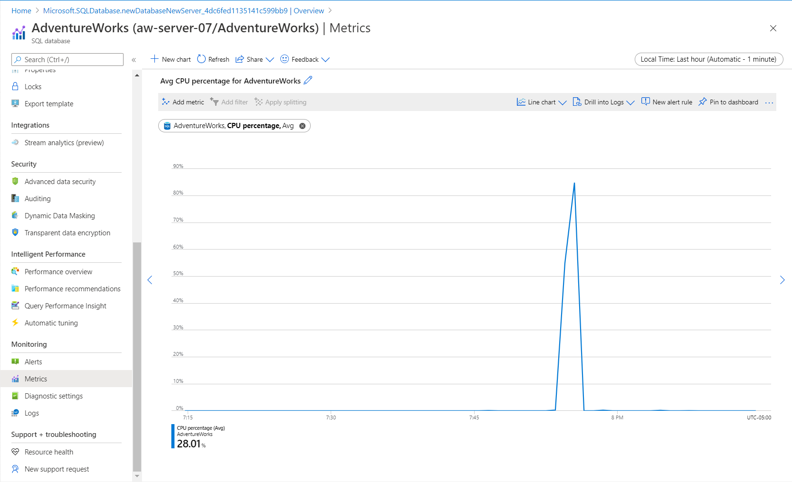

    The default is a line chart, but the Explorer view allows you to change the chart type. There are various options with Metrics Explorer including the ability to show multiple metrics on the same chart.

## Azure Monitor Logs

In this exercise you did not setup an Azure Monitor Log (mainly because there is a delay in metrics information appearing in the log) but it is worth looking at what a log may look like for a CPU resource usage scenario. Azure Monitor Logs can provide a much longer historical record than Azure Metrics.

If you had configured Azure Monitor Logs with a Log Analytics workspace, you could use the following **Kusto Query** to see the same type of results for CPU utilization for the database:

```kusto
AzureMetrics
| where MetricName == 'cpu_percent'
| where Resource == "<database name>"
| project TimeGenerated, Average
| render columnchart
```

Your results would look like the following:

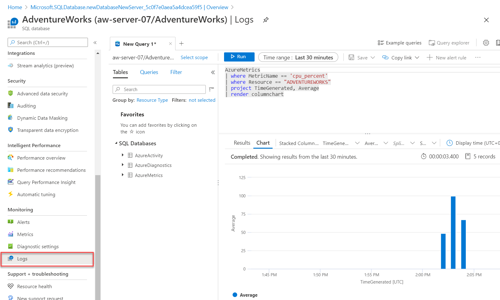

Azure Monitor Logs have a delay when first configuring log diagnostics for a database so these results may take some time to appear.

In this exercise, you learned how to observe a common SQL performance scenario and dive into details to decide on a possible solution to improve performance. In the next unit you will learn methods to accelerate and tune performance and then use the database you deployed in this unit to see a performance improvement.