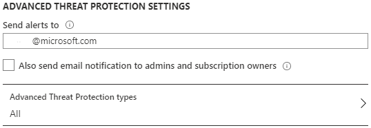

#### Activity 6: Advanced Data Security

Advanced data security (ADS) is a unified package for advanced SQL security capabilities, providing a single go-to location for enabling and managing three main capabilities:  

* [Data discovery & classification](https://docs.microsoft.com/azure/sql-database/sql-database-data-discovery-and-classification)  
* [Vulnerability assessment](https://docs.microsoft.com/azure/sql-database/sql-vulnerability-assessment)  
* [Advanced Threat Protection](https://docs.microsoft.com/azure/sql-database/sql-database-threat-detection-overview)  

In this activity, you'll enable ADS and explore some of the features within each of the capabilities mentioned above.  

### Steps

#### Step 1 - Enable ADS  

In the Azure portal, navigate to your Azure SQL Database logical server. Then, in the left-hand menu, under Security, select **Advanced data security**. If you followed the deployment activity in Module 2, ADS should already be enabled. If it is not, select **ON** and select **Save**.

  

#### Step 2 - ADS server level settings  

In this step, you'll review the selections you've made for your Azure SQL Database logical server. In the same pane as step 1 (Azure SQL Database logical server > Security > Advanced data security), you will also see information regarding Vulnerability Assessments and Advanced Threat Protection.  

At the highest level, SQL Vulnerability Assessment (VA) is a scanning service that provides visibility into your security state. It then provides actionable steps to address any potential concerns. When you configure periodic recurring scans, you're enabling the service to scan your databases every seven days and check for any vulnerabilities. You can then choose to send those reports to the admins, subscription owners, or anyone else that might need to be made notified of changes. In order for this service to operate, you have to specify a storage account for the results to be stored. This storage account was deployed during deployment of your Azure SQL Database, as you opted in to turn on ADS. Review the options and add your email address if you want to receive the results of the recurring scan (weekly).  

  

Lastly, you can configure your Advanced Threat Protection (ATP) settings. ATP enables you to detect and respond to potential threats as they occur by providing security alerts on anomalous activities. To check the ATP alert types available, select **All** under Advanced Threat Protection types.  

  

Just like you can configure who receives the VA scans, you can configure who receives the ATP alerts. Review the options and **add your personal email address** so you can view the alerts in a future lab.  

  

Once you've updated all your settings, don't forget to select **Save**.  

  

Setting these settings up will enable you to complete some of the other steps in this activity, so you'll see more of VA and ATP soon.  

#### Step 3 - Data Discovery & Classification  

Navigate back to your Azure SQL Database (not the logical server!). In the left-hand menu, under Security, Select **Advanced data security**.  

  

First, you'll review Data Discovery & Classification (DD&C) which provides advanced capabilities for discovering, classifying, labeling, and reporting the sensitive data in your database. For more information, refer to the [documentation](https://docs.microsoft.com/azure/sql-database/sql-database-data-discovery-and-classification?tabs=azure-t-sql).

For this step, select the **Data Discovery & Classification** box. This wizard type of view is similar (but not exactly matching) to the Data Discovery & Classification tool that exists in SQL Server today through SSMS. Using the SSMS wizard is **supported** for Azure SQL Managed Instance but **not supported** for Azure SQL Database, but you can achieve similar functionality using the Azure portal (supported for both Azure SQL Database and Managed Instance).  

> Note: T-SQL can be used across all deployment options to add/drop column classifications and to retrieve classifications. Refer to the [documentation](https://docs.microsoft.com/azure/sql-database/sql-database-data-discovery-and-classification?tabs=azure-t-sql#subheading-5) for details.  

Select the information bar that says **We have found XX columns with classification recommendations**.  

  

DD&C tries to identify potential sensitive data based on the column names in your tables. Review some of the suggested labels and then select **Select all** and **Accept selected recommendations**.  

  

Then, select **Save** near the top left corner.

  

Finally, select **Overview** to view the overview dashboard and review the classifications you've added.  

  

#### Step 4 - Vulnerability Assessment  

Select the **X** in the top right corner of DD&C to bring you back to the ADS dashboard. Next, you'll review the Vulnerability Assessment (VA) capabilities. Start by selecting the **Vulnerability Assessment** box.  

  

Next, select **Scan** to get the most current VA results. This will take a few moments, while VA scans all the databases in your Azure SQL Database logical server.  

> Note: You might be wondering why you need to complete the scan again. When you configured ADS in Step 2, you set up periodic recurring scans. These scans take place every 7 days. By this definition, the first scan happened when you deployed the database. But since then, you have made several changes related to security (networking and auditing specifically), so to get an up-to-date report, you need to run the scan again.  

  

Your resulting view should be similar to below.  

  

Every security risk has a risk level (high, medium, or low) and additional information. The rules in place are based on benchmarks provided by the Center for Internet Security (you can read more about the CIS benchmark [here](https://www.cisecurity.org/benchmark/microsoft_sql_server/)). Select the security check **VA2109** to get a detailed view, similar to below. Review the status and other available information.  

> Note: If **VA2109** does not fail, you can perform a similar exercise below, depending on what failed security checks do occur.  

  

In this case, VA is suggesting that you configure a baseline of what principals have certain access. Once you have a baseline, you can then monitor and assess any changes.  

Depending on the security check, there will be alternate views and recommendations. Review the information that's provided. For this security check, you can select the **Approve as Baseline** button > **Yes** at the top of the details page. Now that a baseline is in place, this security check will fail in any future scans where the results are different from the baseline. Select **X** to exit the specific rule.    

  

You can then **optionally** complete another scan by selecting **Scan** and confirming that VA2065 is now showing up as a *Passed* security check.  

  

If you click into the passed security check above, you should be able to see the baseline you configured. If anything changes in the future, VA scans will pick it up and the security check will fail.  

To learn more about VA, refer to the [documentation](https://docs.microsoft.com/azure/sql-database/sql-vulnerability-assessment).  

#### Step 5 - Advanced Threat Protection overview  

Select the **X** in the top right corner of VA to get back to the ADS dashboard. Select the **Advanced Threat Protection** (ATP) box to drill in and review the results. ATP detects anomalous activities indicating unusual and potentially harmful attempts to access or exploit databases.  

  

Likely, you won't see any security alerts at this stage. In the next step, you will run a test that will trigger an alert, so you can review the results in ATP.  

#### Step 6 - Testing ATP capabilities  

ATP can be used to identify and alert when the following things are suspected of occurring:  

* SQL injection
* SQL injection vulnerability
* Data exfiltration
* Unsafe action
* Brute force
* Anomalous client login

In this activity you will see how a SQL Injection alert can be triggered through SSMS. SQL Injection alerts are intended for custom written application not for standard tools like SSMS. Therefore, to trigger an alert through SSMS as a test for a SQL Injection we need to "set" the **Application Name** (which is a connection property for clients connecting to SQL Server or Azure SQL).

> Note: To get the full experience of this step, you'll need access to the email address you provided for ATP alerts in Step 1 of this activity. If you need to update it, do so before proceeding.  

Using SSMS, select **File** > **New** > **Database Engine Query** to create a query using a new connection.  

  

In the main login window, fill in your AdventureWorksID login information as you usually would, with SQL authentication. Before connecting, however, select **Options** > **Connection Properties**. Once in here, specify your AdventureWorks database using the "Connect to database" drop-down.  

  

Then, select the **Additional Connection Parameters** tab and insert the following into the empty text box:  

```
Application Name=webappname
```

To connect, finally, select **Connect**.  
  

In the new query window, run the following query:  

```sql
SELECT * FROM sys.databases WHERE database_id like '' or 1 = 1 --' and family = 'test1';
```

Within a few minutes, you should receive an email similar to the following.  

  

Additionally, navigate to the Azure portal to your AdventureWorks database. In the left-hand menu, under Security, select **Advanced data security**. You should now see an alert.  

  

You can drill into that alert to see the overall security alerts.  

  

You can also click specific alerts to see more details about them.  


You can learn more about SQL Injection attacks in the [documentation](https://docs.microsoft.com/sql/relational-databases/security/sql-injection?view=sql-server-ver15). You can read more about Advanced Threat Protection [here](https://docs.microsoft.com/azure/sql-database/sql-database-advanced-data-security).

In this activity, you learned how to configure and leverage some of the features in Advanced data security. In the following bonus activity, you'll expand on what you've learned throughout the security module by using various security features together.  

> **Important! Clean up note:** You might consider closing all your query editors in SSMS and removing all connections except the one Azure AD connection. The **Azure AD connection** will be used in the next Activity. 