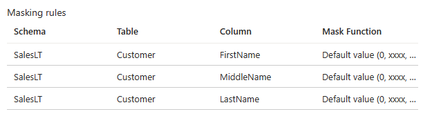

In this exercise, you will learn how to audit users trying to view columns that were marked for data classification. This exercise will combine several of the things you've already learned about in the module, and take those learnings to the next level.

1. In the Azure portal, navigate to your Azure SQL Database (not logical server).

    > [!div class="nextstepaction"]
    > [Azure Portal](https://portal.azure.com/learn.docs.microsoft.com/?azure-portal=true)

1. In the left-hand menu, under Security, select **Advanced data security** and then select the **Data Discovery & Classification** box.  

    [!div class="mx-imgBorder"]
      

1. Select the **Classification** tab and then select **+ Add classification**.  

    [!div class="mx-imgBorder"]
      

    In a previous exercise, you added all the recommended column classifications. In this step, you will *manually* add a potentially sensitive column to the list of classified columns.  

    In the SalesLT Customer table, DD&C identified FirstName and LastName to be classified, but not MiddleName. Using the drop-downs, add it now. Then, select **Add classification**.  

    [!div class="mx-imgBorder"]
      

1. Select **Save**.

    You can confirm the added classification was successful by viewing the **Overview** tab and confirming that MiddleName is now present in the list of classified columns under the SalesLT schema. Select **X**.  

1. Dynamic Data Masking (DDM) is something available in Azure SQL as well as in SQL Server. It limits data exposure by masking sensitive data to non-privileged users at SQL Server vs the application having to code those types of rules. Azure SQL will recommend things for you to mask, or you can add masks manually. You'll mask the FirstName, MiddleName, and LastName columns which you reviewed in the previous step.  

    In the Azure portal, navigate to your Azure SQL Database. In the left-hand menu, under Security, select **Dynamic Data Masking** and then select **+ Add mask**.  

    [!div class="mx-imgBorder"]
      

1. First, select the **SalesLT** schema, **Customer** table, and **FirstName** column. Then, you can review the options for masking, but the default is good for this scenario. Select **Add** to add the masking rule.  

    [!div class="mx-imgBorder"]
      

1. Repeat these steps for both **MiddleName** and **LastName** in that table.  

    Now, you should have three masking rules, similar to below.  

    [!div class="mx-imgBorder"]
      

1. Select **Save**.  

1. Select **Overview** in the left hand menu to navigate back to the overview of your database.

1. Next, you will simulate someone querying the classified columns and explore dynamic data masking in action. Navigate to SSMS and create a new query in your AdventureWorks database.  

    [!div class="mx-imgBorder"]
      

1. Now, run the following query to return the classified (and in some cases columns marked for masked) data.  

    ```sql
    SELECT TOP 10 FirstName, MiddleName, LastName
    FROM SalesLT.Customer;
    ```

    You should get a result of the first ten names, with no masking applied. Why? Because you are the admin for this Azure SQL Database logical server.  

    [!div class="mx-imgBorder"]
      

1. In the following query, you'll create a new user and run the previous query as that user. You'll also use `EXECUTE AS` to impersonate `Bob`. When an `EXECUTE AS` statement is run, the execution context of the session is switched to the login/user. This means that the permissions will be checked against the login/user instead of the person executing the `EXECUTE AS` command (in this case, you). `REVERT` is then used to stop impersonating the login/user.  

    You may notice the first few parts of the commands that follow, since they are a repeat from a previous exercise. Run the following, and observe the results.  

    ```sql
    -- Create a new SQL user and give them a password
    CREATE USER Bob WITH PASSWORD = 'goTitans1!';

    -- Until you run the following two lines, Bob has no access to read or write data
    ALTER ROLE db_datareader ADD MEMBER Bob;
    ALTER ROLE db_datawriter ADD MEMBER Bob;

    -- Execute as our new, low-privilege user, Bob
    EXECUTE AS USER = 'Bob';
    SELECT TOP 10 FirstName, MiddleName, LastName
    FROM SalesLT.Customer;
    REVERT;
    ```

    Now, you should get a result of the first ten names, but with masking applied. Bob has not been granted access to the unmasked form of this data.  

    [!div class="mx-imgBorder"]
      

1. What if, for some reason, Bob needs access to the names and gets permission to have it?  

    You can update excluded users from masking in the Azure portal (in the Dynamic Data Masking pane under Security), but you can also do it using T-SQL. Use the query below to allow Bob to query the names results without masking.  

    ```sql
    GRANT UNMASK TO Bob;  
    EXECUTE AS USER = 'Bob';
    SELECT TOP 10 FirstName, MiddleName, LastName
    FROM SalesLT.Customer;
    REVERT;  
    ```

    Your results should include the names in full.  

    [!div class="mx-imgBorder"]
      

1. Finally, you can also take away a user's unmasking privileges, and confirm that with the following T-SQL.  

    ```sql
    -- Remove unmasking privilege
    REVOKE UNMASK TO Bob;  

    -- Execute as Bob
    EXECUTE AS USER = 'Bob';
    SELECT TOP 10 FirstName, MiddleName, LastName
    FROM SalesLT.Customer;
    REVERT;  
    ```

    Your results should include the masked names.  

    [!div class="mx-imgBorder"]
      

1. As an admin, you may want to review and audit who is accessing the databases and specifically the classified data. Next, you'll take a look at the audit files that are being sent to Azure Blob storage. The first thing you have to do is merge the audit files, in case logs span multiple files. You can do this from SSMS. First, select **File** > **Open** > **Merge Audit Files**.  

    [!div class="mx-imgBorder"]
      

    Next, select **Add**.  

    [!div class="mx-imgBorder"]
      

    Specify to add then from Azure Blob storage and select **Connect**.  

    [!div class="mx-imgBorder"]
      

    Now sign into Azure with the account you are using for this module.  

    [!div class="mx-imgBorder"]
      

    Select the subscription, storage account, and blob container you configured Audit logs to go to (refer to your selection in the Azure portal under your Azure SQL Database logical server's Auditing blade). The container will be called `sqldbauditlogs`.  

    [!div class="mx-imgBorder"]
      

    Select your Azure SQL Database logical server and your AdventureWorks database. It should take everything from the day up until the second you select the Database name. Select **OK**.  

    [!div class="mx-imgBorder"]
      

1. The confirmation window lets you know how many files are being downloaded and merged. Select **OK**.  

    [!div class="mx-imgBorder"]
      

1. Review the files and select **OK** one last time.  

    [!div class="mx-imgBorder"]
      

    You should now be able to see all the audit logs. Look for where you were testing with masking with Bob (should be near the bottom). You can select the statement, and then use the detail pane below to review the information. For example, for one of the queries where Bob tries to view classified data, under the `data_sensitivity_information` field, you can see the data that is classified.

1. You can double-click on the value of the data_sensitivity_information in the Details tab. It will display a pop-up where you can more easily read the data.

    And example of what you might see under `data_sensitivty_information` is below.  

    ```cxel
    <sensitivity_attributes max_rank="20" max_rank_desc="Medium"><sensitivity_attribute label="Confidential - GDPR" label_id="bf91e08c-f4f0-478a-b016-23422b2a65ff" information_type="Name" information_type_id="57845286-7598-22f5-3422-15b24aeb125e" rank="20" rank_desc="Medium"/></sensitivity_attributes>
    ```

    This merged file can then be exported to an XEL or CSV file (or to a table) for additional analysis. You can also query the Extended Events files using PowerShell.  

1. Analyzing your audit logs will depend on your preference, and the method in Step 5 may be more familiar. In this step, you'll be exposed to querying security logs in the Azure portal with Log Analytics.  

    In the Azure portal, navigate to your Azure SQL Database. In the left-hand menu, under Security, select **Auditing**. Then select **View audit logs**.  

    [!div class="mx-imgBorder"]
      

    You should now be able to see a query of your event records, options to run in Query Editor (run T-SQL queries through the portal), options for Log Analytics/View dashboard, and more.  

    [!div class="mx-imgBorder"]
      

    Feel free to click around and understand what some of the options are.  

1. Click on **Log Analytics**. If you see a *Get Started* screen, select **OK**. This then takes you to a query editor but it is not T-SQL. This view allows you to query logs using Kusto query language or KQL, which is meant to be easy to use and understand by SQL professionals.  

    The default query is querying the category `SQLSecurityAuditEvents`, so while you might use this category now to view security-related incidents, this tool can also be used for querying other Azure logs and categories in Azure Monitor. For this step, you can look for the statements where Bob tried to access sensitive information, and expand the details (click the **`>`**) to get the same information that you saw in SSMS.  

    [!div class="mx-imgBorder"]
      

    It may take a few minutes for the results to show up here. You can refresh the query by selecting **Run** again.  

    This activity won't go deep into KQL querying of logs, but there are many resources in the references above if you want more practice later.  

1. In this step, you'll see how SQL Security has built a dashboard based on Log Analytics for you to monitor and audit the logs and other SQL activity. To get back to Audit records, select the **X** in the top-right corner of the Log Analytics query window.  

    Then, select **View dashboard**.  

    [!div class="mx-imgBorder"]
      

1. You should now see an overview dashboard. Drill in to **Azure SQL - Access to Sensitive Data**.  

   You may need to wait 3-5 minutes and select **Refresh** for items to show up here.  

    [!div class="mx-imgBorder"]
      

    You can use this drill down to find out:  

    1. How many queries are accessing sensitive data
    1. Which types and sensitivities of are being accessed
    1. Which principals are accessing sensitive data
    1. Which IPs are accessing sensitive data  

    Review what's available here, and how you can audit usage with this tool. You can even click into each of these and see the related logs in Log Analytics.  

    When you're done, select the **X** in the top-right corner of the **Azure SQL - Access to Sensitive Data** tab.  

1. Back in the overview, select **Azure SQL - Security Insights**.  

    [!div class="mx-imgBorder"]
      

    This dashboard gives more auditing information to help you understand database activity, and gain insight into anomalies. Spend a few minutes reviewing and drilling into the options here.  

    In addition to these insights for Azure SQL services, by being in Azure you can leverage the Azure Security Center to monitor, manage, and respond to issues that arise across your entire Azure estate. If you want to look around (may be limited depending on your subscription level), you can search for **Security Center** and select under *Services*.

    [!div class="mx-imgBorder"]
    
