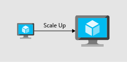
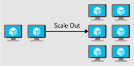

Imagine that a news story was just published about one of your organization's recent product announcements. The additional publicity from the news story will undoubtedly bring a large influx of traffic to your website. Will your website be able to handle this traffic increase, or will the additional load cause your site to be slow or unresponsive?

In this unit, you'll look at some of the basic principles of ensuring outstanding application performance by using scaling and optimization principles that make up the performance efficiency pillar.

## What is performance efficiency?

Performance efficiency is matching the resources that are available to an application with the demand that it's receiving. Performance efficiency includes scaling resources, identifying and optimizing potential bottlenecks, and optimizing your application code for peak performance.

Let's look at some patterns and practices that can enhance the scalability and performance of your application.

### Scale up and scale out

Compute resources can be scaled in two directions:

- Scaling *up* is adding more resources to a single instance.

    

- Scaling *out* is adding more instances.

    

Scaling up is concerned with adding more resources, such as CPU or memory, to a single instance. This instance might be a virtual machine or a PaaS service. 

The act of adding more capacity to the instance increases the resources that are available to your application, but it does come with a limit. Virtual machines are limited to the capacity of the host that they run on, and hosts themselves have physical limitations. Eventually, when you scale up an instance, you can run into these limits. They restrict your ability to add more resources to the instance.

Scaling out is concerned with adding more instances to a service. They can be virtual machines or PaaS services. Instead of adding more capacity by making a single instance more powerful, we add capacity by increasing the total number of instances. 

The advantage of scaling out is that you can conceivably scale out forever if you have more machines to add to the architecture. Scaling out requires some type of load distribution. This might be in the form of a load balancer that distributes requests across available servers. Or it might be a service discovery mechanism for identifying active servers to send requests to.

In both types of scaling, resources can be reduced, which brings cost optimization into the picture.

Autoscaling is the process of dynamically allocating resources to match performance requirements. As the volume of work grows, an application might need more resources to maintain the desired performance levels and satisfy service-level agreements (SLAs). As demand slackens and the additional resources are no longer needed, they can be deallocated to minimize costs. 

Autoscaling takes advantage of the elasticity of cloud-hosted environments while easing management overhead. It reduces the need for an operator to continually monitor the performance of a system and make decisions about adding or removing resources.

### Optimize network performance

When you're optimizing for performance, you'll look at network and storage performance to ensure that their levels are within acceptable limits. These performance levels can affect the response time of your application. Selecting the right networking and storage technologies for your architecture will help you ensure that you're providing the best experience for your consumers.

Adding a messaging layer between services can have a benefit to performance and scalability. A messaging layer creates a buffer so that requests can continue to flow in without error if the receiving application can't keep up. As the application works through the requests, they'll be answered in the order in which they were received.

### Optimize storage performance

In many large-scale solutions, data is divided into separate partitions that can be managed and accessed separately. The partitioning strategy must be chosen carefully to maximize the benefits while minimizing adverse effects. Partitioning can help improve scalability, reduce contention, and optimize performance.

Use caching in your architecture to help improve performance. Caching is a mechanism to store frequently used data or assets (webpages, images) for faster retrieval. You can use caching at different layers of your application. You can use caching between your application servers and a database in order to decrease data retrieval times. 

You can also use caching between your users and your web servers, by placing static content closer to users and decreasing the time it takes to return webpages to the users. This has a secondary effect of offloading requests from your database or web servers, increasing the performance for other requests.

### Identify performance bottlenecks in your application

Distributed applications and services running in the cloud are complex pieces of software that comprise many moving parts. In a production environment, it's important to be able to track the way in which users utilize your system, trace resource utilization, and generally monitor the health and performance of your system. You can use this information as a diagnostic aid to detect and correct issues. You can also use this information to help spot potential problems and prevent them from occurring.

Performance optimization will include understanding how the applications themselves are performing. Errors, poorly performing code, and bottlenecks in dependent systems can all be uncovered through an application performance management tool. Often, these issues might be hidden or obscured for users, developers, and administrators. But they can have an adverse impact on the overall performance of your application.

Look across all layers of your application and identify and remediate performance bottlenecks. These bottlenecks might be poor memory handling in your application, or even the process of adding indexes into your database. It might be an iterative process as you relieve one bottleneck and then uncover another that you were unaware of.

With a thorough approach to performance monitoring, you'll be able to determine the types of patterns and practices that your architecture will benefit from.
