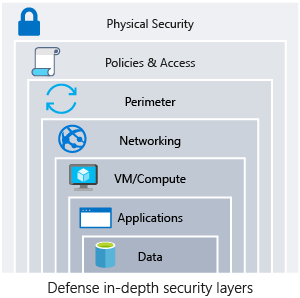
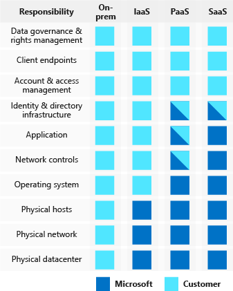

Healthcare organizations store personal and potentially sensitive customer data. Financial institutions store account numbers, balances, and transaction histories. Retailers store purchase history, account information, and demographic details of customers. A security incident might expose this sensitive data, which might cause personal embarrassment or financial harm. How do you ensure the integrity of your customer's data and ensure that your systems are secure?

In this unit, you learn about the important elements of the security pillar.

## What is security?

Security is ultimately about protecting the data that your organization uses, stores, and transmits. The data that your organization stores or handles is at the heart of your securable assets. This data might be sensitive data about customers, financial information about your organization, or critical line-of-business data that supports your organization. Securing the infrastructure on which the data exists, along with the identities used to access it, is also critically important.

Your data might be subject to more stringent legal and regulatory requirements. These extra requirements depend on where you're located, the type of data you're storing, or the industry in which your application operates.

For instance, in the healthcare industry in the United States, there's a law called the Health Insurance Portability and Accountability Act (HIPAA). In the financial industry, the Payment Card Industry Data Security Standard is concerned with the handling of credit card data. Organizations that store data to which these laws and standards apply, are required to ensure that certain safeguards are in place for the protection of that data. In Europe, the General Data Protection Regulation (GDPR) lays out the rules of how personal data is protected, and defines individuals' rights related to stored data. Some countries/regions require that certain types of data don't leave their borders.

When a security breach occurs, there can be a substantial effect on the finances and reputation of both organizations and customers. A security breach breaks down the trust that customers are willing to instill in your organization, and can affect the organization's long-term health.

### Defense in depth

A multilayered approach to securing your environment increases its security posture. Commonly known as *defense in depth*, we can break down the layers as follows:

- Data
- Applications
- VM/compute
- Networking
- Perimeter
- Policies and access
- Physical security

Each layer focuses on a different area where attacks can happen, and creates a depth of protection if one layer fails or an attacker bypasses it. If you were to focus on just one layer, an attacker would have unfettered access to your environment if they got through this layer.

Addressing security in layers increases the work an attacker must do to gain access to your systems and data. Each layer has different security controls, technologies, and capabilities that apply. When you're identifying the protections to put in place, cost is often of concern. You need to balance cost with business requirements and overall risk to the business.

No single security system, control, or technology fully protects your architecture. Security is more than just technology; it's also about people and processes. Creating an environment that looks holistically at security and makes it a requirement by default helps ensure that your organization is as secure as possible.

### Protect from common attacks

At each layer, there are some common attacks that you want to protect against. The following list isn't all-inclusive, but it can give you an idea of how each layer can be attacked and what types of protections you might need.

- **Data layer**: Exposing an encryption key or using weak encryption can leave your data vulnerable if unauthorized access occurs.

- **Application layer**: Malicious code injection and execution are the hallmarks of application-layer attacks. Common attacks include SQL injection and cross-site scripting (XSS).

- **VM/compute layer**: Malware is a common method of attacking an environment, which involves executing malicious code to compromise a system. After malware is present on a system, further attacks can occur that lead to credential exposure and lateral movement throughout the environment.

- **Networking layer**: Taking advantage of unnecessary open ports to the internet is a common method of attack. Open ports might also include leaving the SSH or RDP protocols open to virtual machines. When these protocols are open, they can allow brute-force attacks against your systems as attackers attempt to gain access.

- **Perimeter layer**: Denial-of-service (DoS) attacks often happen at this layer. These attacks try to overwhelm network resources, forcing them to go offline or making them incapable of responding to legitimate requests.

- **Policies and access layer**: This layer is where authentication occurs for your application. This layer might include modern authentication protocols such as OpenID Connect, OAuth, or Kerberos-based authentication such as Active Directory. The exposure of credentials is a risk at this layer, and it's important to limit the permissions of identities. You also want to have monitoring in place to look for possible compromised accounts, such as logins coming from unusual places.

- **Physical layer**: Unauthorized access to facilities through methods, such as door drafting and theft of security badges, can happen at this layer.

### Shared security responsibility

Revisiting the model of shared responsibility, we can reframe this model in the context of security. Depending on the type of service you select, some security protections are built into the service, while others remain your responsibility. Careful evaluation of the services and technologies you select are necessary, to ensure that you're providing the proper security controls for your architecture.

