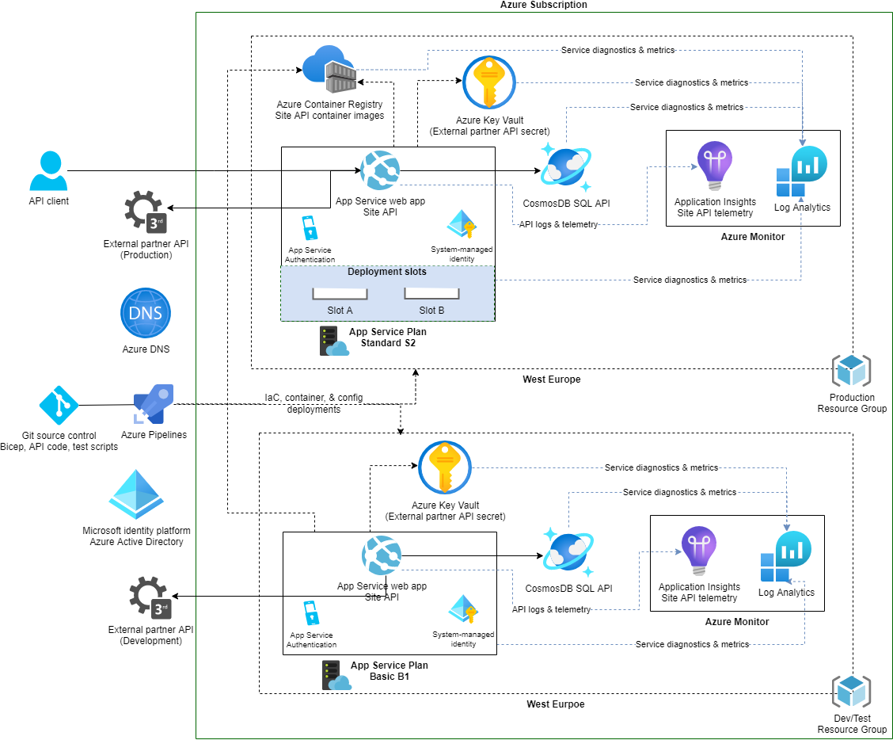

You'll be adding your own enhancements to an existing architecture that meets an organization's high reliability requirements. Here, we'll discuss the background context in order to be successful with the exercises.

## Problem context

Contoso Shoes needs to be ready for their next high-profile product launch, which is expected to create a significant increase in traffic. In the last two years, there have been several incidents causing the website to be offline for as long as half a day. The system wasn't tested completely in the dev/test environment and some bugs crept into production. Troubleshooting and remediation took a long time because the operators weren't able to identify the root causes quickly. 

There have been some challenges when certain components aren't available. The scale-out operations on compute were impacted when Azure Key Vault was misconfigured. Also, there aren't any strategies in place for regional outages. In a recent incident, the entire West Europe region went down. Because the workload was only running in that region, they had to bear financial loss until the region was back up. 

## Current architecture

For you to complete this challenge, you need to have a good understanding of Contoso Shoe's current architecture. The focus will be on their API layer. 

### Components

All components of this architecture are deployed to a single region. 

- **App Service plan** Standard S2 provides the compute platform that hosts the app. Autoscaling is enabled. In the development environment, Basic B1 SKU is used.

- **App Service** provides the application platform that runs the containerized the API code. The App Service Authentication feature is enabled for authorization. 

- **Deployment slots** let you stage a deployment and then swap it with the production deployment. They are used in production only.

- **Azure Container Registry** stores the containerized API code and is pushed through Continuous Integration/Continuous Delivery (CI/CD) pipelines created and managed by the workload team. The container registry is used by both production and dev/test environments. 

- **Azure Cosmos DB with SQL API** stores all state related to the workload. The Cosmos DB database account has a single database that contains a few containers in the Shared throughput model. The Azure Cosmos account uses the Serverless capacity mode. There is one instance for production and one for dev/test.

- **Azure Key Vault** stores secrets needed for the API to make an HTTP POST call to an external, 3rd-party API as part of one request flow. The application accesses the secrets through a Key Vault reference in the Azure App Service’s app configuration. There is one Key Vault for production and one for dev/test.

- **Azure Log Analytics** is used as a unified sink to store logs and metrics for all Azure Diagnostics settings for all components used in the solution. There is one workspace for production and one for dev/test.

- **Application Insights** is used for capturing telemetry and logs from the API. Application Insights uses the self-contained mode, not writing to a dedicated log analytics workspace. Production and dev/test do not share a common instance.

- **Azure Pipelines** is used for CI/CD that builds, tests, and deploys the workload in preproduction and production environments. The pipelines are managed by the workload team, which also manages all of the infrastructure in their solution. Bicep is the choice of technology for Infrastructure-as-Code (IaC).

### Design choices

In the list of components, the _deployment stamp_ consists of services that participate in processing of a request:  Those services include **App Services and the API code** and **Cosmos DB**. The stamp also includes non-functional components: **Key Vault**, **Container Registry**. The application has a third-party dependency on a performance and resilience framework. System-managed identities are used between components of stamp. 

In the stamp, App Services is configured to automatically scale based on load. 

Separate environments are used for Production and Dev/Test. The Production environment uses App Service plan Standard SKU. This choice was made to have the capability of prewarming the application to a slot before deploying it to production. In the Dev/Test environment, the SKU is lowered to the Basic SKU for cost optimization. Both environments have their own instances of services. Only **Container Registry** is shared between the environments.

The containerized API code is delivered in a single container image, that runs in App Service. The API has multiple HTTP endpoints that are used by various frontends for both reads and writes. The frontends are out of scope for this module. However, they are in scope in the big picture for the mission critical status of this solution. The code was instrumented with Application Insights to capture some basic telemetry. The development team of this code also manages the CI/CD pipeline for the API container image and the CI/CD pipelines.

## Tradeoffs

However, as with everything, there are tradeoffs with the current architecture. Business requirements prioritized cost optimization over reliability and operations. To keep within the cost limits, the architecture hasn't evolved. The components fall short when taking advantage of the reliability capabilities offered by the platform. For example, the choice of SKU for compute prevents the workload from using Availability Zones. For telemetry, an older version of Application Insights is used that isn't integrated with Log Analytics. 

Also, access to the workload is overly pervasive. For example, without any virtual network integration, all Azure services can be directly reached over the public internet.

When the solution was developed, the app development team used a single Azure Subscription, colocating dev/test and production in the the same subscription. The choice was made to make tooling easy for the DevOps teams. But,  production resources and dev/test resources aren't completely isolated. Some resources are shared between the two environments. They did get an isolated subscription from the rest of the solutions from Contoso Shoes.
	
Also, the dev/test environment is a single environment that is shared across all members of the development and QA team. The choice was justified given the size of the teams and coordination between them didn't need a higher degree of isolation. As the team and solution evolved, the single dev/test environment increasingly caused integration complexity as workstream lifecycles collide. The churn and its impact on reliability have been expensive.

## Project specification

The company wants to add capabilities to their solution architecture and make it highly reliable. Here are the business requirements:

- Extend the architecture to multiple regions
- Improve the customer experience by serving clients faster in a region geographically closer to them
- Upgrade the Azure services so that they're aligned with the Azure roadmap
- Build an overall health model to make sure issues are caught early in the development cycle

Those requirements are only the prioritized list of their improvement plans. The application team is aware that _all_ design areas must be considered to bring this solution's reliability up to mission critical standards. Rest assured, they won't stop improving their solution and operations after you help them with the aspects covered in the upcoming exercises. Welcome to the team, Contoso Shoes is looking forward to hearing your recommendations.

## Setup

In this **_Challenge Project_**, you'll be taking on the role of an architect who will help Contoso shoes achieve their reliability outcomes, starting with the prioritized items above.
	
- This solution will heavily draw from the Azure Well-Architected Framework guidance for [**mission-critical workloads**](/azure/architecture/framework/mission-critical/mission-critical-overview), so you should familiarize yourself with all of the guidance, and linked reference architecture, so that you can efficiently reference them throughout the exercises.
- We recommend that you use the architecture diagramming tool to visualize the architecture. 
- You don't need an Azure subscription for this challenge if you're comfortable with the services and their features. For product documentation for used services, see:
    - [Azure App Service plan](/azure/app-service/overview-hosting-plans) 
    - [Azure App Service](/azure/app-service/overview) 
    - [Deployment slots](/azure/app-service/deploy-staging-slots) 
    - [Azure Container Registry](/azure/container-registry/)
    - [Azure Cosmos DB](/azure/cosmos-db/)
    - [Azure Key Vault](/azure/key-vault/)
    - [Azure Log Analytics](/azure/azure-monitor/)
    - [Azure Application Insights](/azure/azure-monitor/)
    - [Azure Pipelines](/azure/devops/pipelines/get-started/what-is-azure-pipelines)
