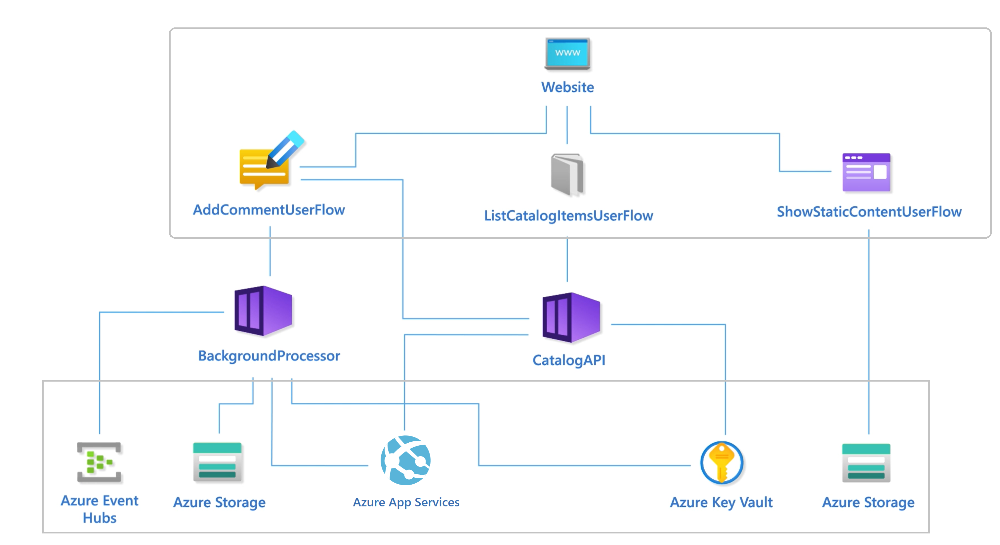

Contoso Shoes needs a way to check the health of the web application at the API level and also its dependencies. You would like to build an overall health model that's measurable through a health status. You'll apply the health status to all user and system flows. The goal is to identify failure points before they can cause an outage.

## Current state and problem

In the current implementation, the API logs application errors that result from:

- Runtime issues in the API code
- Dependency failures, such as failed database queries

Azure App Service and the external monitoring tools don't have a way to check for health status on the API itself in order to build resiliency or make outage decisions. A lack of a dedicated health check endpoint has led to traffic being routed to unhealthy App Service instances resulting in failed requests.

An operator isn't able to see the cascading impact of an issue resulting from the API and platform dependencies. In some cases, time taken to triage an issue and respond with has led to longer down times. 

## Specification

Introduce a health check API in your application. This new component must report the health status of the API and it's dependencies so that the application can perform its duties as expected. The health check API must be called twice a minute, by multiple sources, and should not degrade the performance of the API.
Azure App Service should be able to use that data to make informed decisions about which App Service instances to include in the built-in Azure App Service load balancer. You also want the health check data available to you in Azure Monitor for future needs.

Design a health model that hierarchically shows the relationship between the application components and the platform dependencies. 

Define an overall health status that is based on aggregated historical data. Represent the status in three health states: unhealthy, degraded, and healthy.

## How to proceed with the health check API

## How to proceed with health modeling

Health modeling in a top-down design activity and you'll need a complete list of components used in the architecture. This includes the application components as well as the Azure services.

Place those components in a dependency graph that shows a hierarchical view of solution. The top layer has the _user flows_ that track request from the end user, to the website, and flows at the application API level. The bottom layer contains the _system flows_ from the Azure services that the application has dependencies on. Also map dependencies between the Azure resources.

Your graph should look something like this:

For each component, collect metrics and metric thresholds and decide the value at which the component should be considered health, degraded, and unhealthy. That decision is should be influenced by expected the performance and non-functional business requirements. 

For example, 

|Azure Event Hubs|Health status|
|---|---|
|Queue depth < 10  Processing time < 100ms Time in queue <200 ms|Healthy
|Queue depth < 50  Processing time < 200ms Time in queue <1000 ms|Degraded
|Queue depth < 50  Processing time > 200ms Time in queue > 1000 ms|Unhealthy

For each user and system flow, define an overall status. You'll need to aggregrate the health status of individual components that participate in that flow. 

For example, a system flow could be composed of Azure Event Hubs and a Storage account for checkpointing. 

|Azure Event Hubs|Azure Storage|Health status|
|---|---|---|
|Queue depth < 10  Processing time < 100ms Time in queue <200 ms|Response Time < 100ms Request_Failure_Count < 2|Healthy
|Queue depth < 50  Processing time < 200ms Time in queue <1000 ms|Response Time < 200ms Request_Failure_Count < 5|Degraded
|Queue depth < 50  Processing time > 200ms Time in queue > 1000 ms|Response Time > 200ms Request_Failure_Count > 5|Unhealthy

The health score for a user flow should be represented by the lowest score across all mapped components. For system flows, apply appropriate weights based on business criticality. Between the two flows, financially significant or customer-facing user flows should be prioritized.

The health score can be shown in the dependency graph in a traffic light representation.

## Check your work

| | Task |
| ----- | ----- | 
|:black_square_button:|Did you build a health check endpoint in the API that was compatible with Azure App service’s Health check feature?|
|:black_square_button:|Did you include checks for runtime dependencies? And what did you use as a proxy/test for availability?  	Cosmos DB read/write Third party API
|:black_square_button:|Did you include checks for non-request-flow dependencies? Those services are Azure Key Vault and Azure Container Registry  If those services were experiencing an outage, that might impact the ability to scale out or survive an app service instance restart, but wouldn’t necessarily impact API requests.
|:black_square_button:|If checking on health was expensive for one of the components, did you cache any of the results? How long?
|:black_square_button:|How would your solution change if your API was a monolith made of up many desperate endpoints with different runtime requirements?
|:black_square_button:|Was your model a dedicated health service that is independently deployable or just an extension to the already-deployed code?
|:black_square_button:|What did you log in your health checks?  Did you note successes in addition to failures?
|:black_square_button:|Are your health check logs subject to Azure Application Insights log sampling?
|:black_square_button:|Your API is protected by App Service Authentication, how did your health check endpoint address that?
