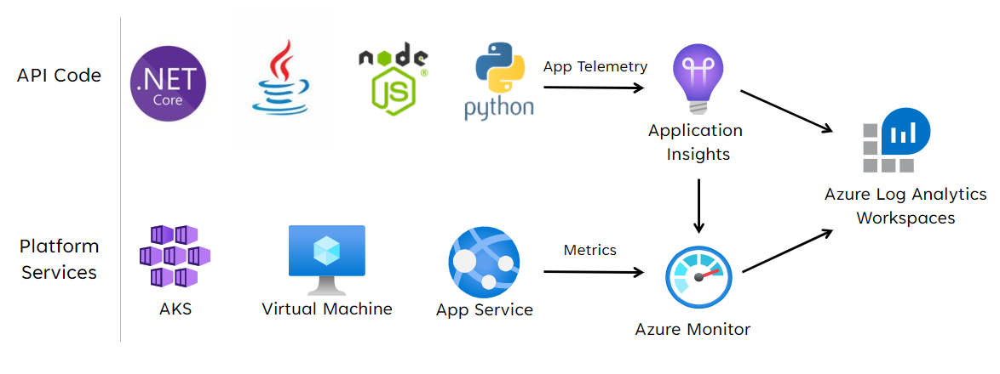

Contoso Shoes needs a way to detect, diagnose, and predict issues across this architecture. You want to build a health model that's measurable through a health status applied to user and system flows. The goal is to identify the potential failure points before they can cause an outage.

## Current state and problem

So far, you’ve added a health check API and built out multi-region capabilities in your architecture. However, there isn't a way to get insight into the complex topology that includes user and system flows. This gap needs to be filled so that the SRE team can quickly identify and resolve issues.

In a recent incident, the team wasn't able to see the cascading impact of an issue resulting from an API component affecting its platform dependencies. There was significant time spent in troubleshooting because the unhealthy component couldn't be spotted right away. Ultimately, this inefficiency led to longer down times causing financial loss to the company. 

## Specification

- Design a health model that shows the relationship between all components in the architecture including the application components and the platform dependencies. Factor in items that exist within the request flow including the gateway, compute, databases, storage, caches, and so on. Also include components that typically exist outside of the request flow. For example, Open Container Initiative (OCI) artifacts, secret stores, configuration services, and others. All Azure services must be configured to send Diagnostic data.

- Add a unified data sink in the architecture for collecting data from various sources. 
    
- Define an overall health status based on aggregated historical logs and metrics. Represent the status in one of three health states: unhealthy, degraded, and healthy.

- Visualize the health status of all components in a hierarchy that represents all flows. 

## Recommended approach
To get started on your design, we recommend that you follow these steps.

### 1&ndash;Start health modeling

This exercise is theoretical. Health modeling in a top-down design activity in which you'll need a comprehensive list of components used in the architecture. This list should include all the application components and the Azure services.

Place those components in a dependency graph that shows a hierarchical view of the solution. The top layer has the _user flows_ that track request from the end user, to the website, and flows at the application API level. The bottom layer contains the _system flows_ from the Azure services. Also map dependencies between the Azure resources.

Your graph should look something like this:

> **Check your progress: [Layered application health](/azure/architecture/framework/mission-critical/mission-critical-health-modeling#layered-application-health)**

### 2&ndash;Define the health scores

For each component, collect metrics and metric thresholds and decide the value at which the component should be considered **healthy**, **degraded**, and **unhealthy**. That decision is should be influenced by expected the performance and non-functional business requirements. Categorize your metrics as:

- Application metrics&mdash;Data points from application code​, such as the exception count​.

- Service metrics​&mdash;Data points from Azure services​, such as database transaction units (DTUs) in use​.

- Solution metrics​​&mdash;Solution level data points, such as end-to-end processing time of a request.

Here's an example of service metrics for Azure Event Hubs.

|Azure Event Hubs|Health status|
|---|---|
|Queue depth < 10  Processing time < 100ms Time in queue <200 ms|
|Queue depth < 50  Processing time < 200ms Time in queue <1000 ms|
|Queue depth < 50  Processing time > 200ms Time in queue > 1000 ms|

### 3&ndash;Define an overall health status

For each user and system flow, define an overall status. You'll need to aggregate the health status of individual components that participate in that flow. 

Suppose a system flow is composed of an application component, Azure Event Hubs, a Storage account. 

|API|Azure Event Hubs|Azure Storage|Health status|
|---|---|---|---|
|Maximum latency < 30ms |Queue depth < 10  Processing time < 100ms Time in queue <200 ms|Response Time < 100ms Request_Failure_Count < 2| 
|Maximum latency < 30ms|Queue depth < 50  Processing time < 200ms **Time in queue <1000 ms**|**Response Time < 200ms** Request_Failure_Count < 5|
|**Maximum latency > 30ms**|Queue depth < 50  **Processing time > 200ms** **Time in queue > 1000 ms** |Response Time > 200ms **Request_Failure_Count > 5**|

The health score for a user flow should be represented by the lowest score across all mapped components. For system flows, apply appropriate weights based on business criticality. Between the two flows, financially significant or customer-facing user flows should be prioritized.

> **Check your progress: [Example - Layered health model](/azure/architecture/framework/mission-critical/mission-critical-health-modeling#example---layered-health-model)**

### 4&ndash;Collect monitoring data

You'll need a unified data sink, in each region, which collects logs and metrics for all application and platform services deployed as part of the regional stamp. You'll  need another sink for storing metrics emitted from global resources, such as Azure Front Door and Cosmos DB. 

#### Technology choices

- **Azure Application Insights** is used to collect all application telemetry. 
- **Azure Monitor** collects data sent by Application insights and platform metrics for the Azure services. 
- **Azure Log Analytics** is used as the central store for logs and metrics from all application and infrastructure components. 

> Check your progress: [Monitoring](/azure/architecture/reference-architectures/containers/aks-mission-critical/mission-critical-health-modeling#monitoring)

### 5&ndash;Set up queries for monitoring data

Kusto Query Language (KQL) is well-integrated with Log Analytics. Implement custom KQL queries as functions to retrieve data from Log Analytics.

Store custom queries in the code repository so that they're imported and applied automatically as part of your continuous Integration/continuous Delivery (CI/CD) pipelines. 

### 6&ndash;Visualize the health status

The dependency graph with health scores can be visualized with a traffic light representation. Use tools such as Azure Dashboards, Monitor Workbooks, or Grafana. Here's an example:

> **Check your progress: [Visualization](/azure/architecture/framework/mission-critical/mission-critical-health-modeling#visualization)**

### 7&ndash;Set up alerts
Dashboards should be used with alerts to raise immediate attention for issues. You can use 

If the health state of a component changes to **Degraded** or **Unhealthy**, the operator should be immediately notified. Set the alert to the root node because any change to this node indicates unhealthy state in the underlying user flows or resources. 

> **Check your progress: [Alerting](/azure/architecture/reference-architectures/containers/aks-mission-critical/mission-critical-health-modeling#alerting)**

## Check your work

Watch this video for a demo on monitoring and health modeling. Did you cover all aspects in your design?

> [!VIDEO https://www.microsoft.com/en-us/videoplayer/embed/RE55Nd9]

- Do you have a unified data sink for correlated analysis?
- Have you included application logs, platform metrics, and solution data points?
- Have you set up dashboards to visualize the health status of all components?
- Did you consider failure points at each service (or part of that service) that could cause an outage or prevent you from scaling, deploying, monitoring?
- Did  you consider Query Packs for capturing key queries that would  triage of issues faster?
- Was your health check API helpful in this model? Did you need to alter that API to better suit the health model?

