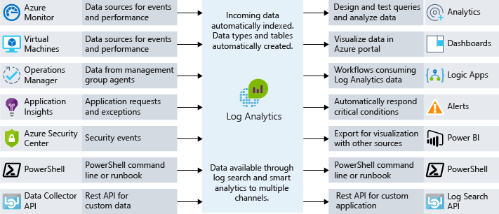
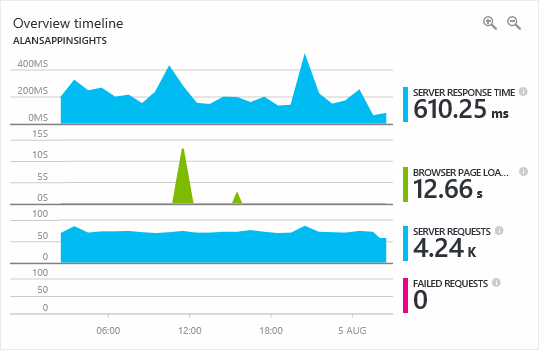

Let's say that you run an operations team that's responsible for resources running on Azure. What would you do to ensure you have visibility into the health of your systems? If something happens, who finds out first? Your team or your end users?

Monitoring is the act of collecting and analyzing data from your systems. You then use that data to determine the performance, health, and availability of your business applications and the resources on which they depend. An effective monitoring strategy helps you focus on the health of your application. It also helps you increase your uptime by proactively notifying you of critical issues so that you can resolve them before they become problems.

When it comes to monitoring and analytics on Azure, we can bundle services into three specific areas of focus:

- Core monitoring
- Deep infrastructure monitoring
- Deep application monitoring

In this unit, we examine each of these bundles, and you learn how Azure services enable these capabilities for your architecture. Even though we've grouped these services together, there are several integration points between them, which allows you to share important monitoring data points among them. The following illustration shows the available monitoring services assembled into logical groups.

## Core monitoring

Core monitoring provides fundamental, required monitoring across Azure resources. When we talk about fundamental monitoring, you can think of it as monitoring what's happening with your resources at the Azure platform level. This area of focus gives you insight into things like the health of the Azure platform, changes being made to your resources, and performance metrics. Using services from this area lets you monitor the basic pieces you need to keep your application running.

Azure provides services to give you visibility into four key core monitoring areas: activity logging, the health of services, metrics and diagnostics, and recommendations on best practices.

These services are built into Azure and take little to no configuration to enable and set up. Let's take a closer look at each of these services.

### Activity logging

Activity logging is an incredibly important source of information about what's happening with your resources at the Azure platform level. Every change submitted to the Azure platform is tracked in the Azure Activity Log, which gives you the ability to trace any action taken on your resources. The Activity Log contains detailed information on activities to help you answer questions like:

- Who attached a disk to this virtual machine?
- When was this machine shut down?
- Who changed the load balancer configuration?
- Why did the autoscale operation on my Virtual Machine Scale Set fail?

Using Activity Log to answer these types of questions helps you troubleshoot issues, track changes, and provide auditing of what's happening in your Azure environment. Activity Log data is only retained for 90 days, although you can archive your data to a storage account, or you can send your data to Azure Log Analytics for longer retention and further analysis.

### Health of cloud services

Any system can have issues at some point, and that's true for Azure services as well. Staying informed of the health of Azure services helps you understand if and when an issue that's impacting an Azure service is impacting your environment. What may seem like a localized issue could be the result of a more widespread issue, and Azure Service Health provides this insight. Azure Service Health identifies any issues with Azure services that might affect your application. Service Health also helps you plan for scheduled maintenance.

### Metrics and diagnostics

For issues that are more localized in nature, it's important to have visibility into what's happening on your system or service instance. The ability to view metrics and diagnostic information is critical for troubleshooting performance issues and staying notified when something goes wrong. To provide this visibility, Azure services have a common way of showing health, metric, or diagnostic information. Azure Monitor enables core monitoring for Azure services by allowing the collection, aggregation, and visualization of metrics, activity logs, and diagnostic logs.

Metrics are available that provide performance statistics for different resources, and even the operating system inside a virtual machine. You can view this data with one of the explorers in the Azure portal, and create alerts based on these metrics. Azure Monitor provides a fast metrics pipeline, so you should use it for time-critical alerts and notifications.

### Recommendations on best practices

When we think of monitoring, we typically think of the current health of a resource. But even when a resource is healthy, there could be adjustments that would result in greater availability, reduced cost, or improved security. Azure Advisor can help by keeping an eye out for potential performance, cost, high availability, or security issues within your resources. Advisor makes personalized recommendations based on resource configuration and telemetry and provides you with guidance that most traditional monitoring platforms don't provide.

## Deep infrastructure monitoring

While the monitoring components we've covered thus far are great at offering insights, they only give visibility to the Azure platform. For typical IaaS workloads, there's more diagnostic information and metrics to gather from the network or the actual operating systems. For example: Log Analytics can provide deep insights by pulling information from SQL Server to ensure it's properly configured, analyzing free disk space across all the servers in your environment, or visualizing the network dependencies between your systems and services.

When you're designing a monitoring strategy, it's important to include every component in the application chain so you can correlate events across services and resources. You can easily configure services that support Azure Monitor to send their data to a Log Analytics workspace. Virtual machines (both in the cloud and on-premises) can have an agent installed to send data to Log Analytics. You can submit custom data to Log Analytics through the Log Analytics API. The following illustration shows how Log Analytics acts as a central hub for monitoring data. Log Analytics receives monitoring data from your Azure resources and makes that data available to consumers for analysis or visualization.

With this data in Log Analytics, you can query the raw data for troubleshooting, root-cause identification, and auditing purposes. For several known services, like SQL Server and Windows Server Active Directory, there are readily available management solutions that visualize monitoring data and uncover compliance with best practices.

Log Analytics allows you to create queries and interact with other systems based on those queries. The most common example is an alert. Maybe you want to receive an email when a system runs out of disk space, or when a best practice on your SQL Servers is no longer being followed. Log Analytics can send alerts, kick off automation, and even hook into custom APIs.

## Deep application monitoring

It's important to understand how core services and infrastructure are performing, but you can take your monitoring capabilities even further. By using an application performance-management tool to look deep into your applications, you can identify performance issues, usage trends, and the overall availability of services you develop and depend on. Allowing you to better detect and diagnose issues that occur within your web apps and services.

Azure Application Insights allows you to do exactly that. Application Insights provides telemetry collection, query, and visualization capabilities. Instrumenting this level of monitoring requires little to no code changes; you only have to install a small instrumentation package into your application. Application Insights is cross platform, supporting .NET, Node.js, or Java.

For instance, the response time for one of your applications might be complex to troubleshoot. For example: is the web server being overloaded? Is a specific SQL query not optimized? Is an API that you're calling performing slower than usual? Application performance monitoring solutions can help uncover the underlying issues that basic metric monitoring can't expose. The following screenshot shows a graphical display of an application’s performance details provided by Azure Application Insights.

An application performance-monitoring solution helps you monitor usage, performance, and availability, allowing you to respond to failure faster, and should be included in any monitoring strategy.
