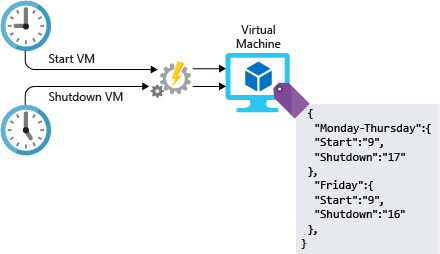

Managing the infrastructure for any type of workload involves configuration tasks. You can do this configuration manually, but manual steps don't scale well; in addition, they can be labor-intensive, prone to error, and inefficient. What if you're assigned to lead a project that requires the deployment of hundreds of systems on Azure? How would you build and configure these resources? How long would this take? Could you ensure that each system is configured properly, with no variance between systems?

By using automation in your architecture design, you can work past these challenges. In this unit, you learn about some of the ways you can automate on Azure.

## Infrastructure as code

Infrastructure as code (IaC) is the management of infrastructure in a descriptive model. IaC uses a versioning system, similar to what's used for source code. The code in an IaC model describes infrastructure such as networks, virtual machines, load balancers, and connection topology. When you're creating an application, the same source code generates the same binary every time it's compiled. In a similar manner, an IaC model generates the same environment every time it's applied. IaC is a key DevOps practice, and it's often used with continuous delivery.

IaC evolved to solve the problem of *environment drift*. Without IaC, teams must maintain the settings of individual deployment environments. Over time, each environment becomes a *snowflake* that is increasingly unique and can't be reproduced automatically. The administration and infrastructure maintenance of these snowflake environments involves manual processes that are hard to track and that contribute to errors. The resulting inconsistencies between these snowflake environments lead to issues during deployments.

There are two different approaches you can take When automating the deployment of services and infrastructure: *imperative* and *declarative*.

- With an **imperative** approach, you explicitly state the commands that are executed to produce the outcome you're looking for.

- With a **declarative** approach, you specify what you want the outcome to be instead of specifying how you want it done.

Both approaches are valuable, so there's no wrong choice. What do these different approaches look like on Azure, and how do you use them?

### Imperative automation

Let's start with imperative automation. With imperative automation, we're specifying *how* things are to be done. This specification is typically done programmatically through a scripting language or SDK. For Azure resources, we could use the Azure CLI or Azure PowerShell. Let's take a look at an example that uses the Azure CLI to create a storage account:

```azurecli
az group create \
    --name storage-resource-group \
    --location eastus

az storage account create \
    --name mystorageaccount \
    --resource-group storage-resource-group \
    --kind BlobStorage \
    --access-tier hot
```

In this example, we're specifying how to create these resources: execute a command to create a resource group, then execute another command to create a storage account. We're explicitly telling Azure which commands to run in order to produce the output we need.

With this approach, we're able to fully automate our infrastructure. We can provide areas for input and output, and can ensure that the same commands are executed every time. By automating our resources, we've taken the manual steps out of the process, making resource administration operationally more efficient.

However, there are some downsides to this approach. Scripts to create resources can quickly become complex as the architecture becomes more complex. Error handling and input validation may need to be added to ensure full execution. Commands may change, requiring ongoing maintenance of the scripts.

### Declarative automation

With declarative automation, we're specifying *what* we want our result to be, leaving the details of how it's done to the system we're using. On Azure, you can accomplish declarative automation by using Azure Resource Manager (ARM) templates, which are JSON-structured files that specify what we want created. ARM templates have four sections: *parameters*, *variables*, *resources*, and *outputs*.

- *Parameters* handle input to be used within the template.
- *Variables* provide a way to store values for use throughout the template.
- *Resources* are the things that are being created.
- *Outputs* provide details to the user of what was created.

In the following example, we're telling Azure to create a storage account with the names and properties that we specify. The actual steps that are executed behind the scenes to create this storage account are left for Azure to decide.

```json
{
    "$schema": "https://schema.management.azure.com/schemas/2015-01-01/deploymentTemplate.json#",
    "contentVersion": "1.0.0.0",
    "parameters": {
        "name": {
            "type": "string"
        },
        "location": {
            "type": "string"
        },
        "accountType": {
            "type": "string",
            "defaultValue": "Standard_RAGRS"
        },
        "kind": {
            "type": "string"
        },
        "accessTier": {
            "type": "string"
        },
        "httpsTrafficOnlyEnabled": {
            "type": "bool",
            "defaultValue": true
        }
    },
    "variables": {
    },
    "resources": [
        {
            "apiVersion": "2018-02-01",
            "name": "[parameters('name')]",
            "location": "[parameters('location')]",
            "type": "Microsoft.Storage/storageAccounts",
            "sku": {
                "name": "[parameters('accountType')]"
            },
            "kind": "[parameters('kind')]",
            "properties": {
                "supportsHttpsTrafficOnly": "[parameters('httpsTrafficOnlyEnabled')]",
                "accessTier": "[parameters('accessTier')]",
                "encryption": {
                    "services": {
                        "blob": {
                            "enabled": true
                        },
                        "file": {
                            "enabled": true
                        }
                    },
                    "keySource": "Microsoft.Storage"
                }
            },
            "dependsOn": []
        }
    ],
    "outputs": {
        "storageAccountName": {
            "type": "string",
            "value": "[parameters('name')]"
        }
    }
}
```

You can use ARM templates to create and manipulate most services on Azure. You can store your templates in code repositories and inherit all the benefits of using a source-control system. You can also share your templates across environments to ensure that the infrastructure you use for your development environment matches your production environment. ARM templates are a great way to automate deployments, and they help ensure consistency, eliminate deployment misconfigurations, and can increase operational speed.

Automating your infrastructure deployment is a great first step, but when you're deploying virtual machines, there's still more work to do. Let's take a look at a couple of approaches to automating configuration post deployment.

## VM images vs. post-deployment configuration

For many virtual machine deployments, your job isn't done when a VM is simply up and running. In many situations, more configuration is needed before the VM can serve its intended purpose. For example, more disks might need formatting, the VM might need to be joined to a domain, or the workload for a management software package might need to be installed and configured.

There are two common strategies that you can use for the configuration work, which for all intents and purposes are considered to be part of the configuration process for the VM itself. Each of these strategies has its advantages and disadvantages.

- **Custom images** are generated by deploying a virtual machine, then configuring or installing software on that running instance. When everything is configured correctly, the virtual machine can be shut down, and an image is created from the VM. You can then use this image as a base for deploying other new virtual machines. Working with custom images can speed up your overall deployment time. Because as soon as the virtual machine is deployed and running, no extra configuration is needed. If deployment speed is an important factor, custom images are definitely worth exploring.

- **Post-deployment scripting** typically applies a basic base image, then relies on scripting or a configuration-management platform to perform the necessary configuration after the VM is deployed. The post-deployment scripting could be done by executing a script on the VM through the Azure Script Extension, or by using a more robust solution such as Azure Automation Desired State Configuration (DSC).

Each of these approaches has a few specific and some shared considerations to keep in mind.

- When using images, you need to ensure there's a process to handle image updates, security patches, and inventory management of the images themselves.

- With post-deployment scripting, build times can be extended since the VM can't be added to live workloads until the build is complete. For standalone systems, a longer build time may not be a significant issue. But for services that autoscale, such as Virtual Machine Scale Sets, this extended build time can impact how quickly you can scale.

- With both approaches, you want to ensure that you address configuration drift. As new configurations are rolled out, you need to ensure that existing systems are updated accordingly.

Automating resource deployment can be a massive benefit to your environment. The amount of time saved and the number of errors reduced can move your operational capabilities to another level.

## Automation of operational tasks

Once your solutions are up and running, there are ongoing operational activities that you can also automate. Automating these tasks with Azure Automation reduces manual workloads, enables configuration and update management of compute resources, provides a framework for running any type of Azure task, and centralizes shared resources such as schedules, credentials, and certificates.

Examples of this automation might include:

- Periodically searching for orphaned disks
- Installing the latest security patches on VMs
- Searching for and shutting down virtual machines in off hours
- Running daily reports and producing a dashboard to report to senior management

As an example, let's suppose that you want to reduce your compute costs by configuring one of your development virtual machines to run only during your organization's business hours. You can write a script to start the VM in the morning and shut it down in the evening, and you can configure Azure Automation to run the script at set times. The following illustration shows the role of Azure Automation in this process.



## Automate development environments

At the other end of your cloud infrastructure pipeline are a collection of development machines, which your developers use to write the applications and services that are the core of your business. You can use Azure DevTest Labs to deploy VMs with all of the correct tools and repositories that your developers need. Developers working on multiple services can switch between development environments without having to provision a new VM themselves. These development environments can be shut down when they're not in use, and then restarted when they're required again.
