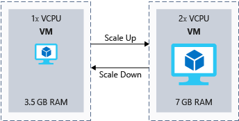
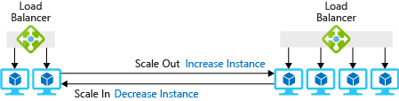
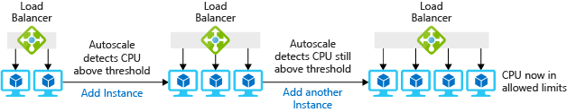

It's rare that we can exactly predict the load on our systems. A public-facing application might grow rapidly in popularity and usage, or an internal application might need to support a larger user base as the business grows. Even when we can predict load, it's rarely flat. Retailers have more demand during the holidays, and sports websites peak during the playoff seasons.

In this unit, we will:
- Define scaling up or down and scaling out or in.
- Discuss some ways Azure can improve your scaling capabilities.
- Look at how serverless and container technologies can improve your architecture's ability to scale.

## What is scaling?

When we look at ways to increase or decrease the compute capacity and relative costs for your applications, it's important to define two key concepts: *scaling* and *resources*.

- **Scaling** is the process of managing your resources to help your application meet a set of performance requirements. When you have too many resources serving your users, you won't be using those resources efficiently, and you'll be wasting money. When you have too few resources available, the performance of your application can be adversely affected. Your goal is to meet your defined performance requirements while optimizing for cost.
- **Resources** can refer to anything you need to manage and run your applications. Memory and CPUs for virtual machines are the most obvious resources. But some Azure services might require you to consider bandwidth or abstractions, like Request Units (RUs) for Azure Cosmos DB.

In a hypothetical world where application demand was constant, it would be easy to predict the right amount of resources you'd need. But in the real world, the demands of applications change over time, so the right amount of resources you'll need can be harder to predict. If you're lucky, that change will be predictable or seasonal, but that's not typical of all scenarios. Ideally, you want to provision the right amount of resources to meet demand and then adjust the amount as demand changes.

Scaling is difficult in an on-premises scenario, where you purchase and manage your own servers. Adding resources can be costly, and often takes too much time to bring resources online. Sometimes it can take longer than your actual need for the increased capacity. It also can be difficult to reduce your resources during times of low demand on the system, so you might be stuck with the increased cost.

Easy scaling is a key benefit of Azure. Most Azure resources let you easily add or remove resources as demand changes. Many services have automated options that monitor demand and adjust for you. This automatic scaling capability is commonly known as *autoscaling*. Autoscaling lets you set thresholds for the minimum and maximum level of instances that should be available. It also adds or removes instances based on a performance metric. An example is CPU utilization.

> [!VIDEO https://www.microsoft.com/videoplayer/embed/RE2yBWi]

## What is scaling up or down?

When you use a single instance of a service, such as a virtual machine, you might need to scale the number of resources that are available to your instance.

- **Scaling up** is the process where you increase the capacity of a given instance. For example, to increase your processing capacity, you might increase a virtual machine from 1 vCPU and 3.5 GB of RAM to 2 vCPUs and 7 GB of RAM.
- **Scaling down** is the process where you decrease the capacity of a given instance. For example, you might decrease a virtual machine's capacity from 2 vCPUs and 7 GB of RAM to 1 vCPU and 3.5 GB of RAM. In this way, you reduce capacity and cost.

The following illustration shows an example of changing the size of a virtual machine.

Let's look at what scaling up or down means in the context of Azure resources:

- In Azure virtual machines, you scale based on a virtual machine size. Each VM size has a certain amount of vCPUs, RAM, and local storage associated with it. For example, you could scale up from a Standard_DS1_v2 virtual machine (1 vCPU and 3.5 GB of RAM) to a Standard_DS2_v2 virtual machine (2 vCPUs and 7 GB of RAM).
- Azure SQL Database is a platform as a service (PaaS) implementation of Microsoft SQL Server. You can scale up a database based on the number of database transaction units (DTUs) or vCPUs. DTUs are an abstraction of underlying resources and are a blend of CPU, IO, and memory. For example, you could scale your database in Azure SQL Database from a size of P2 with 250 DTUs up to a P4 with 500 DTUs to give the database more throughput and capacity.
- Azure App Service is a PaaS website-hosting service on Azure. Websites run on a virtual server farm, which is also known as an App Service plan. You can scale the App Service plan up or down between tiers. You also have capacity options within those tiers. For example, an S1 App Service plan has 1 vCPU and 1.75 GB of RAM per instance. You could scale up to an S2 App Service plan, which has 2 vCPUs and 3 GB of RAM per instance.

To scale these types of capabilities in an on-premises environment, you typically have to wait for procurement and installation of the necessary hardware before you can start using the new level of scale. In Azure, the physical resources are already deployed and available for you. You simply need to select the alternate level of scale that you want to use.

You might need to consider the impact of scaling up in your solution. Your decision depends on the cloud services that you chose.

For example, if you choose to scale up in Azure SQL Database, the service deals with scaling up individual nodes and continues the operation of your service. Changing the service tier or performance level of a database creates a replica of the original database at the new performance level. Connections are then switched over to the replica. No data is lost during this process. There's only a brief interruption when the service switches over to the replica. The interruption is typically less than four seconds.

Alternatively, if you choose to scale up or down a virtual machine, you do so by selecting a different instance size. In most situations, if the VM is already running, you're required to restart the VM. With that in mind, expect that a reboot will be required when you scale your VMs. You'll need to account for that eventuality in your planning.

Finally, you should always look for places where scaling down is an option. If your application can provide adequate performance at a lower price tier, your Azure bill could be reduced.

## What is scaling out or in?

You now know that scaling up and down adjusts the amount of resources a single instance has available. Scaling out and in adjusts the total number of instances.

- **Scaling out** is the process of adding more instances to support the load of your solution. For example, if your website front ends were hosted on virtual machines, you could increase the number of virtual machines if the level of load increased.
- **Scaling in** is the process of removing instances that are no longer needed to support the load of your solution. If your website front ends have low usage, you might want to lower the number of instances to save cost.

The following illustration shows an example of changing the number of virtual machine instances.

Here are some examples of what scaling out or in means in the context of Azure resources:

- For the infrastructure layer, you would likely use virtual machine scale sets to automate the addition and removal of extra instances.
  - Virtual machine scale sets let you create and manage a group of identical, load-balanced VMs.
  - The number of VM instances can automatically increase or decrease in response to demand or a defined schedule.
- In an Azure SQL Database implementation, you could share the load across database instances by *sharding*. Sharding is a technique to distribute large amounts of identically structured data across a number of independent databases.
- In Azure App Service, the App Service plan is the virtual web server farm that hosts your application. Scaling out in this way means that you're increasing the number of virtual machines in the farm. As with virtual machine scale sets, the number of instances can be automatically raised or lowered in response to certain metrics or a schedule.

Scaling out is easily performed via the Azure portal, command-line tools, or Azure Resource Manager templates. In most cases, it's seamless to the user.

### Autoscale

You can configure some of these services to use a feature called *autoscale*. With autoscale, you no longer have to worry about scaling services manually. Instead, you can set a minimum and maximum threshold of instances. You can scale based on specific metrics like queue length or CPU utilization. You also can scale based on schedules. An example is weekdays between 5:00 PM and 7:00 PM. The following illustration shows how the autoscale feature manages instances to handle the load.

### Considerations when you scale in and out

When you scale out, the startup time of your application can impact how quickly your application can scale. If your web app takes two minutes to start up and become available for users, that means each of your instances will take two minutes until they're available to your users. You need to consider this startup time when you determine how fast you want to scale.

You also need to think about how your application handles state. When the application scales in, any state that was stored on the instance that's removed from your environment will be lost. If a user connects to an instance that doesn't have its state, your application might force the user to sign in or reselect their data. The result is a poor user experience. A common pattern is to externalize your state to another service, like Azure Cache for Redis or SQL Database, which makes your web servers stateless. Now that your web front ends are stateless, you don't need to worry about which individual instances are available. They're all doing the same job and are deployed in the same way.

## Throttling

We've established that the load on an application varies over time. This variation might be because of the number of active or concurrent users and the activities that are being performed. You can use autoscaling to add capacity. But you can also use a throttling mechanism to limit the number of requests from a source. You can safeguard performance limits by putting known limits into place at the application level. In this way, you prevent the application from breaking. Throttling is most frequently used in applications that expose API endpoints.

After the application has identified that it would breach a limit, throttling could begin and ensure the overall system SLA isn't breached. For example, if you exposed an API for customers to get data, you could limit the number of requests to 100 per minute. If any single customer exceeded this limit, you could respond with an HTTP 429 status code and include the wait time before another request can successfully be submitted.

## Serverless

Serverless computing provides a cloud-hosted execution environment that runs your apps but completely abstracts the underlying environment. You create an instance of the service, and you add your code. No infrastructure management or maintenance is required or even allowed.

You configure your serverless apps to respond to events. An event can be a REST endpoint, a timer, or a message received from another Azure service. The serverless app runs only when it's triggered by an event.

When you work with serverless apps, infrastructure isn't your responsibility. Scaling and performance are handled automatically. You're only billed for the resources you use. There's no need to reserve capacity. Azure Functions, Azure Container Instances, and Azure Logic Apps are examples of serverless computing available on Azure.

## Containers

A container is a method of running applications in a virtualized environment. A virtual machine is virtualized at the hardware level, where a hypervisor makes it possible to run multiple virtualized operating systems on a single physical server. Containers take the virtualization up a level. The virtualization is done at the OS level, which makes it possible to run multiple identical application instances within the same OS.

Containers are lightweight and well suited to scale-out scenarios. They're designed to be created, scaled out, and stopped dynamically as your environment and demands change. Another benefit of using containers is the ability to run multiple isolated applications on each virtual machine. Because containers are secured and isolated at a kernel level, you don't necessarily need to separate VMs for separate workloads.

Although you can run containers on virtual machines, there are a couple of Azure services that ease the management and scaling of containers:

- **Azure Kubernetes Service (AKS)**

    With Azure Kubernetes Service, you can set up virtual machines to act as your nodes. Azure hosts the Kubernetes management plane. You're charged only for the running worker nodes that host your containers.

    To increase the number of your worker nodes in Azure, you can use the Azure CLI to increase that number manually. At the time of this writing, a preview of Cluster Autoscaler on AKS is available. It enables autoscaling of your worker nodes. On your Kubernetes cluster, you can use the Horizontal Pod Autoscaler to scale out the number of instances of the container to be deployed.

    AKS can also scale with the Virtual Kubelet, which is described in the next section.

- **Azure Container Instances**
  
    Azure Container Instances is a serverless approach that lets you create and execute containers on demand. You're charged only for the execution time per second.

    You can use Virtual Kubelet to connect Azure Container Instances into your Kubernetes environment, which includes AKS. With Virtual Kubelet, when your Kubernetes cluster demands additional container instances, those demands can be met from Container Instances. Because Container Instances is serverless, there's no need to have reserved capacity. You can take advantage of the control and flexibility of Kubernetes scaling with the per-second-billing of serverless. At the time of this writing, the Virtual Kubelet is described as experimental software and shouldn't be used in production scenarios.
