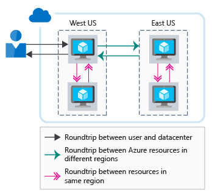
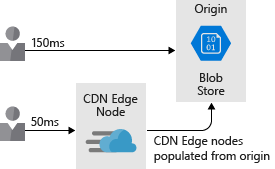

Network performance can have a dramatic impact on a user's experience. In complex architectures with many different services, minimizing the latency at each network hop can affect the overall performance. In this unit, you'll learn about the importance of network latency and how to reduce it within your architecture. We'll also discuss strategies to minimize network latency between Azure resources and between users and Azure.

## The importance of network latency

Latency is a measure of delay. Network latency is the time that it takes for data to travel between a source to a destination across a network. The time that it takes for data to travel from the source to a destination and for the destination to respond is commonly known as a round-trip delay.

In a traditional datacenter environment, latency might be minimal because resources often share the same location and a common set of infrastructure. The time taken to get from source to destination is typically lower when resources are physically close together.

In comparison, a cloud environment is built for scale. Cloud-hosted resources might not be in the same rack, datacenter, or region. This distributed approach can have an impact on the round-trip time of your network communications. While all Azure regions are interconnected by a high-speed fiber backbone, the speed of light is still a physical limitation. Calls between services in different physical locations will still have network latency directly correlated to the distance between them.

In addition, depending on the communication needs of an application, more round trips might be required. Each round trip comes with a latency tax, and each round trip adds to the overall latency. The following illustration shows how the latency perceived by the user is the combination of the round trips required to service the request.

Let's look at how to improve performance between Azure resources, and also from your users to your Azure resources.

## Latency between Azure resources

Imagine that you work for a healthcare organization that's pilot testing a new patient booking system. This system runs on several web servers and a database. All of the resources are located in the West Europe Azure region. The scope of your pilot test is available only for users in Western Europe. This architecture minimizes your network latency, because all of your resources are colocated inside a single Azure region.

Suppose that your pilot testing of the booking system was successful. As a result, the scope of your pilot test has expanded to include users in Australia. When the users in Australia view your website, they'll incur the additional round-trip time that's necessary to access all of the resources that are located in West Europe. Their experience will be diminished because of the additional network latency.

To address your network latency issues, your IT team decides to host another front-end instance in the Australia East region. This design helps reduce the time for your web servers to return content to users in Australia. But their experience is still diminished because there's significant latency for data that's being transferred between the front-end web servers in Australia East and the database in West Europe.

There are a few ways you could reduce the remaining latency:

- Create a read-replica of the database in Australia East. A read replica allows reads to perform well, but writes still incur latency. Azure SQL Database geo-replication allows for read-replicas.
- Sync your data between regions with Azure SQL Data Sync.
- Use a globally distributed database such as Azure Cosmos DB. This database allows both reads and writes to occur regardless of location. But it might require changes to the way your application stores and references data.
- Use caching technology, such as Azure Cache for Redis, to minimize high-latency calls to remote databases for frequently accessed data.

The goal here is to minimize the network latency between each layer of the application. How you'll improve your network latency depends on your application and data architecture. Azure provides mechanisms to resolve latency issues through several services.

## Latency between users and Azure resources

You've looked at the latency between your Azure resources, but you should also consider the latency between your users and your cloud application. You want to optimize delivery of the front-end user interface to your users. Let's look at some ways to improve the network performance between your users and your application.

### Use a DNS load balancer for endpoint path optimization

In our example scenario, your IT team created an additional web front-end node in Australia East. But users have to explicitly specify which front-end endpoint they want to use. As the designer of a solution, you want to make the experience as smooth as possible for users.

Azure Traffic Manager could help. Traffic Manager is a DNS-based load balancer that you can use to distribute traffic within and across Azure regions. Rather than having the user browse to a specific instance of your web front end, Traffic Manager can route users based on a set of characteristics:

- **Priority**: You specify an ordered list of front-end instances. If the one with the highest priority is unavailable, Traffic Manager routes the user to the next available instance.
- **Weighted**: You set a weight against each front-end instance. Traffic Manager then distributes traffic according to those defined ratios.
- **Performance**: Traffic Manager routes users to the closest front-end instance based on network latency.
- **Geographic**: You set up geographical regions for front-end deployments and route your users based on data sovereignty mandates or localization of content.

Traffic Manager profiles can also be nested. For example, you could initially route your users across different geographies (such as Europe and Australia) by using geographic routing. Then you can route them to local front-end deployments by using the performance routing method.

Recall that the organization in our example scenario deployed a web front end in West Europe and another front end in Australia. Let's assume that they deployed Azure SQL Database with their primary deployment in West Europe and a read replica in Australia East. Let's also assume the application can connect to the local SQL instance for read queries.

Your team deploys a Traffic Manager instance in performance mode and adds the two front-end instances as Traffic Manager profiles. As a user, you navigate to a custom domain name (for example, contoso.com) which routes to Traffic Manager. Traffic Manager then returns the DNS name of the West Europe or Australia East front end based on the best network latency performance.

It's important to note that this load balancing is only handled via DNS. No inline load balancing or caching is happening here. Traffic Manager simply returns the DNS name of the closest front end to the user.

### Use a CDN to cache content close to users

Your website likely uses some form of static content, either whole pages or assets such as images and videos. This static content can be delivered to users faster by using a content delivery network (CDN), such as Azure Content Delivery Network.

With content deployed to Azure Content Delivery Network, those items are copied to multiple servers around the globe. Let's say one of those items is a video served from blob storage: `HowToCompleteYourBillingForms.MP4`. The team then configures the website so that each user's link to the video references the CDN edge server nearest them, rather than referencing blob storage. This approach puts content closer to the destination, which reduces latency and improves the user experience. The following illustration shows how using Azure Content Delivery Network puts content closer to the destination, which reduces latency and improves the user experience.

Content delivery networks _can_ also be used to host cached dynamic content. Extra consideration is required though, because cached content might be out of date compared with the source. Context expiration can be controlled by setting a time to live (TTL). If the TTL is too high, out-of-date content might be displayed and the cache would need to be purged.

One way to handle cached content is with a feature called *dynamic site acceleration*, which can increase performance of webpages with dynamic content. Dynamic site acceleration can also provide a low-latency path to additional services in your solution. An example is an API endpoint.

### Use ExpressRoute for connectivity from on-premises to Azure

Optimizing network connectivity from your on-premises environment to Azure is also important. For users who connect to applications, whether they're hosted on virtual machines or on platform as a service (PaaS) offerings like Azure App Service, you'll want to ensure they have the best connection to your applications.

You can always use the public internet to connect users to your services, but internet performance can vary and might be affected by outside issues. Also, you might not want to expose all of your services over the internet. You might want a private connection to your Azure resources. Site-to-site VPN over the internet is also an option. VPN overhead and internet variability can have a noticeable impact on network latency for high-throughput architectures.

Azure ExpressRoute can help. ExpressRoute is a private, dedicated connection between your network and Azure. It gives you guaranteed performance and ensures that your users have the best path to all of your Azure resources. The following illustration shows how an ExpressRoute circuit provides connectivity between on-premises applications and Azure resources.

If we consider our example scenario once again, your team decides to further improve user experience for users who are in their facilities by provisioning an ExpressRoute circuit in both Australia East and West Europe. This option gives users a direct connection to their booking system. It also ensures the lowest latency possible for their application.

Considering the impact of network latency on your architecture is important to ensure the best possible performance for your users. In this unit, we've looked at some options to lower network latency between users and Azure and between Azure resources.
