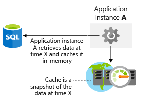

It's important to include storage performance considerations in your architecture. Just like network latency, poor performance at the storage layer can affect your user experience. How would you optimize your data storage? What things do you need to consider to make sure that you're not introducing storage bottlenecks into your architecture?

In this unit, you'll learn about optimizing your storage performance in your architecture.

## Optimize virtual machine storage performance

Let's first look at how to optimize storage for virtual machines (VMs). Disk storage plays a critical role in the performance of your VMs. Selecting the right disk type for your application is an important decision.

Different applications have different storage requirements. Your application might be sensitive to latency of disk reads and writes. Or, it might require the ability to handle a large number of input/output operations per second (IOPS) or greater overall disk throughput.

When you build an infrastructure as a service (IaaS) workload, which type of disk should you use? There are four options:

- **Local SSD storage**: Each virtual machine has a temporary disk that's backed by local SSD storage. The size of this disk varies depending on the size of the virtual machine. Because this SSD is local to the virtual machine, the performance is high. But data could be lost during a maintenance event or a redeployment of the VM. This disk is only suitable for temporary storage of data that you don't need permanently. For example, this disk is great for the VM's page or swap file, and for things like tempdb in Azure SQL Server. There's no charge for this storage. It's included in the cost of the VM.
- **Standard storage HDD**: This type of storage is spindle disk storage. It might fit well where your application isn't bound by inconsistent latency or lower levels of throughput. A dev/test workload where guaranteed performance isn't required is a great use case for this disk type.
- **Standard storage SSD**: This SSD-backed storage has the low latency of an SSD, but with lower levels of throughput. A non-production web server is a good use case for this disk type.
- **Premium storage SSD**: This SSD-backed storage is well suited for those workloads that are going into production and require the greatest reliability, demand consistent low latency, or need high levels of throughput and IOPS. Because these disks have greater performance and reliability capabilities, they're recommended for all production workloads.

Premium storage can attach only to specific VM sizes. Premium storage-capable sizes are designated with an "s" in the name. Examples are D2*s*\_v3 or Standard_F2*s*\_v2. Any virtual machine type (with or without an "s" in the name) can attach standard storage HDD or SSD drives.

Disks can be striped by using a striping technology like Storage Spaces on Windows or mdadm on Linux. Striping increases the throughput and IOPS by spreading disk activity across multiple disks. You can use disk striping to push the limits of performance for disks. Striping is often seen in high-performance database systems and other systems with intensive storage requirements.

When you rely on virtual machine workloads, you need to evaluate the performance requirements of your application to determine the underlying storage that you provision for your virtual machines.

## Optimize storage performance for your application

You've just learned how you can use different types of storage technologies to improve raw disk performance. You can also address the performance of access to data at the application layer. Let's look at a few ways you can do this.

### Caching

A common approach to improve application performance is to integrate a caching layer between your application and your data store.

A cache typically stores data in memory and allows for fast retrieval. This data can be frequently accessed data, data that you specify from a database, or temporary data such as user state. You have control over the type of data stored, how often it refreshes, and when it expires. By colocating this cache in the same region as your application and database, you reduce the overall latency between the two. Pulling data out of the cache is almost always faster than retrieving the same data from a database. By using a caching layer, you can substantially improve the overall performance of your application. 

The following illustration shows how an application retrieves data from a database, stores it in a cache, and uses the cached value as needed.

Azure Cache for Redis is a caching service on Azure that stores data in memory. It's based on the open-source Redis cache and is a fully managed service offering by Microsoft. You select the performance tier that you require, and then you configure your application to use the service.

### Polyglot persistence

Polyglot persistence is the use of different data storage technologies to handle your storage requirements.

Consider the following e-commerce example. Suppose that you store application assets in a blob store, product reviews and recommendations in a NoSQL store, and user profile or account data in a SQL database. The following illustration shows how an application might use multiple data storage techniques to store different types of data.

It's important to know that different data stores are designed for certain use cases or might be more accessible because of cost. As an example, storing blobs in a SQL database might be costly and slower to access than directly from a blob store.

Maintaining data consistency across distributed data stores can be a significant challenge. The issue is that strategies such as serialization and locking only work well if all application instances share the same data store and the application is designed to ensure that the locks are short lived. But if data is partitioned or replicated across different data stores, locking and serializing data access to maintain consistency can become an expensive overhead that affects the throughput, response time, and scalability of a system. As a result, most modern distributed applications don't lock the data that they modify. They take a more relaxed approach to consistency, which is known as *eventual consistency*.

Eventual consistency means that replica data stores eventually converge if there are no further writes. If a write is made to one of the data stores, reads from another data store might provide slightly out-of-date data. Eventual consistency enables higher scale because there's a low latency for reads and writes, instead of waiting to check if information is consistent across all stores.
