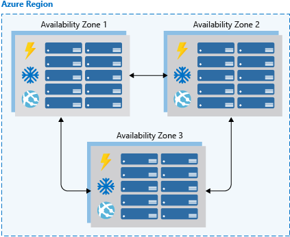
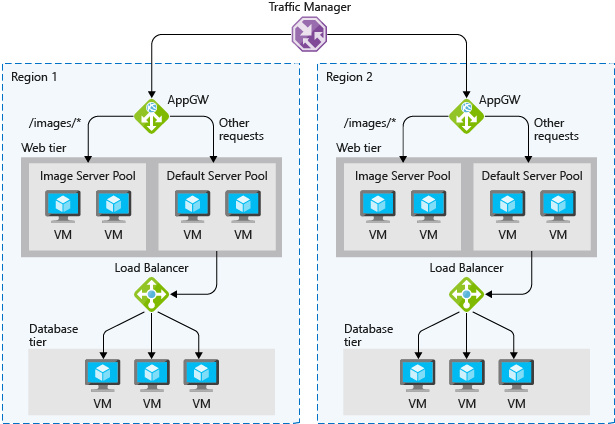

Imagine you're responsible for a system that must always be fully operational. Failures can happen, so you must ensure that your system remains online if something goes wrong. You must also carry out system maintenance and updates without service interruptions.

High availability (HA) ensures that your architecture can handle failures and maintenance events. In this unit, you learn how to evaluate an application for HA, and how to use Azure platform technologies and services to help meet your availability goals.

For an introduction to HA concepts, watch the following video:
> [!VIDEO https://www.microsoft.com/videoplayer/embed/RE2yEvc]

## High availability concepts

A highly available service absorbs temporary failures in dependent services and hardware and fluctuations in availability and load. The application remains online and available, or appears to do so, while performing acceptably. Business requirements, service-level objectives, or service-level agreements often define the degree of availability.

HA describes the ability to handle the loss or severe degradation of a system component. The loss or degradation might be due to application hosts failing and going offline, planned maintenance or upgrades, or cloud service failures. Identify the places where your system can fail, and build in capabilities to handle those failures to ensure that the services you offer your customers can stay online.

HA for a service typically requires HA of the components that make up the service. For example, your online marketplace website might offer customers the ability to list, buy, and sell items online. Multiple components provide this service, such as a database, web servers, and application servers. You must identify how each of these components could fail and where the failure points are, and then determine how to address these failure points in your architecture.

## Evaluate an application for HA

This section explores the steps to evaluate an application for HA:

1. Determine the service-level agreement of your application.
1. Evaluate the HA capabilities of the application.
1. Evaluate the HA capabilities of dependent applications.

### Define the service-level agreement

A service-level agreement (SLA) is an agreement between a service provider and consumer in which the service provider commits to a standard of service based on measurable metrics and defined responsibilities. SLAs can be strict, legally bound, contractual agreements, or can be assumed expectations of availability by customers. Regardless of the specific metrics that make up the SLA, failure to meet the SLA can have serious financial ramifications for the service provider. A common component of service agreements is guaranteed financial reimbursement for missed SLAs.

Service metrics typically focus on service throughput, capacity, and availability, which can all be measured in various ways. Service-level objectives (SLO) are the target metric values that measure performance, reliability, or availability. These metrics could define request processing performance in milliseconds, availability of services in minutes per month, or the number of requests processed per hour.

To define the acceptable and unacceptable ranges for SLOs, evaluate the metrics your application exposes and determine how customers measure quality. By defining these objectives, you clearly set goals and expectations with both the teams that support the services and customers who consume the services. The SLOs determine whether your overall SLA is being met.

The following table shows the potential cumulative downtime for various SLA levels.

| SLA | Downtime per week | Downtime per month | Downtime per year |
| --- | --- | --- | --- |
| 99% |1.68 hours |7.2 hours |3.65 days |
| 99.9% |10.1 minutes |43.2 minutes |8.76 hours |
| 99.95% |5 minutes |21.6 minutes |4.38 hours |
| 99.99% |1.01 minutes |4.32 minutes |52.56 minutes |
| 99.999% |6 seconds |25.9 seconds |5.26 minutes |

Everything else being equal, higher availability is better. But as you strive for higher availability, symbolized by more 9s in the SLA, the cost and complexity to achieve that level increases. An 99.99% uptime means about five minutes of total downtime per month. Whether it's worth the added complexity and cost to reach five 9s depends on your business requirements.

Here are some other factors to consider when you define an SLA:

- To achieve four 9s, or 99.99%, you probably can't rely on manual intervention to recover from failures. The application must be self-diagnosing and self-healing.
- Beyond four 9s, it's challenging to detect outages quickly enough to meet the SLA.
- Consider the time window your SLA is measured against. The smaller the window, the tighter the tolerances. It probably doesn't make sense to define your SLA in terms of hourly or daily uptime.

Identifying SLAs is an important first step to determine the HA capabilities your architecture requires. The SLAs help shape the methods you use to make your application highly available.

### Evaluate application HA capabilities

To evaluate the HA capabilities of your application, perform a failure analysis. Focus on single points of failure and critical components that would have a large impact on the application if they were unreachable, misconfigured, or started behaving unexpectedly. For areas that have redundancy, determine whether the application is capable of detecting error conditions and self-healing.

You need to carefully evaluate all components of your application, including the pieces designed to provide HA functionality, such as load balancers. Single points of failure should either be modified to have HA capabilities, or be replaced with services that can provide HA capabilities.

### Evaluate dependent HA capabilities

You should understand not only your application's SLA requirements, but also the SLAs of any resource your application depends on. If you commit an uptime of 99.9% to your customers, but a service your application depends on has an uptime commitment of only 99%, you might not meet your SLA.

If a dependent service can't provide a sufficient SLA, you might modify your own SLA, replace the dependency with an alternative, or find ways to meet your SLA while the dependency is unavailable. Based on the scenario and the nature of the dependency, you might temporarily work around failing dependencies with solutions like caches and work queues.

## HA in Azure

Both hardware and software platform events can affect applications and systems. It's critical to design your application architecture to handle failures, and the Azure platform provides you with the tools and capabilities to make your application highly available.

The Azure platform provides HA over all its services. The following core technologies provide HA for Azure architectures:

- Availability sets
- Availability zones
- Load balancing
- Platform as a service (PaaS) HA capabilities

### Availability sets

Availability sets help ensure your application remains online if a high-impact maintenance event is required or hardware failures occur. Availability sets are a way to distribute virtual machines (VMs) that belong to the same application workload to prevent simultaneous impact from hardware failure and scheduled maintenance. Availability sets are made up of *update domains* (UDs) and *fault domains* (FDs).

:::image type="content" source="../media/2-availability-sets.png" alt-text="Illustration showing three availability sets in different fault domains. The first set has one update domain, the second has two update domains, and the third has no update domain." loc-scope="other"::: <!-- no-loc -->

Most updates have no impact on the VMs they run on, but sometimes VM hosts in an Azure datacenter need downtime for maintenance. UDs ensure that a subset of your application's servers always keep running during these downtimes.

To ensure that updates don't happen to a whole Azure datacenter at once, the datacenter is logically sectioned into UDs. A maintenance event, such as applying a performance update and critical security patch to the host, sequences through the UDs. Sequencing updates through UDs ensures that the whole datacenter isn't unavailable during platform updates and patching.

While UDs represent logical sections of the datacenter, FDs represent physical sections of the datacenter and ensure rack diversity of servers in an availability set. Placing your VMs in an availability set automatically spreads them across multiple FDs, so if there's a hardware failure, only some of your VMs are affected.

FDs align to the physical separation of shared hardware in the datacenter, including power, cooling, and network hardware that supports the servers in server racks. If the hardware that supports a server rack becomes unavailable, the outage affects only that rack of servers.

### Availability zones

Availability zones are independent physical datacenter locations within a region that include their own power, cooling, and networking. Accounting for availability zones when you deploy resources helps you protect workloads from datacenter outages while you retain presence in a particular region.

Services like VMs are *zonal services* that allow you to deploy to specific zones within a region. Other services are *zone-redundant services* that replicate across the availability zones in the specific Azure region. Both service types ensure that there are no single points of failure within an Azure region.

Supported regions contain a minimum of three availability zones. When you create zonal service resources in those regions, you can select the zone to create the resource in. This ability lets you design your application to withstand a zonal outage and continue to operate in an Azure region instead of having to evacuate your application to another region.

Availability zones are a newer HA service that's currently available for certain regions. If you want to consider this functionality, be sure to check the service availability in the region where you plan to deploy your application. For more information, see [Azure regions with availability zone support](/azure/reliability/availability-zones-service-support#azure-regions-with-availability-zone-support).

Availability zones are supported for VMs and for several PaaS services. Availability zones are mutually exclusive with availability sets. When you use availability zones, you no longer need to define availability sets for your systems. You have diversity at the datacenter level, and updates are never done to multiple availability zones at the same time.

### Load balancing

Load balancers manage how to distribute network traffic across an application. Load balancers are essential to keep your application resilient to individual component failures and to ensure your application is available to process requests. Applications that don't have built-in service discovery require load balancing for both availability sets and availability zones.

There are several Azure load-balancing services, each with distinct network traffic routing abilities. Use one or a combination of these technologies to help ensure you have the necessary options to architect a highly available solution for routing network traffic through your application.

In the preceding diagram, Azure Traffic Manager balances the load between two regions. Within each region, Azure Application Gateway distributes the load among VMs in the web tier based on the type of request. Azure Load Balancer distributes further requests among the VMs in the database tier.

- **Traffic Manager** provides global Domain Name System (DNS) load balancing. Consider using Traffic Manager to provide load balancing of DNS endpoints within or across Azure regions. Traffic Manager distributes requests to available endpoints and uses endpoint monitoring to detect and remove failed endpoints.
  
- **Application Gateway** provides Layer 7 load-balancing capabilities, such as round-robin distribution of incoming traffic, cookie-based session affinity, URL path-based routing, and the ability to host multiple websites behind one gateway. Application Gateway monitors the health of all resources in its backend pool by default, and automatically removes unhealthy resources from the pool. Application Gateway continues to monitor the unhealthy instances and adds them back to the pool once they're available and healthy.
  
- **Azure Load Balancer** is a Layer 4 load balancer. You can configure public and internal load-balanced endpoints and define rules to map inbound connections to backend destinations. Load Balancer can use TCP and HTTP health-probing options to help manage service availability.

### PaaS HA capabilities

Azure PaaS services come with HA built in. Services such as Azure SQL Database, Azure App Service, and Azure Service Bus include HA features and ensure that individual component failures are seamless to your application. Using PaaS services is one of the best ways to ensure that your architecture is highly available.

In summary, when you architect for HA, you should first understand the SLA that you commit to your customers. Then evaluate the HA capabilities of your application, and the HA capabilities and SLAs of dependent systems. After you evaluate your SLA and HA capabilities, use Azure features like availability sets, availability zones, and load-balancing technologies to add HA to your application. Azure PaaS services have HA capabilities built in.

