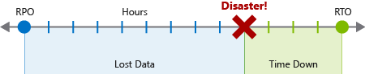
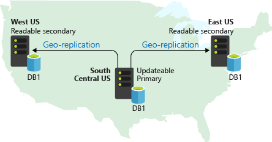
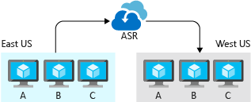
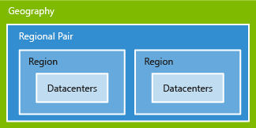

Designing for high availability helps keep an application or process running despite unfavorable events and adverse conditions. But significant occurrences can still happen where you lose data or it's impossible to keep your apps and processes from going down.

When disaster strikes, you need to have a recovery plan to get your services running again. You should know your goals and expectations for recovery, the costs and limitations of your recovery plan, and how to execute the plan. This unit covers how to promote reliability by planning for and recovering from disasters.

## Disaster recovery concepts

A disaster is a single, major event with a larger and longer-lasting impact than an application can mitigate through the high availability part of its design. Disaster recovery (DR) is about recovering from high-impact events that result in downtime and data loss. 

The word disaster often evokes thoughts of natural disasters and external events like earthquakes, floods, and tropical storms, but many other kinds of disasters exist. A failed deployment or upgrade can leave an app in an unrecognizable state. Malicious hackers can encrypt or delete data and inflict other kinds of damage that take an application offline or eliminate some of its functionality.

Regardless of the cause, the best remedy for a disaster is a well-defined and tested DR plan and an application design that actively supports DR.

## Create a disaster recovery plan

A disaster recovery plan is a document that details the procedures required to recover from data loss and downtime caused by a disaster. The document identifies who's in charge of directing the procedures. Operators should be able to use the plan as a manual to restore application connectivity and recover data after a disaster.

A detailed, written plan dedicated to DR is critical to a favorable outcome. Creating a disaster recovery plan requires expert knowledge of the application's workflows, data, infrastructure, and dependencies. The process of creating the plan helps assemble a complete picture of the application. The resulting written steps promote good decision-making and follow-through in the panicked, chaotic aftermath of a disaster.

To create a DR plan, first do a risk assessment and process inventory for your application. Then define your recovery objectives, and then detail the recovery steps to achieve the objectives.

### Risk assessment and process inventory

The first step in creating a DR plan is to do a risk analysis that examines the impact of different kinds of disasters on the application. The exact nature of a disaster isn't as important to the risk analysis as its potential impact through data loss and application downtime.

Explore various kinds of hypothetical disasters and try to be specific when thinking about their effects. For example, a targeted malicious attack might modify code or data that results in a different kind of impact than an earthquake that disrupts network connectivity and datacenter availability.

The risk assessment needs to consider every process that can't afford unlimited downtime, and every category of data that can't afford unlimited loss. When a disaster occurs that affects multiple application components, plan owners must be able to use the plan to completely inventory the components and prioritize each item.

Applications that consist only of a single process or data classification are still important to include. These applications might be single components of a larger DR plan that includes multiple applications within the organization.

### Recovery objectives

A complete DR plan must specify the following critical business requirements for each process the application implements:

- **Recovery Point Objective (RPO)** is the maximum duration of acceptable data loss. RPO is measured in units of time, not volume, such as "30 minutes of data" or "four hours of data." RPO is about limiting and recovering from data loss, not data theft.
- **Recovery Time Objective (RTO)** is the maximum duration of acceptable downtime, where "downtime" is defined by your specification. For example, if the acceptable downtime duration in a disaster is eight hours, then the RTO is eight hours.

Each major process or workload that an application implements should have separate RPO and RTO values. Even if you arrive at the same values for different processes, you should generate each value through a separate analysis that examines disaster-scenario risks and potential recovery strategies.

The process of specifying an RPO and RTO effectively creates DR requirements for your application. You must establish the priority of each workload and data category and do a cost-benefit analysis. The analysis includes the following concerns:

- Implementation and maintenance cost
- Operational expense
- Process overhead
- Performance impact
- Impact of downtime and data loss

You must define exactly what "downtime" means for your application, and in some cases you might establish separate RPO and RTO values for different levels of functionality. Specifying RPO and RTO should be more than simply choosing arbitrary values. Much of the value of a DR plan comes from the research and analysis that goes into discovering the potential impact of a disaster and the cost of mitigating the risks.

### Recovery steps

The final plan should detail exactly what steps to take to restore lost data and application connectivity. Recovery steps often include information about the following components:

- **Backups**: How often backups are created, where they're located, and how to restore data from them.
- **Data replicas**: The number and locations of replicas, the nature and consistency of the replicated data, and how to switch over to a different replica.
- **Deployments**: How deployments are executed, how rollbacks occur, and failure scenarios for deployments.
- **Infrastructure**: On-premises and cloud resources, network infrastructure, and hardware inventory.
- **Dependencies**: External services that the application uses, including their SLAs and contact information.
- **Configuration and notification**: Flags or options that can be set to gracefully degrade the application, and services that notify users of application impact.

The exact required steps depend heavily on the application's implementation details, so it's important to keep the plan updated. Routinely test the plan to help identify gaps and outdated sections.

## Design for DR

DR isn't an automatic feature, but must be designed, built, and tested. To support a solid DR strategy, you must build an application with DR in mind from the ground up. Azure offers services, features, and guidance to help you support DR when you create apps, but it's up to you to include those capabilities in your design.

Designing for disaster recovery has the following main concerns:

- **Data recovery** uses backups and replication to restore lost data.
- **Process recovery** recovers services and deploys code to recover from outages.

### Data recovery and replication

Replication duplicates data in multiple data store replicas. Unlike backup, which creates long-lived, read-only snapshots of data to use for recovery, replication creates real-time or near-real-time copies of live data. The goal of replication is to keep replicas synchronized with as little latency as possible while maintaining application responsiveness. Replication is a key component of designing for high availability and disaster recovery (HADR), and is a common feature of production-grade applications.

Replication mitigates a failed or unreachable data store by executing a *failover*, which changes application configuration to route data requests to a working replica. Error detection built into a data-storage product, or that you implement through a monitoring solution, can trigger and often automate failover. Depending on the implementation and scenario, system operators might need to manually perform failover.

Different replication designs place different priorities on data consistency, performance, and cost.

- **Active** replication requires updates to take place on multiple replicas simultaneously, guaranteeing consistency at the cost of throughput.
- **Passive** replication does synchronization in the background, removing replication as a constraint on application performance, but increasing RPO.
- **Active-active** or **multimaster** replication enables using multiple replicas simultaneously, enabling load balancing at the cost of complicating data consistency.
- **Active-passive** replication reserves replicas for live use during failover only.

You don't implement replication from scratch. Most fully featured database systems and other data-storage products and services include some kind of replication as a tightly integrated feature, due to its functional and performance requirements. It's up to you to include these features in your application design and use them appropriately.

The following Azure services support different replication levels and concepts:

- **Azure Storage** replication capabilities depend on the type of replication you select for the storage account. The replication can be local within a datacenter, zonal between datacenters within a region, or regional between regions. Application and operators don't interact with replication directly. Failovers are automatic and transparent, and you simply need to select a replication level that balances cost and risk.

- **Azure SQL Database** replication is automatic at a small scale, but recovery from a full Azure datacenter or regional outage requires *geo-replication*. Setting up geo-replication is manual, but it's a first-class Azure SQL Database feature that's well-supported by documentation.

- **Azure Cosmos DB** is a globally distributed database system, and replication is central to its implementation. With Azure Cosmos DB, you can configure options for database regions, data partitioning, and data consistency.
> [!IMPORTANT]
> Neither replication nor backup are complete DR solutions on their own. Data recovery is only one component of DR, and replication doesn't fully satisfy many DR scenarios. For example, in a data corruption scenario, the nature of the corruption could allow it to spread from the primary data store to the replicas, rendering all the replicas useless and requiring a backup for recovery.

### Process recovery

After a disaster, business data isn't the only asset that needs recovering. Disaster scenarios also commonly result in downtime, whether due to network connectivity problems, datacenter outages, damaged virtual machines (VMs), or corrupted software deployments. Your application design must let you restore the application to a working state.

In most cases, process restoration involves failover to a separate, working deployment. Depending on the scenario, geographic location might be a critical aspect. For example, a large-scale natural disaster that brings an entire Azure region offline necessitates restoring service in another region.

Your application's DR requirements, especially RTO, should drive your design and help you make the following decisions:

- How many replicated environments to have.
- Where to locate the environments.
- Whether to maintain the environments in a ready-to-run state.
- Whether the environments should be ready to accept a deployment in a disaster.

Depending on your application design, you can use several different strategies and Azure features to improve your application's support for process recovery after a disaster.

#### Azure Site Recovery

Azure Site Recovery is a service that manages process recovery for workloads running on VMs deployed to Azure, VMs on physical servers, and directly on physical servers. Site Recovery replicates workloads to alternate locations, helps you fail over when an outage occurs, and supports testing of a DR plan.

Site Recovery supports replicating VMs, physical server images, and individual workloads. A workload might be an individual application or an entire VM or operating system with its applications. Any application workload can be replicated, but Site Recovery has first-class integrated support for many Microsoft server applications, such as SQL Server and SharePoint, and some third-party applications like SAP.

Investigate Site Recovery for any app that runs on VMs or physical servers as a great way to discover and explore scenarios and possibilities for process recovery.

#### Service-specific DR features

Most services that run on Azure platform as a service (PaaS) offerings like Azure App Service provide features and guidance to support DR. For some scenarios, you can use service-specific features to support fast recovery. For example, Azure SQL Server supports geo-replication for quickly restoring service in another region. Azure App Service has a Backup and Restore feature, and the documentation includes guidance for using Azure Traffic Manager to support routing traffic to a secondary region.

## DR plan testing

DR planning doesn't end once you have a completed plan. Testing the plan to ensure that the directions and explanations are clear and up to date is a crucial aspect of DR planning.

Choose intervals to do different types and scopes of tests. For example, test backups and failover mechanisms every month and do a full-scale DR simulation every six months. Always follow the steps and details exactly as the plan documents. Consider having someone unfamiliar with the plan give perspective on anything that could be made clearer. As you run the test, identify gaps, areas of improvement, and places to automate, and add these enhancements to your plan.

Make sure to include your monitoring system in your testing. For example, if your application supports automated failover, you introduce failures in a dependency or other critical component to ensure that the application behaves correctly end-to-end. Make sure to include failure detection and triggering of automated failover in the plan and testing.

By carefully identifying your DR requirements and laying out a plan, you can determine what types of services you need to meet your DR objectives. Azure provides several services and features to help you meet these objectives.
