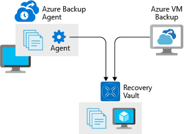

This unit describes backup and recovery as a powerful line of defense against permanent data loss. An effective backup strategy requires more than simply copying data, but should take your application's data architecture and infrastructure into account.

Applications can manage many data types of varying importance, spread across filesystems, databases, and other storage services in the cloud and on-premises. Using the right services and products for each backup simplifies the backup process and decreases recovery time if a backup needs to be restored.

## Requirements for backup and restore

As with a disaster recovery strategy, you base backup requirements on a cost-benefit analysis. Guide the analysis of your application's data by the relative importance of the data categories the app manages. Also consider external requirements such as data retention laws.

To establish backup requirements for your application, group its data types based on the following requirements:

- How much of this type of data can afford to be lost, measured in duration.
- The maximum amount of time a restore of this type of data should require.
- Backup retention requirements, such as how long and how often backups must remain available.

These concepts map to the concepts of Recovery Point Objective (RPO) and Recovery Time Objective (RTO). The duration of acceptable loss generally translates to required backup intervals and RPO. The maximum amount of time a restore takes corresponds to the RTO for your application's data components.

Develop both requirements relative to the cost of achieving them. No organization wants to say that they can afford to lose any data, but that might change when they consider the cost of achieving that requirement.

Backup plays a role in disaster recovery (DR), but backups, restores, and their associated scenarios extend beyond the scope of DR. Backups might need to be restored in nondisaster situations, including scenarios where RTO and RPO aren't a concern.

For example, if a small amount of data older than your backup interval is corrupt or missing, but the application doesn't experience downtime and a successful restore results in no data loss, your application might never be in danger of missing its SLA. Your DR plan might or might not include guidance for doing restores in nondisaster situations.

> [!TIP]
> Don't confuse archival or replication with backup. Archival is storing data for long-term preservation and read access. Replication is near-real-time copying of data between replicas to support high availability and some DR scenarios. Some requirements, such as data retention laws, might influence your strategies for all three of these concerns, but they require separate analysis and implementation.

## Azure backup and restore services

Azure offers several backup-related services and features for Azure and on-premises data. Most Azure services offer some kind of backup functionality. This section reviews several popular backup-related Azure offerings.

### Azure Backup

Azure Backup is a family of backup products that back up data to Recovery Services vaults for storage and recovery. Recovery Services vaults are storage resources in Azure that are dedicated to holding data and configuration backups for virtual machines (VMs), servers, and individual workstations and workloads.

Backup serves as a general-purpose backup solution for cloud and on-premises workflows that run on VMs or physical servers. Backup is a drop-in replacement for traditional backup solutions that stores data in Azure instead of on archive tapes or other local physical media. Backup can add value and contribute to the backup and restore strategy for infrastructure as a service (IaaS) and on-premises applications of many sizes and shapes.

The following products and services can use Backup to create backups:

- **Microsoft Azure Recovery Services (MARS) agent** is a Windows application that backs up files, folders, and system state from the Windows VM it's installed on. It works like many consumer cloud-based backup solutions, but requires configuring a Recovery Services vault. Once you download and install the agent onto a Windows server or VM, you can configure it to create backups up to three times a day.

- **System Center Data Protection Manager** is a robust, fully featured, enterprise-level backup and recovery system for Windows Server. Data Protection Manager can back up file systems and Windows and Linux VMs, create bare-metal backups of physical servers, and do application-aware backups of server products like SQL Server and Exchange. Data Protection Manager is part of System Center, which licenses and sells it. It's part of the Backup family because it can store backups in a Recovery Services vault.

- **Microsoft Azure Backup Server (MABS)** is similar to Data Protection Manager, but is licensed as part of an Azure subscription and doesn't require a System Center license. Azure Backup Server supports the same functionality as Data Protection Manager, except for local tape backup and integration with System Center products.

- **Azure VM backup** is a turnkey backup and restore feature that supports scheduled backups for Azure Windows and Linux VMs. VM backup supports recovery of individual files, full disks, and entire VMs, and can also do application-consistent backups. You can make individual applications aware of backup operations so they get their filesystem resources into a consistent state before the snapshot is taken.

### Azure Blob Storage

Azure Storage doesn't include automated backup, but blobs are commonly used to back up all kinds of data from various sources. Many services that provide backup capabilities use blobs to store their data, and blobs are a common target for scripts and tools in every backup scenario.

Azure general purpose v2 storage accounts support three different Blob Storage tiers of varying performance and cost. *Cool* storage offers the best cost-to-performance ratio for most backups,  while *hot* storage offers lower access costs but higher storage costs. *Archive* storage might be appropriate for secondary backups or backups of data with low expectations for recovery time. Archive storage is low cost but requires up to 15 hours of lead time to access.

Immutable blob storage is configurable to be nonerasable and nonmodifiable for a user-specified interval. Immutable blob storage primarily fulfills strict requirements for certain kinds of data, such as financial data, and is a great option for ensuring that backups are protected against accidental deletion or modification.

### Azure SQL Database

Comprehensive, automatic backup functionality is included with Azure SQL Database at no extra charge. SQL Database backup is enterprise-grade, production-ready, and enabled by default.

SQL Database creates full backups weekly, differential backups every 12 hours, and log backups every five minutes. You can use a SQL Database backup to restore a database to a specific point in time, even if the database has been deleted. You can do restores by using the Azure portal, PowerShell, or the REST API. Backups for databases encrypted with Transparent Data Encryption (TDE), enabled by default, are also encrypted.

If you're evaluating different database options for an application, you should include backup and restore as part of the cost-benefit analysis, because it's a significant benefit of SQL Database. Every application that uses SQL Database should take advantage of its backup and restore capabilities by including them in its DR plan and backup/restore procedures.

### Azure App Service

Web applications hosted in Azure App Service Standard and Premium tiers support turnkey scheduled and manual backups. Backups include application configuration, file contents, and database contents, and support simple filters for excluding files. Restore operations can target different App Service instances, making App Service backup a simple way to move one application's contents to another application.

App Service backups are limited to 10 GB total, including application and database content, and are a good solution for applications under development and small-scale applications. Mature applications don't generally use App Service backup. These applications rely on robust deployment and rollback procedures, storage strategies that don't use application disk storage, and dedicated backup strategies for databases and persistent storage.

## Testing and verification for backup and restore

No backup system is complete without a strategy for verifying backups and testing restore procedures. Even if you use a dedicated backup service or product, you should still document and practice recovery procedures to ensure that everyone understands them. Make sure that the procedures always return the system to the expected state.

Strategies for verifying backups vary and depend on the nature of your infrastructure. You might consider techniques like creating a new deployment of the application, restoring the backup to it, and comparing the states of the two instances. In many cases, this technique closely mimics actual DR procedures.

Simply comparing a subset of the backup data with the live data immediately after creating a backup might be enough verification. A common component of backup verification is attempting to restore old backups to ensure that they're still available and operational, and that the backup system hasn't changed to render them incompatible. Any strategy is better than finding out that your backups are corrupted or incomplete while attempting to recover from a disaster.

A backup and restore strategy is an important part of ensuring your architecture can recover from data loss or corruption. Review your architecture to define your backup and restore requirements, determine a backup plan to meet the requirements, and then test the process regularly. Azure provides several services and features to provide backup and restore capabilities for many architectures.
