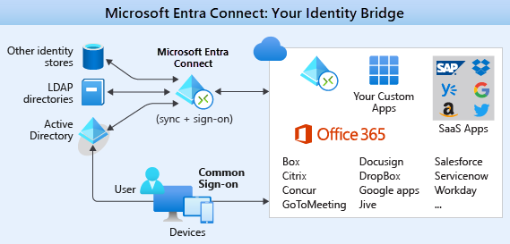

Imagine you work for a healthcare organization that hosts an internal application and web portal for its clinicians to manage patient health data. The organization has received many requests for this application to be available to caregivers, who are often on-site with patients and therefore outside the network.

A recent data leak by malicious agents has forced the company to tighten its password policies. The company now requires users to change their passwords more frequently and use longer, more complex passwords. This has led to the unwanted side effect of users recording complex passwords insecurely as they struggle to remember multiple sets of credentials created for different administrative roles. 

Here, we'll discuss identity as a security layer for internal and external applications. We'll also discuss the benefits of single sign-on (SSO) and multifactor authentication to provide identity security, and why to consider replicating on-premises identities to Azure Active Directory (Azure AD).

## Identity as a layer of security

Digital identities are an integral part of today's business and social interactions on-premises and online. In the past, identity and access services were restricted to operating within a company's internal network. Protocols such as Kerberos and LDAP were designed for this purpose. 

More recently, mobile devices have become the primary way that people interact with digital services. Customers and employees alike expect to be able to access services from anywhere at any time. This expectation has driven the development of identity protocols that can work at internet scale across many disparate devices and operating systems.

As your organization evaluates the capabilities of its architecture around identity, it's looking at ways to bring the following capabilities into the application:

- Provide single-sign on to application users.
- Enhance the application to use modern authentication with minimal effort.
- Enforce multifactor authentication for all sign-ins outside the company's network.
- Develop an application to allow patients to enroll and securely manage their account data.

## Single sign-on

The more identities a user has to manage, the greater the risk of a credential-related security incident. More identities mean more passwords to remember and change. Password policies can vary between applications. As complexity requirements increase, it's more difficult for users to remember them.

On the other side is the management required for all those identities. Additional strain is placed on help desks as they deal with account lockouts and password reset requests. If a user leaves an organization, tracking down all those identities and ensuring that they're disabled can be challenging. An overlooked identity can allow access that should have been eliminated.

With single sign-on, users need to remember only one ID and one password. Access across applications is granted to a single identity tied to a user, simplifying the security model. As users change roles or leave an organization, access modifications are tied to the single identity, greatly reducing the effort needed to change or disable accounts. 

Using single sign-on for accounts will make it easier for users to manage their identities. It will also increase the security capabilities in your environment.

### SSO with Azure Active Directory

Azure AD is a cloud-based identity service. It has built-in support for synchronizing with your on-premises Active Directory instance, or it can be used on its own. This means that all your applications, whether on-premises, in the cloud (including Microsoft 365), or even mobile, can share the same credentials. Administrators and developers can control access to data and applications by using centralized rules and policies configured in Azure AD.

By using Azure AD for SSO, you'll also have the ability to combine multiple data sources into an intelligent security graph. This security graph can help you provide threat analysis and real-time identity protection to all accounts in Azure AD, including accounts that are synchronized from on-premises Active Directory. By using a centralized identity provider, you'll have centralized the security controls, reporting, alerting, and administration of your identity infrastructure.

### Synchronize directories with Azure AD Connect

Azure AD Connect can integrate your on-premises directories with Azure Active Directory. Azure AD Connect provides the newest capabilities and replaces older versions of identity integration tools such as DirSync and Azure AD Sync.

It's a single tool to provide an easy deployment experience for synchronization and sign-in.

Your organization requires that authentication occurs primarily against on-premises domain controllers, but it also requires cloud authentication in a disaster recovery scenario. It doesn't have any requirements that Azure AD doesn't already support.

Your organization has made the decision to move forward with the following configuration:

- Use Azure AD Connect to synchronize groups, user accounts, and password hashes stored in on-premises Active Directory to Azure AD.
  
  This can be a backup if pass-through authentication is unavailable.
- Configure pass-through authentication by using an on-premises authentication agent installed on Windows Server.
- Use the seamless SSO feature of Azure AD to automatically sign in users from on-premises domain-joined computers.
  
  SSO reduces user friction by suppressing multiple authentication requests.

## Authentication and access

Your organization's security policy requires that all sign-ins that occur outside the company's perimeter network are authenticated with an additional factor of authentication. This requirement combines two aspects of the Azure AD service: multifactor authentication and conditional access policies.

### Multifactor authentication

Multifactor authentication provides additional security for your identities by requiring two or more elements for full authentication. These elements fall into three categories:

- *Something you know*: A password or the answer to a security question.
- *Something you have*: A mobile app that receives a notification or a token-generating device.
- *Something you are*: Some sort of biometric property such as a fingerprint or face scan used on many mobile devices.

Using multifactor authentication increases the security of your identity by limiting the impact of credential exposure. An attacker who has a user's password would also need to have possession of their phone or their face in order to fully authenticate. Authentication with only a single factor verified is insufficient, and the attacker would be unable to use those credentials to authenticate. The benefits that this brings to security are huge, so organizations should enable multifactor authentication wherever possible.

Azure AD has multifactor authentication capabilities built in and will integrate with other multifactor authentication providers. Basic multifactor authentication features are available to Microsoft 365 and Azure AD administrators for no extra cost. If you want to upgrade the features for your admins or extend multifactor authentication to the rest of your users, you can purchase more capabilities.

### Conditional access policies

Along with multifactor authentication, ensuring that additional requirements are met before granting access can add another layer of protection. Blocking logins from a suspicious IP address, or denying access from devices without malware protection, can limit access from risky sign-ins.

Azure Active Directory provides conditional access policies based on group, location, or device state. The location feature allows your organization to differentiate IP addresses that don't belong to the network, and it satisfies the security policy to require multifactor authentication from all such locations.

Your organization has created a conditional access policy that requires users who access the application from an IP address outside the company network to be challenged with multifactor authentication.

In the following illustration, user requests to access the on-premises and cloud applications are first checked against a list of conditions. The requests are either allowed access, forced to go through multifactor authentication, or blocked based on the conditions that they satisfy.

## Securing applications

Your employees require secure remote access to their administrative application hosted on-premises. Users currently authenticate to the application by using Windows Integrated Authentication from their domain-joined machines, behind the corporate firewall. 

Although a project to incorporate modern authentication mechanisms into the application has been planned, there's considerable business pressure to enable remote access capabilities as soon as possible. Azure AD Application Proxy can allow users to access the application remotely without any code changes.

Azure AD Application Proxy is:

- Simple
  - You don't need to change or update your applications to work with Application Proxy.
  - Your users get a consistent authentication experience. They can use the MyApps portal to get single sign-on to both SaaS apps in the cloud and your apps on-premises.
- Secure
  - When you publish your apps by using Azure AD Application Proxy, you can take advantage of the authorization controls and security analytics in Azure. You get cloud-scale security and Azure security features like conditional access and two-step verification.
  - You don't have to open any inbound connections through your firewall to give your users remote access.
- Cost-effective
  - Application Proxy works in the cloud, so you can save time and money. On-premises solutions typically require you to set up and maintain perimeter networks, edge servers, or other complex infrastructures.

Azure AD Application Proxy has two components. The first is a connector agent that sits on a server running Windows within your corporate network. The second is an external endpoint, either the MyApps portal or an external URL. When a user goes to the endpoint, they authenticate with Azure AD and are routed to the on-premises application via the connector agent.

## Working with consumer identities

Since your organization integrated modern authentication with its existing application, it has quickly acknowledged the benefits of a managed identity system such as Azure AD. The leadership team is now interested in exploring other ways that Microsoft identity services can add business value. The team is focusing its attention on external customers and how modernization of existing customer interactions might provide tight integration with identity providers like Google, Facebook, and LinkedIn.

Azure AD B2C is an identity management service that's built on the foundation of Azure Active Directory. It enables you to customize and control how customers sign up, sign in, and manage their profiles when using your applications. This includes applications developed for iOS, Android, and .NET, among others. 

Azure AD B2C provides a social identity login experience, while at the same time protecting your customer identity profile information. Azure AD B2C directories are distinct from standard Azure AD directories and can be created in the Azure portal.
