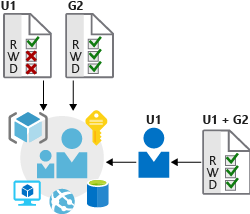

Imagine your organization recently experienced a significant outage to a customer-facing web application. An engineer was granted full access to a resource group that contains the production web application. This engineer accidentally deleted the resource group and all child resources, including the database that hosts live customer data.

Fortunately, the application source code and resources were available in source control and regular database backups were running automatically on a schedule. The service was reinstated relatively easily. Here, we'll explore how the organization could have avoided this outage by using capabilities in Azure to protect access to the infrastructure.

## Criticality of infrastructure

Cloud infrastructure is becoming an essential piece of many businesses. It's critical to ensure that people and processes have only the rights they need to get their job done. Assigning incorrect access can result in data loss, data leakage, or unavailability of services. 

System administrators can be responsible for a large number of users, systems, and permission sets. So correctly granting access can quickly become unmanageable and can lead to a "one size fits all" approach. This approach can reduce the complexity of administration, but makes it far easier to inadvertently grant more permissive access than required.

## Role-based access control

Role-based access control (RBAC) offers a slightly different approach. Roles are defined as collections of access permissions. Security principals are mapped to roles directly or through group membership. Separating security principals, access permissions, and resources provides simplified access management and more detailed control.

On Azure, users, groups, and roles are all stored in Azure Active Directory (Azure AD). The Azure Resource Manager API uses role-based access control to secure all resource access management within Azure.

### Roles and management groups

Roles are sets of permissions, like *read-only* or *contributor*, that users can be granted to access an Azure service instance. Roles can be granted at the level of an individual service instance, but they also flow down the Azure Resource Manager hierarchy. Roles assigned at a higher scope, like an entire subscription, are inherited by child scopes, like service instances.

Management groups are an additional hierarchical level recently introduced into the RBAC model. Management groups add the ability to group subscriptions together and apply policy at an even higher level.

The ability to flow roles through an arbitrarily defined subscription hierarchy also allows administrators to grant temporary access to an entire environment for authenticated users. For example, an auditor might require temporary read-only access to all subscriptions.

:::image type="content" source="../media/4-management-groups.png" alt-text="Illustration that shows the hierarchical representation of role-based access in a management group." loc-scope="other"::: <!-- no-loc -->

### Privileged Identity Management

In addition to managing Azure resource access with RBAC, a comprehensive approach to infrastructure protection should consider including the ongoing auditing of role members as the organization changes and evolves. Azure AD Privileged Identity Management (PIM) is an additional paid-for offering that provides oversight of role assignments, self-service, and just-in-time (JIT) role activation. 

With the Azure AD PIM service, you can manage, control, and monitor access to important resources in your organization. This includes access to resources in Azure AD; Azure; and other Microsoft Online Services, like Microsoft 365 and Microsoft Intune. This control does not eliminate the need for users to carry out privileged operations in Azure AD, Azure, Microsoft 365, and software as a service (SaaS) apps.

Organizations can give users JIT privileged access to Azure resources and Azure AD. Oversight is needed for what those users do with their administrator privileges. PIM helps mitigate the risk of excessive, unnecessary, or misused access rights.

Here are some of the key features of PIM:

* Providing just-in-time privileged access to Azure AD and Azure resources
* Assigning time-bound access to resources by using start and end dates
* Requiring approval to activate privileged roles
* Enforcing Azure AD multifactor authentication to activate any role
* Using justification to understand why users activate
* Getting notifications when privileged roles are activated
* Conducting access reviews to ensure that users still need roles
* Downloading an audit history for an internal or external audit

To use PIM, you need one of the following paid or trial licenses:

* Azure AD Premium P2
* Enterprise Mobility + Security (EMS) E5

## Providing identities to services

It's often valuable for services to have identities. Often, and against best practices, credential information is embedded in configuration files. With no security around these configuration files, anyone with access to the systems or repositories can access these credentials and risk exposure.

Azure AD addresses this problem through two methods: service principals and managed identities for Azure services.

### Service principals

To understand service principals, it's useful to first understand the words *identity* and *principal* as they're used in the world of identity management.

An *identity* is just a thing that can be authenticated. Obviously, this includes users with usernames and passwords. But it can also include applications or other servers, which might authenticate with secret keys or certificates. As a bonus definition, an *account* is data associated with an identity.

A *principal* is an identity that acts with certain roles or claims. Consider the use of Sudo on a Bash prompt or on Windows via **Run as administrator**. In both of those cases, you're still signed in as the same identity as before, but you've changed your role.

So, a *service principal* is literally named. It's an identity that a service or application uses. Like other identities, it can be assigned roles.

For example, your organization can assign its deployment scripts to run authenticated as a service principal. If that's the only identity that has permission to perform destructive actions, your organization has gone a long way toward making sure that it doesn't repeat the accidental resource deletion.

### Managed identities for Azure resources

The creation of service principals can be a tedious process. There are also many touch points that can make maintaining service principals difficult. Managed identities for Azure resources are much easier and will do most of the work for you.

A managed identity can be instantly created for any Azure service that supports it. (The list is constantly growing.) When you create a managed identity for a service, you're creating an account on the Azure AD tenant. Azure infrastructure will automatically take care of authenticating the service and managing the account. You can then use that account like any other Active Directory account, including letting the authenticated service securely access other Azure resources.
