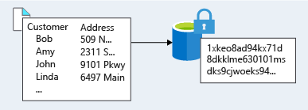
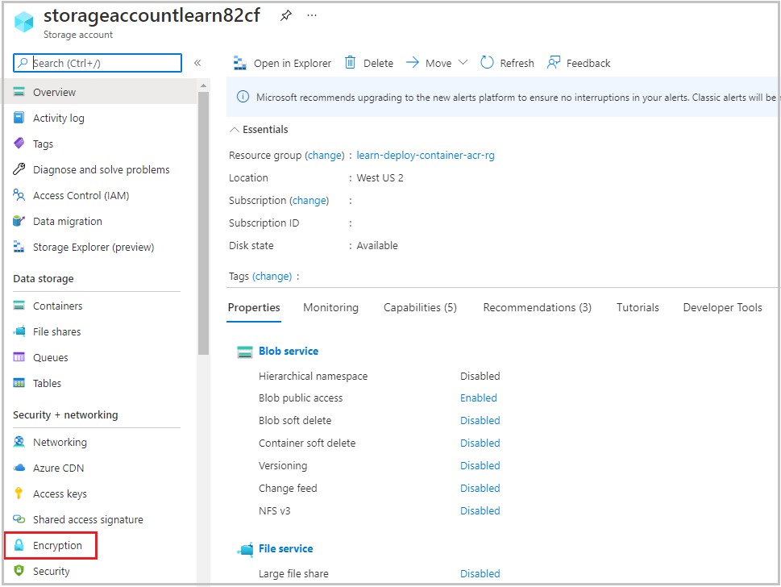

Data is an organization's most valuable and irreplaceable asset. Encryption serves as the last and strongest line of defense in a layered security strategy for data. 

Imagine you work for a healthcare organization that stores large amounts of sensitive data. The organization recently experienced a breach that exposed the unencrypted sensitive data of patients. The organization is now fully aware that it has gaps in its data protection capabilities. It wants to understand how it could have better used encryption to protect itself and its patients from this type of incident. 

Here, we'll take a look at what encryption is, how to approach the encryption of data, and what encryption capabilities are available on Azure.

## What is encryption?

Encryption is the process of making data unreadable and unusable. To use or read the encrypted data, it must be *decrypted*, which requires the use of a secret key. There are two top-level types of encryption: *symmetric* and *asymmetric*.

Symmetric encryption uses the same key to encrypt and decrypt the data. Consider a password manager application. You enter your passwords, and they're encrypted with your own personal key. (Your key is often derived from your master password.) When the data needs to be retrieved, the same key is used and the data is decrypted.

Asymmetric encryption uses a public key and private key pair. Either key can encrypt but can't decrypt its own encrypted data. To decrypt, you need the paired key. Asymmetric encryption is used for things like TLS (used in HTTPS) and data signing.

Both symmetric and asymmetric encryption play a role in properly securing your data. 

Encryption is typically approached in two ways: encryption at rest and encryption in transit.

### Encryption at rest

Data at rest is the data that has been stored on a physical medium. This might be data stored on the disk of a server, data stored in a database, or data stored in a storage account. 

Regardless of the storage mechanism, encryption of data at rest ensures that the stored data is unreadable without the keys and secrets needed to decrypt it. If an attacker obtained a hard drive with encrypted data and didn't have access to the encryption keys, the attacker would have great difficulty compromising the data. In such a scenario, an attacker would have to attempt attacks against encrypted data, which is much more complex and resource consuming than accessing unencrypted data on a hard drive.

The data that's encrypted can vary in its content, usage, and importance to the organization. It might be financial information that's critical to the business, intellectual property that has been developed by the business, personal data that the business stores about customers or employees, and even the keys and secrets used for the encryption of the data itself.

### Encryption in transit

Data in transit is the data that's actively moving from one location to another, such as across the internet or through a private network. An organization can handle secure transfer by encrypting the data before sending it over a network, or setting up a secure channel to transmit unencrypted data between two systems. Encrypting data in transit protects the data from outside observers and provides a mechanism to transmit data while limiting risk of exposure.

The following illustration is an example of encryption in transit. The data is encrypted before it's transferred. After the data reaches the destination, it's decrypted.

## Identify and classify data

Let's revisit the problem that your organization is trying to solve. The organization has had previous incidents that exposed sensitive data, so there's a gap between what's being encrypted and what should be encrypted. The organization needs to start by identifying and classifying the types of data that it's storing, and align this with the business and regulatory requirements for the storage of data. 

It's beneficial to classify this data as it relates to the impact of exposure to the organization, its customers, or its partners. An example classification might be as follows:

|Data classification|Explanation|Examples|
|---|---|---|
|Restricted|Data classified as restricted poses significant risk if exposed, altered, or deleted. This data requires strong levels of protection. |Data that contains Social Security numbers, credit card numbers, personal health records|
|Private| Data classified as private poses moderate risk if exposed, altered, or deleted. This data requires reasonable levels of protection. Data that isn't classified as restricted or public will be classified as private.  |Personal records that contain information such as address, phone number, academic records, customer purchase records|
|Public| Data classified as public poses no risk if exposed, altered, or deleted. This data doesn't require any protection. |Public financial reports, public policies, product documentation for customers|

By taking an inventory of the types of data being stored, the organization can get a better picture of where sensitive data might be stored and where existing encryption might or might not be happening.

A thorough understanding of the regulatory and business requirements that apply to data that the organization stores is also important. The regulatory requirements that an organization must adhere to often drive a large part of the data encryption requirements. 

Your organization is storing sensitive data that falls under the Health Insurance Portability and Accountability Act (HIPAA), which contains requirements on how to handle and store patient data. Other industries fall under different regulatory requirements. A financial institution might store account information that falls within Payment Card Industry (PCI) standards. An organization that does business in the EU might fall under the General Data Protection Regulation (GDPR), which defines the handling of personal data in the EU. 

Business requirements might also dictate that any data that could put the organization at financial risk needs to be encrypted. Competitive information falls in this category.

After you've classified the data and defined your requirements, you can take advantage of tools and technologies to implement and enforce encryption in your architecture.

## Encryption on Azure

Let's take a look at some ways that Azure enables you to encrypt data across services.

### Encrypting raw storage

Azure Storage encryption for data at rest helps you protect your data to meet your organizational security and compliance commitments. The Azure Storage platform automatically encrypts your data with 256-bit Advanced Encryption Standard (AES) encryption before persisting it to disk and then decrypts the data during retrieval. This handling of encryption, encryption at rest, decryption, and key management in Azure Storage is transparent to applications that use the service. You don't need to add any code or turn on any features.

You can use Microsoft-managed encryption keys with Azure Storage encryption, or you can use your own encryption keys by selecting the option in the Azure portal.

Azure Storage automatically encrypts data in:

- All Azure Storage services, including Azure Managed Disks, Azure Blob Storage, Azure Files, Azure Queue Storage, and Azure Table Storage
- Both performance tiers (Standard and Premium)
- Both deployment models (Azure Resource Manager and classic)

For your organization, Azure Storage encryption means that whenever someone is using services that support Azure Storage encryption, their data is encrypted on the physical medium of storage. In the unlikely event that someone gets access to the physical disk, the data will be unreadable.

### Encrypting virtual machines

Azure Storage provides low-level encryption protection for data written to physical disk, but how do you protect the virtual hard disks (VHDs) of virtual machines (VMs)? If a malicious attacker gained access to your Azure subscription and exfiltrated the VHDs of your virtual machines, how would you ensure they'd be unable to access data stored on the VHD?

Azure Disk Encryption is a capability that helps you encrypt your Windows and Linux IaaS virtual machine disks. Azure Disk Encryption uses the industry-standard BitLocker feature of Windows and the DM-Crypt feature of Linux to provide volume encryption for the OS and data disks. The solution is integrated with Azure Key Vault to help you control and manage the disk-encryption keys and secrets. (And you can use managed identities for Azure services for accessing the key vault.)

Disk Encryption for Windows IaaS and Linux VMs is in general availability in all Azure public regions and Azure Government regions for Standard and Premium VMs. When you apply the Disk Encryption management solution, you can satisfy the following business needs:

- IaaS VMs are secured at rest through industry-standard encryption technology to address organizational security and compliance requirements.
- IaaS VMs start under customer-controlled keys and policies. You can audit their usage in your key vault.

In addition, if you use Azure Security Center, you're alerted if you have VMs that aren't encrypted. The alerts appear as High Severity, and the recommendation is to encrypt these VMs.

Your organization can apply Disk Encryption to its virtual machines to be sure that any data stored on VHDs is secured to organizational and compliance requirements. Because startup disks are also encrypted, the organization can control and audit usage.

### Encrypting databases

Your organization has several databases that store data that needs more protection. The organization has moved many databases to Azure SQL Database and wants to ensure that data is encrypted there. The organization wants to make sure that if the data files, log files, or backup files are stolen, they're unreadable without access to the encryption keys.

Transparent data encryption helps protect Azure SQL Database and Azure Data Warehouse against the threat of malicious activity. It performs real-time encryption and decryption of the database, associated backups, and transaction log files at rest without requiring changes to the application. By default, transparent data encryption is enabled for all newly deployed Azure SQL databases.

Transparent data encryption encrypts the storage of an entire database by using a symmetric key called the database encryption key. By default, Azure provides a unique encryption key per logical SQL Server instance and handles all the details. *Bring your own key* is also supported with keys stored in Azure Key Vault.

Because transparent data encryption is enabled by default, your organization can be confident that it has the proper protections in place for data stored in its databases.

For its on-premises SQL Server databases, your organization has turned on the SQL Server Always Encrypted feature. Always Encrypted is designed to protect sensitive data, such as client personal information or financial data. This feature helps protect column data at rest and in transit by having the client application handle the encryption and decryption outside the SQL Server database through an installed driver. This allows your organization to minimize exposure of data, because the database never works with unencrypted data. 

The Always Encrypted client driver performs the encryption and decryption processes. It rewrites the T-SQL queries as necessary to encrypt data passed to the database and decrypt the results, while keeping these operations transparent to the application.

### Encrypting secrets

We've seen that the encryption services all use keys to encrypt and decrypt data. How do we ensure that the keys themselves are secure? You might also have passwords, connection strings, or other sensitive pieces of information that you need to securely store.

Azure Key Vault is a cloud service that works as a secure store for secrets. Key Vault allows you to create multiple secure containers, called vaults. These vaults are backed by hardware security modules (HSMs). Vaults help reduce the chances of accidental loss of security information by centralizing the storage of application secrets. Vaults also control and log the access to anything stored in them. 

Azure Key Vault can handle requesting and renewing Transport Layer Security (TLS) certificates, to provide a robust certificate lifecycle management solution. Key Vault is designed to support any type of secret. These secrets can be passwords, database credentials, API keys, and certificates.

Because you can grant Azure Active Directory identities access to use Key Vault secrets, applications that use managed identities for Azure services can automatically and seamlessly acquire the secrets they need.

Your organization can use Key Vault for the storage of all of its sensitive application information. That information includes the TLS certificates that the organization uses to secure communication between systems.

### Encrypting backups

Encrypting all of its data won't help your organization if the daily backups of systems aren't also encrypted. Your organization uses Azure Backup to back up data from on-premises machines and Azure VMs. Azure Backup lets the IT department back up and recover data at a granular level. The backups include files, folders, machine system state, and app-aware data.

Luckily for your hard-working IT department, there's no work to do here because all the data is stored encrypted at rest. Azure Backup encrypts local backups by using AES256 and a key created from the passphrase configured by the administrator. The data is securely transferred to Azure through HTTPS. The already-encrypted data is then stored on disk. Azure VMs are also automatically encrypted at rest because they use Azure Storage for their disks.
